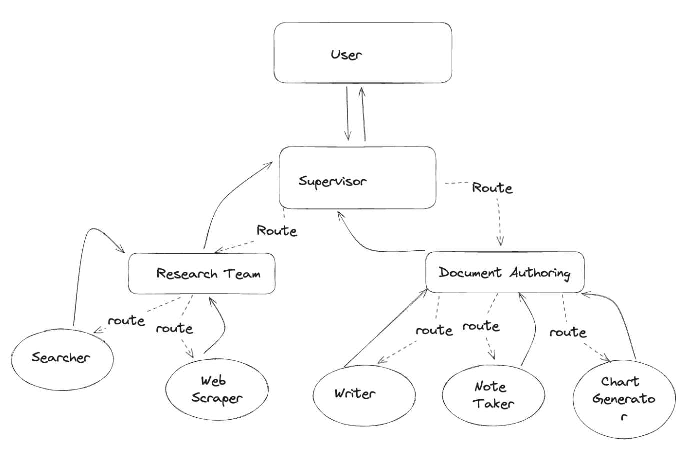
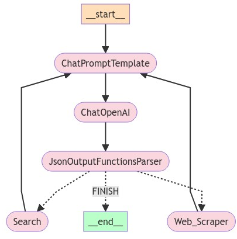
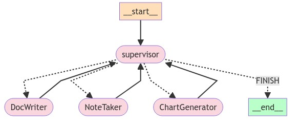
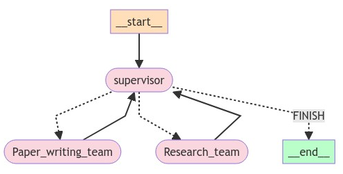

# 分层团队

## 分层代理团队

在我们之前的示例（[代理主管](https://langchain-ai.github.io/langgraph/tutorials/multi_agent/agent_supervisor/)）中，我们介绍了一个单一的主管节点来在不同的工作节点之间分配工作。

但如果单个工作节点的任务变得太复杂呢？如果工作节点的数量变得太多呢？

对于某些应用程序，如果工作*分层*分配，系统可能会更有效。

您可以通过组合不同的子图并创建一个顶级主管以及中级主管来实现这一点。

为了做到这一点，让我们构建一个简单的研究助手！图表看起来像下面这样：



这个笔记本的灵感来自 Wu 等人的论文[《AutoGen: Enabling Next-Gen LLM Applications via Multi-Agent Conversation》](https://arxiv.org/abs/2308.08155)。在这个笔记本的其余部分，您将：

1. 定义访问网页和写文件的代理工具
2. 定义一些有助于创建图表和代理的实用程序
3. 创建并定义每个团队（网页研究 + 文档编写）
4. 将所有内容组合在一起

但在此之前，一些设置：

```python
pip install -U langgraph langchain langchain_openai langchain_experimental
```

```python
import getpass
import os


def _set_if_undefined(var: str):
    if not os.environ.get(var):
        os.environ[var] = getpass.getpass(f"Please provide your {var}")


_set_if_undefined("OPENAI_API_KEY")
_set_if_undefined("LANGCHAIN_API_KEY")
_set_if_undefined("TAVILY_API_KEY")

# 可选，添加 LangSmith 的跟踪
# 这将帮助您可视化和调试控制流
os.environ["LANGCHAIN_TRACING_V2"] = "true"
os.environ["LANGCHAIN_PROJECT"] = "Multi-agent Collaboration"
```

## 创建工具

每个团队将由一个或多个代理组成，每个代理有一个或多个工具。下面，定义不同团队将使用的所有工具。

我们将从研究团队开始。

**研究团队工具**

研究团队可以使用搜索引擎和 URL 抓取工具在网页上查找信息。您可以随意添加其他功能以提高团队的性能！

```python
from typing import Annotated, List

from langchain_community.document_loaders import WebBaseLoader
from langchain_community.tools.tavily_search import TavilySearchResults
from langchain_core.tools import tool

tavily_tool = TavilySearchResults(max_results=5)


@tool
def scrape_webpages(urls: List[str]) -> str:
    """使用 requests 和 bs4 抓取提供的网页以获取详细信息。"""
    loader = WebBaseLoader(urls)
    docs = loader.load()
    return "\n\n".join(
        [
            f'\n{doc.page_content}\n'
            for doc in docs
        ]
    )
```

**文档编写团队工具**

接下来，我们将为文档编写团队提供一些工具。我们在下面定义了一些基本的文件访问工具。

请注意，这会给代理提供对文件系统的访问权限，这可能是不安全的。我们也没有为性能优化工具描述。

```python
from pathlib import Path
from tempfile import TemporaryDirectory
from typing import Dict, Optional

from langchain_experimental.utilities import PythonREPL
from typing_extensions import TypedDict

_TEMP_DIRECTORY = TemporaryDirectory()
WORKING_DIRECTORY = Path(_TEMP_DIRECTORY.name)


@tool
def create_outline(
    points: Annotated[List[str], "主要点或部分的列表。"],
    file_name: Annotated[str, "保存大纲的文件路径。"],
) -> Annotated[str, "保存的大纲文件的路径。"]:
    """创建并保存大纲。"""
    with (WORKING_DIRECTORY / file_name).open("w") as file:
        for i, point in enumerate(points):
            file.write(f"{i + 1}. {point}\n")
    return f"大纲已保存到 {file_name}"


@tool
def read_document(
    file_name: Annotated[str, "保存文档的文件路径。"],
    start: Annotated[Optional[int], "起始行。默认为0"] = None,
    end: Annotated[Optional[int], "结束行。默认为None"] = None,
) -> str:
    """读取指定的文档。"""
    with (WORKING_DIRECTORY / file_name).open("r") as file:
        lines = file.readlines()
    if start is not None:
        start = 0
    return "\n".join(lines[start:end])


@tool
def write_document(
    content: Annotated[str, "要写入文档的文本内容。"],
    file_name: Annotated[str, "保存文档的文件路径。"],
) -> Annotated[str, "保存的文档文件的路径。"]:
    """创建并保存文本文档。"""
    with (WORKING_DIRECTORY / file_name).open("w") as file:
        file.write(content)
    return f"文档已保存到 {file_name}"


@tool
def edit_document(
    file_name: Annotated[str, "要编辑的文档路径。"],
    inserts: Annotated[
        Dict[int, str],
        "字典，其中键是行号（1索引），值是在该行插入的文本。",
    ],
) -> Annotated[str, "编辑后的文档文件的路径。"]:
    """通过在特定行号插入文本来编辑文档。"""

    with (WORKING_DIRECTORY / file_name).open("r") as file:
        lines = file.readlines()

    sorted_inserts = sorted(inserts.items())

    for line_number, text in sorted_inserts:
        if 1 <= line_number <= len(lines) + 1:
            lines.insert(line_number - 1, text + "\n")
        else:
            return f"错误：行号 {line_number} 超出范围。"

    with (WORKING_DIRECTORY / file_name).open("w") as file:
        file.writelines(lines)

    return f"文档已编辑并保存到 {file_name}"


# 警告：此工具会在本地执行代码，在未隔离的环境中使用时可能不安全

repl = PythonREPL()


@tool
def python_repl(
    code: Annotated[str, "生成图表的 Python 代码。"],
):
    """使用此工具执行 Python 代码。如果您想查看值的输出，应该使用 `print(...)` 打印出来。这对用户可见。"""
    try:
        result = repl.run(code)
    except BaseException as e:
        return f"执行失败。错误：{repr(e)}"
    return f"成功执行：\n```python\n{code}\n```\n标准输出：{result}"
```

## 辅助工具

我们将创建一些实用函数，以便在需要时使其更简洁：

1. 创建工作代理。
2. 为子图创建主管。

这些将简化我们最终的图表组合代码，使其更容易理解发生了什么。

```python
from typing import List, Optional

from langchain.agents import AgentExecutor, create_openai_functions_agent
from langchain.output_parsers.openai_functions import JsonOutputFunctionsParser
from langchain_core.prompts import ChatPromptTemplate, MessagesPlaceholder
from langchain_openai import ChatOpenAI

from langgraph.graph import END, StateGraph, START


def create_agent(
    llm: ChatOpenAI,
    tools: list,
    system_prompt: str,
) -> str:
    """创建一个调用函数的代理并将其添加到图中。"""
    system_prompt += "\n根据您的专长自主工作，使用可用的工具。"
    " 不要寻求澄清。"
    " 您的其他团队成员（和其他团队）将根据他们自己的专长与您合作。"
    " 您是因为某种原因被选中的！您是以下团队成员之一：{team_members}。"
    prompt = ChatPromptTemplate.from_messages(
        [
            (
                "system",
                system_prompt,
            ),
            MessagesPlaceholder(variable_name="messages"),
            MessagesPlaceholder(variable_name="agent_scratchpad"),
        ]
    )
    agent = create_openai_functions_agent(llm, tools, prompt)
    executor = AgentExecutor(agent=agent, tools=tools)
    return executor


def agent_node(state, agent, name):
    result = agent.invoke(state)
    return {"messages": [HumanMessage(content=result["output"], name=name)]}


def create_team_supervisor(llm: ChatOpenAI, system_prompt, members) -> str:
    """基于LLM的路由器。"""
    options = ["完成"] + members
    function_def = {
        "name": "route",
        "description": "选择下一个角色。",
        "parameters": {
            "title": "routeSchema",
            "type": "object",
            "properties": {
                "next": {
                    "title": "下一个",
                    "anyOf": [
                        {"enum": options},
                    ],
                },
            },
            "required": ["next"],
        },
    }
    prompt = ChatPromptTemplate.from_messages(
        [
            ("system", system_prompt),
            MessagesPlaceholder(variable_name="messages"),


            (
                "system",
                "根据上面的对话，接下来应该由谁执行？"
                " 还是我们应该完成？选择以下选项之一：{options}",
            ),
        ]
    ).partial(options=str(options), team_members=", ".join(members))
    return (
        prompt
        | llm.bind_functions(functions=[function_def], function_call="route")
        | JsonOutputFunctionsParser()
    )
```

## 定义代理团队

现在我们可以定义我们的分层团队了。"选择您的玩家！"

### 研究团队

研究团队将有一个搜索代理和一个网页抓取"research_agent"作为两个工作节点。让我们创建这些以及团队主管。

```python
import functools
import operator

from langchain_core.messages import BaseMessage, HumanMessage
from langchain_openai.chat_models import ChatOpenAI


# 研究团队图状态
class ResearchTeamState(TypedDict):
    # 每个团队成员完成后都会添加一条消息
    messages: Annotated[List[BaseMessage], operator.add]
    # 跟踪团队成员，以便他们了解彼此的技能集
    team_members: List[str]
    # 用于路由工作。主管调用一个函数
    # 每次做出决定时都会更新此内容
    next: str


llm = ChatOpenAI(model="gpt-4-1106-preview")

search_agent = create_agent(
    llm,
    [tavily_tool],
    "您是一名研究助手，可以使用 tavily 搜索引擎搜索最新信息。",
)
search_node = functools.partial(agent_node, agent=search_agent, name="Search")

research_agent = create_agent(
    llm,
    [scrape_webpages],
    "您是一名研究助手，可以使用 scrape_webpages 函数抓取指定的 URL 以获取更详细的信息。",
)
research_node = functools.partial(agent_node, agent=research_agent, name="WebScraper")

supervisor_agent = create_team_supervisor(
    llm,
    "您是一名主管，负责管理以下工作人员之间的对话： Search, WebScraper。根据以下用户请求，"
    "回答下一个应该执行的工作人员。每个工作人员将执行一个"
    "任务并回复其结果和状态。完成时，"
    "回答完成。",
    ["Search", "WebScraper"],
)
```

现在我们已经创建了必要的组件，定义它们的交互就很容易了。将节点添加到团队图中，并定义边，这决定了转换条件。

```python
research_graph = StateGraph(ResearchTeamState)
research_graph.add_node("Search", search_node)
research_graph.add_node("WebScraper", research_node)
research_graph.add_node("supervisor", supervisor_agent)

# 定义控制流
research_graph.add_edge("Search", "supervisor")
research_graph.add_edge("WebScraper", "supervisor")
research_graph.add_conditional_edges(
    "supervisor",
    lambda x: x["next"],
    {"Search": "Search", "WebScraper": "WebScraper", "完成": END},
)


research_graph.add_edge(START, "supervisor")
chain = research_graph.compile()


# 以下函数在顶级图状态和研究子图状态之间进行交互
# 这样每个图的状态不会混合在一起
def enter_chain(message: str):
    results = {
        "messages": [HumanMessage(content=message)],
    }
    return results


research_chain = enter_chain | chain

```



我们可以直接给这个团队分配工作。下面试试看。

```python
for s in research_chain.stream(
    "Taylor Swift 的下一次巡演是什么时候？", {"recursion_limit": 100}
):
    if "__end__" not in s:
        print(s)
        print("---")
```

### 文档编写团队

使用类似的方法创建文档编写团队。这次，我们将给每个代理访问不同的文件写入工具。

请注意，我们在这里给代理提供了文件系统访问权限，这在所有情况下都是不安全的。

```python
import operator
from pathlib import Path


# 文档编写团队图状态
class DocWritingState(TypedDict):
    # 跟踪团队内部的对话
    messages: Annotated[List[BaseMessage], operator.add]
    # 为每个工作人员提供有关其他技能集的上下文
    team_members: str
    # 这是主管告诉langgraph下一个工作的方式
    next: str
    # 跟踪共享目录状态
    current_files: str


# 这将在每个工作人员代理开始工作之前运行
# 使其更加了解当前工作目录的状态
def prelude(state):
    written_files = []
    if not WORKING_DIRECTORY.exists():
        WORKING_DIRECTORY.mkdir()
    try:
        written_files = [
            f.relative_to(WORKING_DIRECTORY) for f in WORKING_DIRECTORY.rglob("*")
        ]
    except Exception:
        pass
    if not written_files:
        return {**state, "current_files": "没有写入文件。"}
    return {
        **state,
        "current_files": "\n以下是您的团队已写入目录的文件：\n"
        + "\n".join([f" - {f}" for f in written_files]),
    }


llm = ChatOpenAI(model="gpt-4-1106-preview")

doc_writer_agent = create_agent(
    llm,
    [write_document, edit_document, read_document],
    "您是一名撰写研究文档的专家。\n"
    # {current_files} 值由图表状态自动填充
    "以下是您目录中的文件：\n{current_files}",
)
# 在每次调用之前注入当前目录工作状态
context_aware_doc_writer_agent = prelude | doc_writer_agent
doc_writing_node = functools.partial(
    agent_node, agent=context_aware_doc_writer_agent, name="DocWriter"
)

note_taking_agent = create_agent(
    llm,
    [create_outline, read_document],
    "您是一名高级研究员，负责撰写论文大纲和"
    "记笔记以编写完美的论文。{current_files}",
)
context_aware_note_taking_agent = prelude | note_taking_agent
note_taking_node = functools.partial(
    agent_node, agent=context_aware_note_taking_agent, name="NoteTaker"
)

chart_generating_agent = create_agent(
    llm,
    [read_document, python_repl],
    "您是一名数据可视化专家，负责生成研究项目的图表。"
    "{current_files}",
)
context_aware_chart_generating_agent = prelude | chart_generating_agent
chart_generating_node = functools.partial(
    agent_node, agent=context_aware_note_taking_agent, name="ChartGenerator"
)

doc_writing_supervisor = create_team_supervisor(
    llm,
    "您是一名主管，负责管理以下工作人员之间的对话：{team_members}。根据以下用户请求，"
    "回答下一个应该执行的工作人员。每个工作人员将执行一个"
    "任务并回复其结果和状态。完成时，"
    "回答完成。",
    ["DocWriter", "NoteTaker", "ChartGenerator"],
)
```

有了这些对象后，我们可以构建图表。

```python
# 在此处创建图表：
# 请注意，为了本文档的完整性，我们已展开循环
authoring_graph = StateGraph(DocWritingState)
authoring_graph.add_node("DocWriter", doc_writing_node)
authoring_graph.add_node("NoteTaker", note_taking_node)
authoring_graph.add_node("ChartGenerator", chart_generating_node)
authoring_graph.add_node("supervisor", doc_writing_supervisor)

# 添加始终发生的边
authoring_graph.add_edge("DocWriter", "supervisor")
authoring_graph.add_edge("NoteTaker", "supervisor")
authoring_graph.add_edge("ChartGenerator", "supervisor")

# 添加适用路由的边
authoring_graph.add_conditional_edges(
    "supervisor",
    lambda x: x["next"],
    {
        "DocWriter": "DocWriter",
        "NoteTaker": "NoteTaker",
        "ChartGenerator": "ChartGenerator",
        "完成": END,
    },
)

authoring_graph.add_edge(START, "supervisor")
chain = authoring_graph.compile()


# 以下函数在顶级图状态和研究子图状态之间进行交互
# 这样每个图的状态不会混合在一起
def enter_chain(message: str, members: List[str]):
    results = {
        "messages": [HumanMessage(content=message)],
        "team_members": ", ".join(members),
    }
    return results


# 我们重用进入/退出函数来包装图表
authoring_chain = (
    functools.partial(enter_chain, members=authoring_graph.nodes)
    | authoring_graph.compile()
)

```



```python
for s in authoring_chain.stream(
    "为诗歌写一个大纲，然后将诗歌写入磁盘。",
    {"recursion_limit": 100},
):
    if "__end__" not in s:
        print(s)
        print("---")
```

## 添加层

在这个设计中，我们强制执行自上而下的规划策略。我们已经创建了两个图，但我们必须决定

如何在两者之间分配工作。

我们将创建*第三个*图来协调前两个，并添加一些连接器，以定义如何在不同的图之间共享顶级状态。

```python
from langchain_core.messages import BaseMessage
from langchain_openai.chat_models import ChatOpenAI

llm = ChatOpenAI(model="gpt-4-1106-preview")

supervisor_node = create_team_supervisor(
    llm,
    "您是一名主管，负责管理以下团队之间的对话：{team_members}。根据以下用户请求，"
    "回答下一个应该执行的工作人员。每个工作人员将执行一个"
    "任务并回复其结果和状态。完成时，"
    "回答完成。",
    ["ResearchTeam", "PaperWritingTeam"],
)

```

```python
# 顶级图状态
class State(TypedDict):
    messages: Annotated[List[BaseMessage], operator.add]
    next: str


def get_last_message(state: State) -> str:
    return state["messages"][-1].content


def join_graph(response: dict):
    return {"messages": [response["messages"][-1]]}


# 定义图表
super_graph = StateGraph(State)
# 首先添加节点，它们将执行工作
super_graph.add_node("ResearchTeam", get_last_message | research_chain | join_graph)
super_graph.add_node(
    "PaperWritingTeam", get_last_message | authoring_chain | join_graph
)
super_graph.add_node("supervisor", supervisor_node)

# 定义图表连接，这控制逻辑如何
# 通过程序传播
super_graph.add_edge("ResearchTeam", "supervisor")
super_graph.add_edge("PaperWritingTeam", "supervisor")
super_graph.add_conditional_edges(
    "supervisor",
    lambda x: x["next"],
    {
        "PaperWritingTeam": "PaperWritingTeam",
        "ResearchTeam": "ResearchTeam",
        "完成": END,
    },
)
super_graph.add_edge(START, "supervisor")
super_graph = super_graph.compile()
```



```python
for s in super_graph.stream(
    {
        "messages": [
            HumanMessage(
                content="写一份关于北美鲟鱼的简短研究报告。包括一张图表。"
            )
        ],
    },
    {"recursion_limit": 150},
):
    if "__end__" not in s:
        print(s)
        print("---")
```