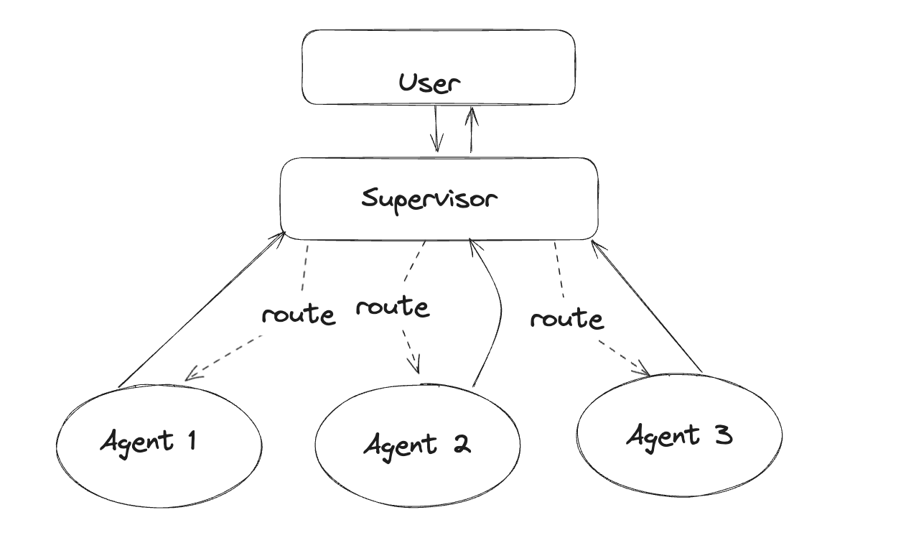
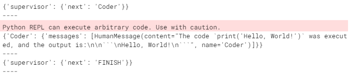
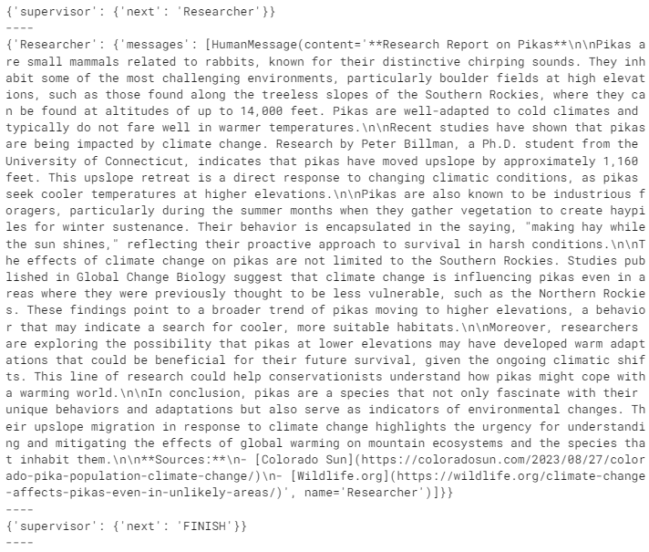

# 监督

## 代理监督者

[之前的示例](https://langchain-ai.github.io/langgraph/tutorials/multi_agent/multi-agent-collaboration/)基于初始研究代理的输出自动路由消息。

我们还可以选择使用一个大语言模型（LLM）来协调不同的代理。

在下面，我们将创建一个代理组，并由一个代理监督者来帮助分配任务。



为了简化每个代理节点中的代码，我们将使用LangChain的AgentExecutor类。本笔记本和其他“高级代理”笔记本旨在展示如何在LangGraph中实现某些设计模式。如果这种模式适合您的需求，我们建议将其与文档中描述的其他基本模式结合使用，以获得最佳性能。

在构建之前，让我们配置我们的环境：

```bash
pip install -U langgraph langchain langchain_openai langchain_experimental langsmith pandas
```

```python
import getpass
import os


def _set_if_undefined(var: str):
    if not os.environ.get(var):
        os.environ[var] = getpass.getpass(f"Please provide your {var}")


_set_if_undefined("OPENAI_API_KEY")
_set_if_undefined("LANGCHAIN_API_KEY")
_set_if_undefined("TAVILY_API_KEY")

# 可选，在LangSmith中添加追踪
os.environ["LANGCHAIN_TRACING_V2"] = "true"
os.environ["LANGCHAIN_PROJECT"] = "Multi-agent Collaboration"
```

## 创建工具

在这个示例中，您将创建一个使用搜索引擎进行网页研究的代理和一个用于生成图表的代理。定义他们将使用的工具如下：

```python
from typing import Annotated

from langchain_community.tools.tavily_search import TavilySearchResults
from langchain_experimental.tools import PythonREPLTool

tavily_tool = TavilySearchResults(max_results=5)

# 这将在本地执行代码，可能不安全
python_repl_tool = PythonREPLTool()
```

## 辅助工具

定义一个辅助函数，使添加新的代理工作节点变得更容易。

```python
from langchain.agents import AgentExecutor, create_openai_tools_agent
from langchain_core.messages import BaseMessage, HumanMessage
from langchain_openai import ChatOpenAI


def create_agent(llm: ChatOpenAI, tools: list, system_prompt: str):
    # 每个工作节点都会有一个名称和一些工具
    prompt = ChatPromptTemplate.from_messages(
        [
            (
                "system",
                system_prompt,
            ),
            MessagesPlaceholder(variable_name="messages"),
            MessagesPlaceholder(variable_name="agent_scratchpad"),
        ]
    )
    agent = create_openai_tools_agent(llm, tools, prompt)
    executor = AgentExecutor(agent=agent, tools=tools)
    return executor
```

我们还可以定义一个函数，用于作为图中的节点 - 它负责将代理响应转换为人类消息。这很重要，因为这是我们将其添加到全局图状态的方法。

```python
def agent_node(state, agent, name):
    result = agent.invoke(state)
    return {"messages": [HumanMessage(content=result["output"], name=name)]}
```

### 创建代理监督者

它将使用函数调用来选择下一个工作节点或完成处理。

```python
from langchain_core.output_parsers.openai_functions import JsonOutputFunctionsParser
from langchain_core.prompts import ChatPromptTemplate, MessagesPlaceholder

members = ["Researcher", "Coder"]
system_prompt = (
    "您是一名主管，负责管理以下工作人员之间的对话：{members}。根据以下用户请求，"
    "回答下一个应该执行的工作人员。每个工作人员将执行一个"
    "任务并回复其结果和状态。完成时，"
    "回答完成。"
)
# 我们的团队监督者是一个LLM节点。它只选择下一个要处理的代理
# 并决定何时完成工作
options = ["FINISH"] + members
# 使用openai函数调用可以使输出解析更容易
function_def = {
    "name": "route",
    "description": "选择下一个角色。",
    "parameters": {
        "title": "routeSchema",
        "type": "object",
        "properties": {
            "next": {
                "title": "下一个",
                "anyOf": [
                    {"enum": options},
                ],
            }
        },
        "required": ["next"],
    },
}
prompt = ChatPromptTemplate.from_messages(
    [
        ("system", system_prompt),
        MessagesPlaceholder(variable_name="messages"),
        (
            "system",
            "根据上面的对话，接下来应该由谁执行？"
            " 还是我们应该完成？选择以下选项之一：{options}",
        ),
    ]
).partial(options=str(options), members=", ".join(members))

llm = ChatOpenAI(model="gpt-4-1106-preview")

supervisor_chain = (
    prompt
    | llm.bind_functions(functions=[function_def], function_call="route")
    | JsonOutputFunctionsParser()
)
```

## 构建图表

我们准备开始构建图表。下面，使用我们刚定义的函数定义状态和工作节点。

```python
import functools
import operator
from typing import Sequence, TypedDict

from langchain_core.prompts import ChatPromptTemplate, MessagesPlaceholder

from langgraph.graph import END, StateGraph, START


# 代理状态是图中每个节点的输入
class AgentState(TypedDict):
    # 注解告诉图表新消息将始终
    # 添加到当前状态
    messages: Annotated[Sequence[BaseMessage], operator.add]
    # 'next'字段指示下一个路由的位置
    next: str


research_agent = create_agent(llm, [tavily_tool], "您是一名网页研究员。")
research_node = functools.partial(agent_node, agent=research_agent, name="Researcher")

# 注意：这会执行任意代码。谨慎进行
code_agent = create_agent(
    llm,
    [python_repl_tool],
    "您可以生成安全的python代码来分析数据并使用matplotlib生成图表。",
)
code_node = functools.partial(agent_node, agent=code_agent, name="Coder")

workflow = StateGraph(AgentState)
workflow.add_node("Researcher", research_node)
workflow.add_node("Coder", code_node)
workflow.add_node("supervisor", supervisor_chain)
```

现在连接图中的所有边。

```python
for member in members:
    # 我们希望工作人员在完成后始终向主管“汇报”
    workflow.add_edge(member, "supervisor")
# 主管会在图表状态中填充“next”字段
# 这会路由到一个节点或完成
conditional_map = {k: k for k in members}
conditional_map["FINISH"] = END
workflow.add_conditional_edges("supervisor", lambda x: x["next"], conditional_map)
# 最后，添加入口点
workflow.add_edge(START, "supervisor")

graph = workflow.compile()
```

## 调用团队

图表创建完成后，我们可以现在调用它，看看它的表现！

```python
for s in graph.stream(
    {
        "messages": [
            HumanMessage(content="编写hello world代码并将其打印到终端")
        ]
    }
):
    if "__end__" not in s:
        print(s)
        print("----")
```



```python
for s in graph.stream(
    {"messages": [HumanMessage(content="写一份关于鼠兔的简短研究报告。")]},
    {"recursion_limit": 100},
):
    if "__end__" not in s:
        print(s)
        print("----")
```

