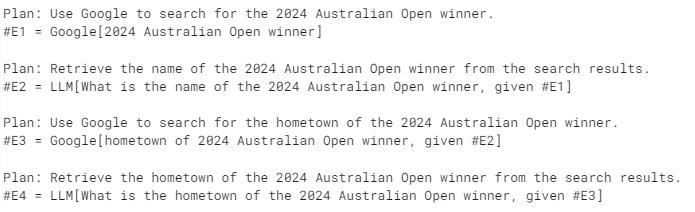

# Reasoning without Observation

In [ReWOO](https://arxiv.org/abs/2305.18323), Xu, et. al, propose an agent that combines a multi-step planner and variable substitution for effective tool use. It was designed to improve on the ReACT-style agent architecture in the following ways:

1. Reduce token consumption and execution time by generating the full chain of tools used in a single pass. (*ReACT-style agent architecture requires many LLM calls with redundant prefixes (since the system prompt and previous steps are provided to the LLM for each reasoning step*)
2. Simplify the fine-tuning process. Since the planning data doesn't depend on the outputs of the tool, models can be fine-tuned without actually invoking the tools (in theory).

The following diagram outlines ReWOO's overall computation graph:


ReWOO is made of 3 modules:

1. 🧠**Planner**: Generate the plan in the following format:

```
Plan: <reasoning>
#E1 = Tool[argument for tool]
Plan: <reasoning>
#E2 = Tool[argument for tool with #E1 variable substitution]
...
```

1. **Worker**: executes the tool with the provided arguments.
2. 🧠**Solver**: generates the answer for the initial task based on the tool observations.

The modules with a 🧠 emoji depend on an LLM call. Notice that we avoid redundant calls to the planner LLM by using variable substitution.

In this example, each module is represented by a LangGraph node. The end result will leave a trace that looks [like this one](https://smith.langchain.com/public/39dbdcf8-fbcc-4479-8e28-15377ca5e653/r). Let's get started!

## 0. Prerequisites

For this example, we will provide the agent with a Tavily search engine tool. You can get an API key [here](https://app.tavily.com/sign-in) or replace with a free tool option (e.g., [duck duck go search](https://python.langchain.com/v0.2/docs/integrations/tools/ddg/)).

To see the full langsmith trace, you can s

```
pip install -U langgraph langchain_community langchain_openai tavily-python
```

```
import getpass
import os


def _set_if_undefined(var: str):
    if not os.environ.get(var):
        os.environ[var] = getpass.getpass(f"{var}=")


os.environ["LANGCHAIN_TRACING_V2"] = "true"
os.environ["LANGCHAIN_PROJECT"] = "ReWOO"
_set_if_undefined("TAVILY_API_KEY")
_set_if_undefined("LANGCHAIN_API_KEY")
_set_if_undefined("OPENAI_API_KEY")
```

**Graph State**: In LangGraph, every node updates a shared graph state. The state is the input to any node whenever it is invoked.

Below, we will define a state dict to contain the task, plan, steps, and other variables.

```
from typing import List, TypedDict


class ReWOO(TypedDict):
    task: str
    plan_string: str
    steps: List
    results: dict
    result: str
```

## 1. Planner

The planner prompts an LLM to generate a plan in the form of a task list. The arguments to each task are strings that may contain special variables (`#E{0-9}+`) that are used for variable substitution from other task results.


Our example agent will have two tools:

1. Google - a search engine (in this case Tavily)
2. LLM - an LLM call to reason about previous outputs.

The LLM tool receives less of the prompt context and so can be more token-efficient than the ReACT paradigm.

```

from langchain_openai import ChatOpenAI

model = ChatOpenAI(temperature=0)
```

```
prompt = """For the following task, make plans that can solve the problem step by step. For each plan, indicate \
which external tool together with tool input to retrieve evidence. You can store the evidence into a \
variable #E that can be called by later tools. (Plan, #E1, Plan, #E2, Plan, ...)

Tools can be one of the following:
(1) Google[input]: Worker that searches results from Google. Useful when you need to find short
and succinct answers about a specific topic. The input should be a search query.
(2) LLM[input]: A pretrained LLM like yourself. Useful when you need to act with general
world knowledge and common sense. Prioritize it when you are confident in solving the problem
yourself. Input can be any instruction.

For example,
Task: Thomas, Toby, and Rebecca worked a total of 157 hours in one week. Thomas worked x
hours. Toby worked 10 hours less than twice what Thomas worked, and Rebecca worked 8 hours
less than Toby. How many hours did Rebecca work?
Plan: Given Thomas worked x hours, translate the problem into algebraic expressions and solve
with Wolfram Alpha. #E1 = WolframAlpha[Solve x + (2x − 10) + ((2x − 10) − 8) = 157]
Plan: Find out the number of hours Thomas worked. #E2 = LLM[What is x, given #E1]
Plan: Calculate the number of hours Rebecca worked. #E3 = Calculator[(2 ∗ #E2 − 10) − 8]

Begin! 
Describe your plans with rich details. Each Plan should be followed by only one #E.

Task: {task}"""
```

```
task = "what is the hometown of the 2024 australian open winner"
```

```
result = model.invoke(prompt.format(task=task))
```

```
print(result.content)
```



#### Planner Node

To connect the planner to our graph, we will create a `get_plan` node that accepts the `ReWOO` state and returns with a state update for the `steps` and `plan_string` fields.

```
import re

from langchain_core.prompts import ChatPromptTemplate

# Regex to match expressions of the form E#... = ...[...]
regex_pattern = r"Plan:\s*(.+)\s*(#E\d+)\s*=\s*(\w+)\s*([^([^([^]+)\]"
prompt_template = ChatPromptTemplate.from_messages([("user", prompt)])
planner = prompt_template | model


def get_plan(state: ReWOO):
    task = state["task"]
    result = planner.invoke({"task": task})
    # Find all matches in the sample text
    matches = re.findall(regex_pattern, result.content)
    return {"steps": matches, "plan_string": result.content}
```

## 2. Executor

The executor receives the plan and executes the tools in sequence.

Below, instantiate the search engine and define the tool execution node.

```
from langchain_community.tools.tavily_search import TavilySearchResults

search = TavilySearchResults()

```

```
def _get_current_task(state: ReWOO):
    if state["results"] is None:
        return 1
    if len(state["results"]) == len(state["steps"]):
        return None
    else:
        return len(state["results"]) + 1


def tool_execution(state: ReWOO):
    """Worker node that executes the tools of a given plan."""
    _step = _get_current_task(state)
    _, step_name, tool, tool_input = state["steps"][_step - 1]
    _results = state["results"] or {}
    for k, v in _results.items():
        tool_input = tool_input.replace(k, v)
    if tool == "Google":
        result = search.invoke(tool_input)
    elif tool == "LLM":
        result = model.invoke(tool_input)
    else:
        raise ValueError
    _results[step_name] = str(result)
    return {"results": _results}
```


## 3. Solver

The solver receives the full plan and generates the final response based on the responses of the tool calls from the worker.

```
solve_prompt = """Solve the following task or problem. To solve the problem, we have made step-by-step Plan and \
retrieved corresponding Evidence to each Plan. Use them with caution since long evidence might \
contain irrelevant information.

{plan}

Now solve the question or task according to provided Evidence above. Respond with the answer
directly with no extra words.

Task: {task}
Response:"""


def solve(state: ReWOO):
    plan = ""
    for _plan, step_name, tool, tool_input in state["steps"]:
        _results = state["results"] or {}
        for k, v in _results.items():
            tool_input = tool_input.replace(k, v)
            step_name = step_name.replace(k, v)
        plan += f"Plan: {_plan}\n{step_name} = {tool}[{tool_input}]"
    prompt = solve_prompt.format(plan=plan, task=state["task"])
    result = model.invoke(prompt)
    return {"result": result.content}
```

## 4. Define Graph

Our graph defines the workflow. Each of the planner, tool executor, and solver modules are added as nodes.

```
def _route(state):
    _step = _get_current_task(state)
    if _step is None:
        # We have executed all tasks
        return "solve"
    else:
        # We are still executing tasks, loop back to the "tool" node
        return "tool"
```

```
from langgraph.graph import END, StateGraph, START

graph = StateGraph(ReWOO)
graph.add_node("plan", get_plan)
graph.add_node("tool", tool_execution)
graph.add_node("solve", solve)
graph.add_edge("plan", "tool")
graph.add_edge("solve", END)
graph.add_conditional_edges("tool", _route)
graph.add_edge(START, "plan")

app = graph.compile()
```

```
for s in app.stream({"task": task}):
    print(s)
    print("---")
```


```


{'plan': {'steps': [('Use Google to search for the 2024 Australian Open winner.', '#E1', 'Google', '2024 Australian Open winner'), ('Retrieve the name of the 2024 Australian Open winner from the search results.', '#E2', 'LLM', 'What is the name of the 2024 Australian Open winner, given #E1'), ('Use Google to search for the hometown of the 2024 Australian Open winner.', '#E3', 'Google', 'hometown of 2024 Australian Open winner, given #E2'), ('Retrieve the hometown of the 2024 Australian Open winner from the search results.', '#E4', 'LLM', 'What is the hometown of the 2024 Australian Open winner, given #E3')], 'plan_string': 'Plan: Use Google to search for the 2024 Australian Open winner.\n#E1 = Google[2024 Australian Open winner]\n\nPlan: Retrieve the name of the 2024 Australian Open winner from the search results.\n#E2 = LLM[What is the name of the 2024 Australian Open winner, given #E1]\n\nPlan: Use Google to search for the hometown of the 2024 Australian Open winner.\n#E3 = Google[hometown of 2024 Australian Open winner, given #E2]\n\nPlan: Retrieve the hometown of the 2024 Australian Open winner from the search results.\n#E4 = LLM[What is the hometown of the 2024 Australian Open winner, given #E3]'}}
---
{'tool': {'results': {'#E1': '[{\'url\': \'https://www.cbssports.com/tennis/news/australian-open-2024-jannik-sinner-aryna-sabalenka-crowned-as-grand-slam-singles-champions-at-melbourne-park/\', \'content\': \'2024 Australian Open odds, Sinner vs. Medvedev picks Sabalenka defeats Zheng to win 2024 Australian Open  Australian Open 2024: Jannik Sinner, Aryna Sabalenka crowned as Grand Slam singles champions at Melbourne Park  2024 Australian Open odds, Sabalenka vs. Zheng picks 2024 Australian Open odds, Medvedev vs. Zverev picks  Sinner, Sabalenka win Australian Open singles titles Sinner makes epic comeback to win Australian OpenJan 28, 2024 — Jan 28, 2024Australian Open 2024: Jannik Sinner, Aryna Sabalenka crowned as Grand Slam singles champions at Melbourne Park ... Watch Now: Jannik Sinner came\\xa0...\'}, {\'url\': \'https://en.wikipedia.org/wiki/2024_Australian_Open\', \'content\': "Contents 2024 Australian Open  The 2024 Australian Open was a Grand Slam level tennis tournament held at Melbourne Park, from 14–28 January 2024.[1]  The Australian Open total prize money for 2024 increased by 13.07% year on year to a tournament record A$86,500,000.  In the tournament\'s 119-year history, this was the first Australian Open Tennis Championships to be held on an openingNovak Djokovic was the defending men\'s singles champion. ... He was defeated in the semifinals by Jannik Sinner, who went on to beat Daniil Medvedev in a five-set\\xa0..."}, {\'url\': \'https://en.wikipedia.org/wiki/2024_Australian_Open_%E2%80%93_Men%27s_singles\', \'content\': "Contents 2024 Australian Open – Men\'s singles  The entry list was released by Tennis Australia based on the ATP rankings for the week of 4 December 2023.[15]  matches, tying the Open Era record set at the 1983 US Open.[14]  feature any of the Big Three members.[4] It was the second time Medvedev lost the Australian Open final after winningJannik Sinner defeated Daniil Medvedev in the final, 3–6, 3–6, 6–4, 6–4, 6–3, to win the men\'s singles tennis title at the 2024 Australian Open."}]'}}}
---
{'tool': {'results': {'#E1': '[{\'url\': \'https://www.cbssports.com/tennis/news/australian-open-2024-jannik-sinner-aryna-sabalenka-crowned-as-grand-slam-singles-champions-at-melbourne-park/\', \'content\': \'2024 Australian Open odds, Sinner vs. Medvedev picks Sabalenka defeats Zheng to win 2024 Australian Open  Australian Open 2024: Jannik Sinner, Aryna Sabalenka crowned as Grand Slam singles champions at Melbourne Park  2024 Australian Open odds, Sabalenka vs. Zheng picks 2024 Australian Open odds, Medvedev vs. Zverev picks  Sinner, Sabalenka win Australian Open singles titles Sinner makes epic comeback to win Australian OpenJan 28, 2024 — Jan 28, 2024Australian Open 2024: Jannik Sinner, Aryna Sabalenka crowned as Grand Slam singles champions at Melbourne Park ... Watch Now: Jannik Sinner came\\xa0...\'}, {\'url\': \'https://en.wikipedia.org/wiki/2024_Australian_Open\', \'content\': "Contents 2024 Australian Open  The 2024 Australian Open was a Grand Slam level tennis tournament held at Melbourne Park, from 14–28 January 2024.[1]  The Australian Open total prize money for 2024 increased by 13.07% year on year to a tournament record A$86,500,000.  In the tournament\'s 119-year history, this was the first Australian Open Tennis Championships to be held on an openingNovak Djokovic was the defending men\'s singles champion. ... He was defeated in the semifinals by Jannik Sinner, who went on to beat Daniil Medvedev in a five-set\\xa0..."}, {\'url\': \'https://en.wikipedia.org/wiki/2024_Australian_Open_%E2%80%93_Men%27s_singles\', \'content\': "Contents 2024 Australian Open – Men\'s singles  The entry list was released by Tennis Australia based on the ATP rankings for the week of 4 December 2023.[15]  matches, tying the Open Era record set at the 1983 US Open.[14]  feature any of the Big Three members.[4] It was the second time Medvedev lost the Australian Open final after winningJannik Sinner defeated Daniil Medvedev in the final, 3–6, 3–6, 6–4, 6–4, 6–3, to win the men\'s singles tennis title at the 2024 Australian Open."}]', '#E2': "content='The name of the 2024 Australian Open winner is Jannik Sinner.'"}}}
---
{'tool': {'results': {'#E1': '[{\'url\': \'https://www.cbssports.com/tennis/news/australian-open-2024-jannik-sinner-aryna-sabalenka-crowned-as-grand-slam-singles-champions-at-melbourne-park/\', \'content\': \'2024 Australian Open odds, Sinner vs. Medvedev picks Sabalenka defeats Zheng to win 2024 Australian Open  Australian Open 2024: Jannik Sinner, Aryna Sabalenka crowned as Grand Slam singles champions at Melbourne Park  2024 Australian Open odds, Sabalenka vs. Zheng picks 2024 Australian Open odds, Medvedev vs. Zverev picks  Sinner, Sabalenka win Australian Open singles titles Sinner makes epic comeback to win Australian OpenJan 28, 2024 — Jan 28, 2024Australian Open 2024: Jannik Sinner, Aryna Sabalenka crowned as Grand Slam singles champions at Melbourne Park ... Watch Now: Jannik Sinner came\\xa0...\'}, {\'url\': \'https://en.wikipedia.org/wiki/2024_Australian_Open\', \'content\': "Contents 2024 Australian Open  The 2024 Australian Open was a Grand Slam level tennis tournament held at Melbourne Park, from 14–28 January 2024.[1]  The Australian Open total prize money for 2024 increased by 13.07% year on year to a tournament record A$86,500,000.  In the tournament\'s 119-year history, this was the first Australian Open Tennis Championships to be held on an openingNovak Djokovic was the defending men\'s singles champion. ... He was defeated in the semifinals by Jannik Sinner, who went on to beat Daniil Medvedev in a five-set\\xa0..."}, {\'url\': \'https://en.wikipedia.org/wiki/2024_Australian_Open_%E2%80%93_Men%27s_singles\', \'content\': "Contents 2024 Australian Open – Men\'s singles  The entry list was released by Tennis Australia based on the ATP rankings for the week of 4 December 2023.[15]  matches, tying the Open Era record set at the 1983 US Open.[14]  feature any of the Big Three members.[4] It was the second time Medvedev lost the Australian Open final after winningJannik Sinner defeated Daniil Medvedev in the final, 3–6, 3–6, 6–4, 6–4, 6–3, to win the men\'s singles tennis title at the 2024 Australian Open."}]', '#E2': "content='The name of the 2024 Australian Open winner is Jannik Sinner.'", '#E3': '[{\'url\': \'https://www.tennis.com/news/articles/soccer-mad-italy-is-now-obsessed-with-tennis-player-jannik-sinner-after-his-australian-open-title\', \'content\': "Soccer-mad Italy is now obsessed with tennis player Jannik Sinner after his Australian Open title  Play & Win Advertising Soccer-mad Italy is now obsessed with tennis player Jannik Sinner after his Australian Open title  \'Grandissimo\': Italian Premier Giorgia Meloni welcomes home Australian Open champion Jannik Sinner  First of many? Jannik Sinner\'s five-set comeback sinks Daniil Medvedev in Australian Open finalJan 28, 2024 — Jan 28, 2024In Sinner\'s tiny hometown of Sesto (population 1,860) near the Austrian border, about 70 people gathered inside the two-court indoor tennis\\xa0..."}, {\'url\': \'https://apnews.com/article/jannik-sinner-italy-australian-open-03573689c4c58c2851d1006e26546ac9\', \'content\': "Soccer-mad Italy is now obsessed with tennis player Jannik Sinner after his Australian Open title  Jannik Sinner, left, of Italy gestures as he holds the Norman Brookes Challenge Cup after defeating Daniil Medvedev,  Jannik Sinner, left, of Italy gestures as he holds the Norman Brookes Challenge Cup after defeating Daniil Medvedev,  Jannik Sinner, left, of Italy gestures as he holds the Norman Brookes Challenge Cup after defeating Daniil Medvedev,Jan 28, 2024 — Jan 28, 2024Soccer-mad Italy has a new obsession. Jannik Sinner\'s Australian Open performance on the tennis court has captured the country\'s attention."}, {\'url\': \'https://en.wikipedia.org/wiki/Jannik_Sinner\', \'content\': \'Sinner is a major champion, having won the 2024 Australian Open.[3] He has won a further ten ATP Tour singles titles,  At the 2024 Australian Open, Sinner defeated world No. 1 Novak Djokovic in the semifinals to reach his first major  Early in the year Sinner made the second round of the 2020 Australian Open, recording his first Grand Slam main draw  a match since Janko Tipsarević in London in 2011.[59][60] Sinner played Daniil Medvedev next in the round robin stage,Since making his professional debut in 2018, Sinner has won 11 ATP Tour singles titles, including a Grand Slam at the 2024 Australian Open and a Masters 1000 at\\xa0...\'}, {\'url\': \'https://ausopen.com/players/italy/jannik-sinner\', \'content\': "Jannik Sinner weathered an early onslaught to reel in Daniil Medvedev, growing in potency to win the Australian Open  the Australian Open 2024 final – his first Grand Slam singles title.  Jannik Sinner will contest his first Grand Slam final after scuttling Novak Djokovic’s bid for a record-extending 11th  Jannick Sinner has form and fitness on his side ahead of his meeting with Andrey Rublev.Jannik Sinner Press Conference | Australian Open 2024 Final. 15:02 · Player & Career Overview. Career Wins 73% · Men\'s Singles. Final • Rod Laver Arena · Comeback\\xa0..."}]'}}}
---
{'tool': {'results': {'#E1': '[{\'url\': \'https://www.cbssports.com/tennis/news/australian-open-2024-jannik-sinner-aryna-sabalenka-crowned-as-grand-slam-singles-champions-at-melbourne-park/\', \'content\': \'2024 Australian Open odds, Sinner vs. Medvedev picks Sabalenka defeats Zheng to win 2024 Australian Open  Australian Open 2024: Jannik Sinner, Aryna Sabalenka crowned as Grand Slam singles champions at Melbourne Park  2024 Australian Open odds, Sabalenka vs. Zheng picks 2024 Australian Open odds, Medvedev vs. Zverev picks  Sinner, Sabalenka win Australian Open singles titles Sinner makes epic comeback to win Australian OpenJan 28, 2024 — Jan 28, 2024Australian Open 2024: Jannik Sinner, Aryna Sabalenka crowned as Grand Slam singles champions at Melbourne Park ... Watch Now: Jannik Sinner came\\xa0...\'}, {\'url\': \'https://en.wikipedia.org/wiki/2024_Australian_Open\', \'content\': "Contents 2024 Australian Open  The 2024 Australian Open was a Grand Slam level tennis tournament held at Melbourne Park, from 14–28 January 2024.[1]  The Australian Open total prize money for 2024 increased by 13.07% year on year to a tournament record A$86,500,000.  In the tournament\'s 119-year history, this was the first Australian Open Tennis Championships to be held on an openingNovak Djokovic was the defending men\'s singles champion. ... He was defeated in the semifinals by Jannik Sinner, who went on to beat Daniil Medvedev in a five-set\\xa0..."}, {\'url\': \'https://en.wikipedia.org/wiki/2024_Australian_Open_%E2%80%93_Men%27s_singles\', \'content\': "Contents 2024 Australian Open – Men\'s singles  The entry list was released by Tennis Australia based on the ATP rankings for the week of 4 December 2023.[15]  matches, tying the Open Era record set at the 1983 US Open.[14]  feature any of the Big Three members.[4] It was the second time Medvedev lost the Australian Open final after winningJannik Sinner defeated Daniil Medvedev in the final, 3–6, 3–6, 6–4, 6–4, 6–3, to win the men\'s singles tennis title at the 2024 Australian Open."}]', '#E2': "content='The name of the 2024 Australian Open winner is Jannik Sinner.'", '#E3': '[{\'url\': \'https://www.tennis.com/news/articles/soccer-mad-italy-is-now-obsessed-with-tennis-player-jannik-sinner-after-his-australian-open-title\', \'content\': "Soccer-mad Italy is now obsessed with tennis player Jannik Sinner after his Australian Open title  Play & Win Advertising Soccer-mad Italy is now obsessed with tennis player Jannik Sinner after his Australian Open title  \'Grandissimo\': Italian Premier Giorgia Meloni welcomes home Australian Open champion Jannik Sinner  First of many? Jannik Sinner\'s five-set comeback sinks Daniil Medvedev in Australian Open finalJan 28, 2024 — Jan 28, 2024In Sinner\'s tiny hometown of Sesto (population 1,860) near the Austrian border, about 70 people gathered inside the two-court indoor tennis\\xa0..."}, {\'url\': \'https://apnews.com/article/jannik-sinner-italy-australian-open-03573689c4c58c2851d1006e26546ac9\', \'content\': "Soccer-mad Italy is now obsessed with tennis player Jannik Sinner after his Australian Open title  Jannik Sinner, left, of Italy gestures as he holds the Norman Brookes Challenge Cup after defeating Daniil Medvedev,  Jannik Sinner, left, of Italy gestures as he holds the Norman Brookes Challenge Cup after defeating Daniil Medvedev,  Jannik Sinner, left, of Italy gestures as he holds the Norman Brookes Challenge Cup after defeating Daniil Medvedev,Jan 28, 2024 — Jan 28, 2024Soccer-mad Italy has a new obsession. Jannik Sinner\'s Australian Open performance on the tennis court has captured the country\'s attention."}, {\'url\': \'https://en.wikipedia.org/wiki/Jannik_Sinner\', \'content\': \'Sinner is a major champion, having won the 2024 Australian Open.[3] He has won a further ten ATP Tour singles titles,  At the 2024 Australian Open, Sinner defeated world No. 1 Novak Djokovic in the semifinals to reach his first major  Early in the year Sinner made the second round of the 2020 Australian Open, recording his first Grand Slam main draw  a match since Janko Tipsarević in London in 2011.[59][60] Sinner played Daniil Medvedev next in the round robin stage,Since making his professional debut in 2018, Sinner has won 11 ATP Tour singles titles, including a Grand Slam at the 2024 Australian Open and a Masters 1000 at\\xa0...\'}, {\'url\': \'https://ausopen.com/players/italy/jannik-sinner\', \'content\': "Jannik Sinner weathered an early onslaught to reel in Daniil Medvedev, growing in potency to win the Australian Open  the Australian Open 2024 final – his first Grand Slam singles title.  Jannik Sinner will contest his first Grand Slam final after scuttling Novak Djokovic’s bid for a record-extending 11th  Jannick Sinner has form and fitness on his side ahead of his meeting with Andrey Rublev.Jannik Sinner Press Conference | Australian Open 2024 Final. 15:02 · Player & Career Overview. Career Wins 73% · Men\'s Singles. Final • Rod Laver Arena · Comeback\\xa0..."}]', '#E4': "content='The hometown of the 2024 Australian Open winner, Jannik Sinner, is Sesto, a small town near the Austrian border in Italy.'"}}}
---
{'solve': {'result': 'The hometown of the 2024 Australian Open winner, Jannik Sinner, is Sesto, Italy.'}}
---
{'__end__': {'task': 'what is the hometown of the 2024 australian open winner', 'plan_string': 'Plan: Use Google to search for the 2024 Australian Open winner.\n#E1 = Google[2024 Australian Open winner]\n\nPlan: Retrieve the name of the 2024 Australian Open winner from the search results.\n#E2 = LLM[What is the name of the 2024 Australian Open winner, given #E1]\n\nPlan: Use Google to search for the hometown of the 2024 Australian Open winner.\n#E3 = Google[hometown of 2024 Australian Open winner, given #E2]\n\nPlan: Retrieve the hometown of the 2024 Australian Open winner from the search results.\n#E4 = LLM[What is the hometown of the 2024 Australian Open winner, given #E3]', 'steps': [('Use Google to search for the 2024 Australian Open winner.', '#E1', 'Google', '2024 Australian Open winner'), ('Retrieve the name of the 2024 Australian Open winner from the search results.', '#E2', 'LLM', 'What is the name of the 2024 Australian Open winner, given #E1'), ('Use Google to search for the hometown of the 2024 Australian Open winner.', '#E3', 'Google', 'hometown of 2024 Australian Open winner, given #E2'), ('Retrieve the hometown of the 2024 Australian Open winner from the search results.', '#E4', 'LLM', 'What is the hometown of the 2024 Australian Open winner, given #E3')], 'results': {'#E1': '[{\'url\': \'https://www.cbssports.com/tennis/news/australian-open-2024-jannik-sinner-aryna-sabalenka-crowned-as-grand-slam-singles-champions-at-melbourne-park/\', \'content\': \'2024 Australian Open odds, Sinner vs. Medvedev picks Sabalenka defeats Zheng to win 2024 Australian Open  Australian Open 2024: Jannik Sinner, Aryna Sabalenka crowned as Grand Slam singles champions at Melbourne Park  2024 Australian Open odds, Sabalenka vs. Zheng picks 2024 Australian Open odds, Medvedev vs. Zverev picks  Sinner, Sabalenka win Australian Open singles titles Sinner makes epic comeback to win Australian OpenJan 28, 2024 — Jan 28, 2024Australian Open 2024: Jannik Sinner, Aryna Sabalenka crowned as Grand Slam singles champions at Melbourne Park ... Watch Now: Jannik Sinner came\\xa0...\'}, {\'url\': \'https://en.wikipedia.org/wiki/2024_Australian_Open\', \'content\': "Contents 2024 Australian Open  The 2024 Australian Open was a Grand Slam level tennis tournament held at Melbourne Park, from 14–28 January 2024.[1]  The Australian Open total prize money for 2024 increased by 13.07% year on year to a tournament record A$86,500,000.  In the tournament\'s 119-year history, this was the first Australian Open Tennis Championships to be held on an openingNovak Djokovic was the defending men\'s singles champion. ... He was defeated in the semifinals by Jannik Sinner, who went on to beat Daniil Medvedev in a five-set\\xa0..."}, {\'url\': \'https://en.wikipedia.org/wiki/2024_Australian_Open_%E2%80%93_Men%27s_singles\', \'content\': "Contents 2024 Australian Open – Men\'s singles  The entry list was released by Tennis Australia based on the ATP rankings for the week of 4 December 2023.[15]  matches, tying the Open Era record set at the 1983 US Open.[14]  feature any of the Big Three members.[4] It was the second time Medvedev lost the Australian Open final after winningJannik Sinner defeated Daniil Medvedev in the final, 3–6, 3–6, 6–4, 6–4, 6–3, to win the men\'s singles tennis title at the 2024 Australian Open."}]', '#E2': "content='The name of the 2024 Australian Open winner is Jannik Sinner.'", '#E3': '[{\'url\': \'https://www.tennis.com/news/articles/soccer-mad-italy-is-now-obsessed-with-tennis-player-jannik-sinner-after-his-australian-open-title\', \'content\': "Soccer-mad Italy is now obsessed with tennis player Jannik Sinner after his Australian Open title  Play & Win Advertising Soccer-mad Italy is now obsessed with tennis player Jannik Sinner after his Australian Open title  \'Grandissimo\': Italian Premier Giorgia Meloni welcomes home Australian Open champion Jannik Sinner  First of many? Jannik Sinner\'s five-set comeback sinks Daniil Medvedev in Australian Open finalJan 28, 2024 — Jan 28, 2024In Sinner\'s tiny hometown of Sesto (population 1,860) near the Austrian border, about 70 people gathered inside the two-court indoor tennis\\xa0..."}, {\'url\': \'https://apnews.com/article/jannik-sinner-italy-australian-open-03573689c4c58c2851d1006e26546ac9\', \'content\': "Soccer-mad Italy is now obsessed with tennis player Jannik Sinner after his Australian Open title  Jannik Sinner, left, of Italy gestures as he holds the Norman Brookes Challenge Cup after defeating Daniil Medvedev,  Jannik Sinner, left, of Italy gestures as he holds the Norman Brookes Challenge Cup after defeating Daniil Medvedev,  Jannik Sinner, left, of Italy gestures as he holds the Norman Brookes Challenge Cup after defeating Daniil Medvedev,Jan 28, 2024 — Jan 28, 2024Soccer-mad Italy has a new obsession. Jannik Sinner\'s Australian Open performance on the tennis court has captured the country\'s attention."}, {\'url\': \'https://en.wikipedia.org/wiki/Jannik_Sinner\', \'content\': \'Sinner is a major champion, having won the 2024 Australian Open.[3] He has won a further ten ATP Tour singles titles,  At the 2024 Australian Open, Sinner defeated world No. 1 Novak Djokovic in the semifinals to reach his first major  Early in the year Sinner made the second round of the 2020 Australian Open, recording his first Grand Slam main draw  a match since Janko Tipsarević in London in 2011.[59][60] Sinner played Daniil Medvedev next in the round robin stage,Since making his professional debut in 2018, Sinner has won 11 ATP Tour singles titles, including a Grand Slam at the 2024 Australian Open and a Masters 1000 at\\xa0...\'}, {\'url\': \'https://ausopen.com/players/italy/jannik-sinner\', \'content\': "Jannik Sinner weathered an early onslaught to reel in Daniil Medvedev, growing in potency to win the Australian Open  the Australian Open 2024 final – his first Grand Slam singles title.  Jannik Sinner will contest his first Grand Slam final after scuttling Novak Djokovic’s bid for a record-extending 11th  Jannick Sinner has form and fitness on his side ahead of his meeting with Andrey Rublev.Jannik Sinner Press Conference | Australian Open 2024 Final. 15:02 · Player & Career Overview. Career Wins 73% · Men\'s Singles. Final • Rod Laver Arena · Comeback\\xa0..."}]', '#E4': "content='The hometown of the 2024 Australian Open winner, Jannik Sinner, is Sesto, a small town near the Austrian border in Italy.'"}, 'result': 'The hometown of the 2024 Australian Open winner, Jannik Sinner, is Sesto, Italy.'}}
---
```

```
# Print out the final result
print(s[END]["result"])
```

`The hometown of the 2024 Australian Open winner, Jannik Sinner, is Sesto, Italy.`

## Conclusion

Congratulations on implementing ReWOO! Before you leave, I'll leave you with a couple limitations of the current implementation from the paper:

1. If little context of the environment is available, the planner will be ineffective in its tool use. This can typically be ameliorated through few-shot prompting and/or fine-tuning.
2. The tasks are still executed in sequence, meaning the total execution time is impacted by *every* tool call, not just the longest-running in a given step.