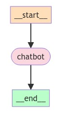

# 快速入门

在这个综合快速入门中，我们将构建一个LangGraph支持的聊天机器人，它可以：

- 通过**搜索网络**回答常见问题
- 在多次调用之间**保持对话状态**
- 将复杂查询路由给**人类审核**
- 使用**自定义状态来控制其行为**
- **回溯并探索替代的对话路径**

我们将从一个基本的聊天机器人开始，并逐步增加更复杂的功能，同时介绍LangGraph的关键概念。

## 设置

首先，安装所需的包：

```py
pip install -U langgraph langsmith

# 用于本教程；不是LangGraph的必要要求
pip install -U langchain_anthropic
```

接下来，设置您的API密钥：

```py
import getpass
import os


def _set_env(var: str):
    if not os.environ.get(var):
        os.environ[var] = getpass.getpass(f"{var}: ")


_set_env("ANTHROPIC_API_KEY")
```

（推荐）[LangSmith](https://smith.langchain.com/) 可以更容易地看到“幕后”的运行情况。

```py
_set_env("LANGSMITH_API_KEY")
os.environ["LANGCHAIN_TRACING_V2"] = "true"
os.environ["LANGCHAIN_PROJECT"] = "LangGraph Tutorial"
```


## 第一部分：构建一个基本的聊天机器人

我们将首先使用LangGraph创建一个简单的聊天机器人。这个聊天机器人将直接响应用户消息。尽管简单，但它将展示使用LangGraph构建的核心概念。在本节结束时，您将构建一个基础的聊天机器人。


首先，创建一个`StateGraph`。==`StateGraph`对象将我们的聊天机器人的结构定义为“状态机”。我们将添加`nodes`来表示聊天机器人可以调用的llm和函数，并添加`edges`来指定机器人在这些函数之间的转换方式==。

```python
from typing import Annotated
from typing_extensions import TypedDict
from langgraph.graph import StateGraph, START, END
from langgraph.graph.message import add_messages

class State(TypedDict):
    # 消息的类型为“list”。注释中的`add_messages`函数定义了该状态键应如何更新
    # （在本例中，它将消息添加到列表中，而不是覆盖它们）
    messages: Annotated[list, add_messages]
    # Annotated 是一个用来附加元数据到类型注解上的工具。它允许我们在类型注解中添加额外的信息，这些信息不会影响类型检查，但是可以在运行时使用。
    # Annotated[list, add_messages]表示消息的类型是一个列表，并且通过注释add_messages指定了如何更新这个列表。

graph_builder = StateGraph(State)
```

**注意：** 

> 将 `State` 定义为一个带有单个键 `messages` 的 `TypedDict` 意味着我们在定义一个字典类型，其中这个字典只有一个键 `messages`，并且这个键的值有特定的类型和行为。
>
> 我们将`State`定义为一个带有单个键`messages`的TypedDict。`messages`键用[`add_messages`](https://langchain-ai.github.io/langgraph/reference/graphs/?h=add+messages#add_messages)函数进行注释，这告诉LangGraph将新消息添加到现有列表中，而不是覆盖它们。

因此，我们的图知道两件事：

1. 我们定义的每个`node`将接收当前的`State`作为输入，并返回一个更新该状态的值。
2. `messages`将被*添加*到当前列表中，而不是直接覆盖。这通过`Annotated`语法中的预构建函数[`add_messages`](https://langchain-ai.github.io/langgraph/reference/graphs/?h=add+messages#add_messages)传达。


接下来，添加一个“`chatbot`”节点（node）。==节点（node）代表工作单元。它们通常是常规的Python函数==。

```python
from langchain_anthropic import ChatAnthropic

llm = ChatAnthropic(model="claude-3-haiku-20240307")

def chatbot(state: State):
    return {"messages": [llm.invoke(state["messages"])]}

	# 这个函数接收一个State作为输入。State是一个字典，包含一个键messages，其值是一个消息列表。
	# llm.invoke(state["messages"])调用语言模型（llm）生成一个新的消息。
	# 返回一个新的状态字典，包含一个更新的messages列表，其中只有最新生成的消息。

# 第一个参数是唯一的节点名称
# 第二个参数是每次使用节点时将调用的函数或对象
graph_builder.add_node("chatbot", chatbot)
```

**注意：** 

> `chatbot`节点函数如何将当前的`State`作为输入并返回更新的`messages`列表。这是所有LangGraph节点函数的基本模式。

我们`State`中的`add_messages`函数将llm的响应消息**添加**到状态中已存在的消息中。


接下来，添加一个“入口”点。这告诉我们的图**每次运行时从哪里开始工作**。

```python
graph_builder.add_edge(START, "chatbot")
```

同样，设置一个“结束”点。这指示图形**“每次运行此节点时，您可以退出。”**

```python
graph_builder.add_edge("chatbot", END)
```

最后，我们需要能够运行我们的图。为此，调用图构建器上的“`compile()`”。这会创建一个我们可以在状态上调用的“`CompiledGraph`”。

```python
graph = graph_builder.compile()
```

您可以使用`get_graph`方法和一种“draw”方法（如`draw_ascii`或`draw_png`）来可视化图形。`draw`方法每个都需要额外的依赖项。

```python
from IPython.display import Image, display

try:
    display(Image(graph.get_graph().draw_mermaid_png()))
except Exception:
    # 这需要一些额外的依赖项，是可选的
    pass
```




现在让我们运行聊天机器人！

**提示：** 您可以随时通过输入“quit”、“exit”或“q”退出聊天循环。

```python
while True:
    user_input = input("User: ")
    if user_input.lower() in ["quit", "exit", "q"]:
        print("Goodbye!")
        break
    for event in graph.stream({"messages": ("user", user_input)}):
        for value in event.values():
            print("Assistant:", value["messages"][-1].content)
            
    # graph.stream 函数将用户输入传递给图，并返回一个事件流。{"messages": ("user", user_input)} 表示用户输入的消息。
	# 对于每个事件（event），我们迭代其值（event.values()）
	# 打印助手生成的最后一条消息内容（value["messages"][-1].content）
```

```python
User:  what's langgraph all about?
Assistant: Langgraph is a new open-source deep learning framework that focuses on enabling efficient training and deployment of large language models. Some key things to know about Langgraph:

1. Efficient Training: Langgraph is designed to accelerate the training of large language models by leveraging advanced optimization techniques and parallelization strategies.

2. Modular Architecture: Langgraph has a modular architecture that allows for easy customization and extension of language models, making it flexible for a variety of NLP tasks.

3. Hardware Acceleration: The framework is optimized for both CPU and GPU hardware, allowing for efficient model deployment on a wide range of devices.

4. Scalability: Langgraph is designed to handle large-scale language models with billions of parameters, enabling the development of state-of-the-art NLP applications.

5. Open-Source: Langgraph is an open-source project, allowing developers and researchers to collaborate, contribute, and build upon the framework.

6. Performance: The goal of Langgraph is to provide superior performance and efficiency compared to existing deep learning frameworks, particularly for training and deploying large language models.

Overall, Langgraph is a promising new deep learning framework that aims to address the challenges of building and deploying advanced natural language processing models at scale. It is an active area of research and development, with the potential to drive further advancements in the field of language AI.
User:  hm that doesn't seem right...
Assistant: I'm sorry, I don't have enough context to determine what doesn't seem right. Could you please provide more details about what you're referring to? That would help me better understand and respond appropriately.
User:  q
Goodbye!
```

**恭喜！** 您已经使用LangGraph构建了第一个聊天机器人。这个机器人可以通过接收用户输入并使用LLM生成响应来进行基本对话。您可以在提供的链接中查看上面调用的[LangSmith Trace](https://smith.langchain.com/public/29ab0177-1177-4d25-9341-17ae7d94e0e0/r)。

但是，您可能已经注意到，机器人的知识仅限于其训练数据。在下一部分，我们将添加一个网络搜索工具，以扩展机器人的知识并使其更有能力。

下面是本节的完整代码供您参考：

**完整代码**

```python
from typing import Annotated
from langchain_anthropic import ChatAnthropic
from typing_extensions import TypedDict
from langgraph.graph import StateGraph
from langgraph.graph.message import add_messages

class State(TypedDict):
    messages: Annotated[list, add_messages]

graph_builder = StateGraph(State)

llm = ChatAnthropic(model="claude-3-haiku-20240307")

def chatbot(state: State):
    return {"messages": [llm.invoke(state["messages"])]}

# 第一个参数是唯一的节点名称
# 第二个参数是每次使用节点时将调用的函数或对象
graph_builder.add_node("chatbot", chatbot)
graph_builder.set_entry_point("chatbot")
graph_builder.set_finish_point("chatbot")
graph = graph_builder.compile()
```


## 第二部分：增强聊天机器人工具

为了处理我们聊天机器人无法“从记忆中”回答的查询，我们将集成一个网络搜索工具。我们的机器人可以使用这个工具来查找相关信息并提供更好的响应。

**要求**

在开始之前，请确保您已安装必要的软件包并设置了API密钥：

首先，安装使用[Tavily搜索引擎](https://python.langchain.com/v0.2/docs/integrations/tools/tavily_search/)的必需组件，并设置您的[TAVILY_API_KEY](https://tavily.com/)。

```python
pip install -U tavily-python
pip install -U langchain_community
```

```python
_set_env("TAVILY_API_KEY")
```

接下来，定义工具：

```python
from langchain_community.tools.tavily_search import TavilySearchResults

tool = TavilySearchResults(max_results=2)
tools = [tool]
tool.invoke("What's a 'node' in LangGraph?")
```

输出结果：

```python
[{'url': 'https://medium.com/@cplog/introduction-to-langgraph-a-beginners-guide-14f9be027141',
  'content': 'Nodes: Nodes are the building blocks of your LangGraph. Each node represents a function or a computation step. You define nodes to perform specific tasks, such as processing input, making ...'},
 {'url': 'https://js.langchain.com/docs/langgraph',
  'content': "Assuming you have done the above Quick Start, you can build off it like:\nHere, we manually define the first tool call that we will make.\nNotice that it does that same thing as agent would have done (adds the agentOutcome key).\n LangGraph\n🦜🕸️LangGraph.js\n⚡ Building language agents as graphs ⚡\nOverview\u200b\nLangGraph is a library for building stateful, multi-actor applications with LLMs, built on top of (and intended to be used with) LangChain.js.\n Therefore, we will use an object with one key (messages) with the value as an object: { value: Function, default?: () => any }\nThe default key must be a factory that returns the default value for that attribute.\n Streaming Node Output\u200b\nOne of the benefits of using LangGraph is that it is easy to stream output as it's produced by each node.\n What this means is that only one of the downstream edges will be taken, and which one that is depends on the results of the start node.\n"}]
```

结果是页面摘要，我们的聊天机器人可以用来回答问题。

接下来，我们将开始定义我们的图。以下所有内容与第一部分相同，只是我们在LLM上添加了`bind_tools`。这使得LLM知道如果它想使用我们的搜索引擎，该使用什么样的JSON格式。

```python
from typing import Annotated

from langchain_anthropic import ChatAnthropic
from typing_extensions import TypedDict

from langgraph.graph import StateGraph, START
from langgraph.graph.message import add_messages


class State(TypedDict):
    messages: Annotated[list, add_messages]


graph_builder = StateGraph(State)


llm = ChatAnthropic(model="claude-3-haiku-20240307")
# 修改：告诉LLM它可以调用哪些工具
llm_with_tools = llm.bind_tools(tools)


def chatbot(state: State):
    return {"messages": [llm_with_tools.invoke(state["messages"])]}


graph_builder.add_node("chatbot", chatbot)
```

接下来，我们需要创建一个实际运行工具的函数。如果调用了工具，我们将通过将工具添加到新节点来实现这一点。

下面，实施一个`BasicToolNode`，检查状态中的最新消息，并在消息包含`tool_calls`时调用工具。它依赖于LLM的`tool_calling`支持，该支持在Anthropic、OpenAI、Google Gemini和许多其他LLM提供商中可用。

我们稍后将用LangGraph的预构建[ToolNode](https://langchain-ai.github.io/langgraph/reference/prebuilt/#toolnode)来替换它，以加快速度，但首先自己构建它是很有启发性的。

```python
import json
from langchain_core.messages import ToolMessage

class BasicToolNode:
    """运行最后一个AI消息中请求的工具的节点。"""

    def __init__(self, tools: list) -> None:
        self.tools_by_name = {tool.name: tool for tool in tools}

    def __call__(self, inputs: dict):
        if messages := inputs.get("messages", []):
            message = messages[-1]
        else:
            raise ValueError("输入中找不到消息")
        outputs = []
        for tool_call in message.tool_calls:
            tool_result = self.tools_by_name[tool_call["name"]].invoke(
                tool_call["args"]
            )
            outputs.append(
                ToolMessage(
                    content=json.dumps(tool_result),
                    name=tool_call["name"],
                    tool_call_id=tool_call["id"],
                )
            )
        return {"messages": outputs}

tool_node = BasicToolNode(tools=[tool])
graph_builder.add_node("tools", tool_node)
```

添加工具节点后，我们可以定义`conditional_edges`。

回想一下，**edges**将控制流从一个节点路由到下一个节点。**Conditional edges**通常包含“if”语句，以根据当前图形状态路由到不同的节点。这些函数接收当前的图形`state`并返回一个字符串或字符串列表，指示接下来调用哪个节点。

下面，定义一个名为`route_tools`的路由函数，检查聊天机器人的输出中是否有tool_calls。通过调用`add_conditional_edges`将此函数提供给图形，这告诉图形每当`chatbot`节点完成时检查此函数以查看接下来该去哪里。

该条件将路由到`tools`，如果存在工具调用，则路由到"`__end__`"。

稍后，我们将用预构建的[tools_condition](https://langchain-ai.github.io/langgraph/reference/prebuilt/#tools_condition)替换它，以使其更加简洁，但首先自己实现它会更加清晰。

```python
from typing import Literal

def route_tools(
    state: State,
) -> Literal["tools", "__end__"]:
    """
    在conditional_edge中使用，如果最后一条消息有工具调用，则路由到ToolNode。
    否则，路由到结束。
    """
    if isinstance(state, list):
        ai_message = state[-1]
    elif messages := state.get("messages", []):
        ai_message = messages[-1]
    else:
        raise ValueError(f"输入状态中找不到消息：{state}")
    if hasattr(ai_message, "tool_calls") and len(ai_message.tool_calls) > 0:
        return "tools"
    return "__end__"

# `tools_condition`函数在聊天机器人请求使用工具时返回“tools”，在直接响应时返回“__end__”。
# 这种条件路由定义了主代理循环。
graph_builder.add_conditional_edges(
    "chatbot",
    route_tools,
    {"tools": "tools", "__end__": "__end__"},
)
# 每次调用工具时，我们返回到聊天机器人以决定下一步
graph_builder.add_edge("tools", "chatbot")
graph_builder.add_edge(START, "chatbot")
graph = graph_builder.compile()
```

**注意：** 

> 条件边从单个节点开始。这告诉图形“每次运行`chatbot`节点时，如果调用工具，则转到`tools`，否则结束循环。”

就像预构建的`tools_condition`一样，我们的函数如果没有工具调用，则返回"`__end__`"字符串。当图形过渡到`__end__`时，它没有更多的任务要完成并停止执行。因为条件可以返回`__end__`，所以这次我们不需要显式设置一个`finish_point`。我们的图形已经有了结束的方法！

让我们可视化我们构建的图形。以下功能需要一些额外的依赖项来运行，这对于本教程并不重要。

```python
from IPython.display import Image, display

try:
    display(Image(graph.get_graph().draw_mermaid_png()))
except Exception:
    # 这需要一些额外的依赖项，是可选的
    pass
```

![No description has been provided for this image](data:image/jpeg;base64,/9j/4AAQSkZJRgABAQAAAQABAAD/4gHYSUNDX1BST0ZJTEUAAQEAAAHIAAAAAAQwAABtbnRyUkdCIFhZWiAH4AABAAEAAAAAAABhY3NwAAAAAAAAAAAAAAAAAAAAAAAAAAAAAAAAAAAAAQAA9tYAAQAAAADTLQAAAAAAAAAAAAAAAAAAAAAAAAAAAAAAAAAAAAAAAAAAAAAAAAAAAAAAAAAAAAAAAAAAAAlkZXNjAAAA8AAAACRyWFlaAAABFAAAABRnWFlaAAABKAAAABRiWFlaAAABPAAAABR3dHB0AAABUAAAABRyVFJDAAABZAAAAChnVFJDAAABZAAAAChiVFJDAAABZAAAAChjcHJ0AAABjAAAADxtbHVjAAAAAAAAAAEAAAAMZW5VUwAAAAgAAAAcAHMAUgBHAEJYWVogAAAAAAAAb6IAADj1AAADkFhZWiAAAAAAAABimQAAt4UAABjaWFlaIAAAAAAAACSgAAAPhAAAts9YWVogAAAAAAAA9tYAAQAAAADTLXBhcmEAAAAAAAQAAAACZmYAAPKnAAANWQAAE9AAAApbAAAAAAAAAABtbHVjAAAAAAAAAAEAAAAMZW5VUwAAACAAAAAcAEcAbwBvAGcAbABlACAASQBuAGMALgAgADIAMAAxADb/2wBDAAMCAgMCAgMDAwMEAwMEBQgFBQQEBQoHBwYIDAoMDAsKCwsNDhIQDQ4RDgsLEBYQERMUFRUVDA8XGBYUGBIUFRT/2wBDAQMEBAUEBQkFBQkUDQsNFBQUFBQUFBQUFBQUFBQUFBQUFBQUFBQUFBQUFBQUFBQUFBQUFBQUFBQUFBQUFBQUFBT/wAARCADaAMcDASIAAhEBAxEB/8QAHQABAAIDAAMBAAAAAAAAAAAAAAYHBAUIAgMJAf/EAE8QAAEDBAADAwYIBg8IAwAAAAECAwQABQYRBxIhEzFVCBYiQZTRFBUXMlFhk+E3QkNxdbQJIyQ0NlJUVmJ2gZKhs8EYJTNzkZWx0kWCg//EABsBAQACAwEBAAAAAAAAAAAAAAACAwEEBQYH/8QANREAAgECAgcFBgcBAQAAAAAAAAECAxETIQQSMUFRUpEFFBVhsSJicYGh8DIzQnLB0eE0Y//aAAwDAQACEQMRAD8A+qdKUoBSlKAViTbtBtpQJk2PFK+qQ+6lHN+bZrLqs8/hR52f2pEmO1ISLZIIS6gKAPatfTRyjCMpy2JNl1GnizUL7ScedVl8Yge0o99POqy+MQPaUe+q783rX4bD+wR7qeb1r8Nh/YI91cnxXR+SXVHT8O976FiedVl8Yge0o99POqy+MQPaUe+q783rX4bD+wR7qeb1r8Nh/YI91PFdH5JdUPDve+hYnnVZfGIHtKPfTzqsvjED2lHvqu/N61+Gw/sEe6nm9a/DYf2CPdTxXR+SXVDw73voWJ51WXxiB7Sj3086rL4xA9pR76rvzetfhsP7BHup5vWvw2H9gj3U8V0fkl1Q8O976FiedVl8Yge0o99eTWS2h91Dbd1hOOLISlCZCCVE9wA3Vc+b1r8Nh/YI91ay/wBmt8Vi3uswYzLqbrb9LbZSlQ/djPrAq+h2hQr1oUVFrWaW1b3YjLQNWLlrbC66UpW+cgUpSgFKUoBSlKAUpSgFKUoBSlKAVXOa/hBtf6Lkf5rVWNVc5r+EG1/ouR/mtVVW/IqftZuaJ+dE8aUpXhD05osyziycPrOLpf5wgQ1OojoUG1urcdUdJQhCAVLUeukpBPQ/RUAyvykMex6ZhBjtTbjbMkfkNmWxb5a1sIZbcJIaSyVqX2iAko0FAcytaBNbjjnbLXc8PjC6W3IJwYnsyI0jGGFPToD6QookISnZ9HqD6KvnaKSCaq8zM4dsXCzMMnsd3usixXyaZbcW3f7wXDcYkMMSHIrfVKyFNlaEjpvuHUDbpU4SjeXnv8sjWqTknZeXqWxk3HPCMNuzNuvV6Vb5LjbbpLsN/s2kudEF1wN8jW/6ZTWTkvGHEsSyMY/crk6m9qjty0wI0KRJdUytSkJWEtNq2NoVvXzdAnQI3Q/GprKM+Od2+Tac2kR59naGL221Mux4au0jbcMxSSkdol0qCmnj3JASlRNWHw8tE53jOL4/ap0aK7g1rjpky4q2uV3t31uMkqA04AUFSD1HTYqTpQjBSfDj8PIiqk3LVRvOHHHG28QsvynH24c2JKs9xchtKXCkht5tDbalLU4ppKEK5lqAQVcxAChsKBqzKp7hm/OxHinn9iuFju6U3u9qu0K6tQlrgLZVEZSQp8eihQUypPKrR2Rre6uGqKqipezssi6m21mK1GTfvOB+lLf+uM1t61GTfvOB+lLf+uM1tdnf9tH90fVCr+XL4Mt+lKV7A8iKUpQClKUApSlAKUpQClKUApSlAKrnNfwg2v8ARcj/ADWqsao5kuDQcnnxpr8mbFkx2lMpXDf7PaVEEg9DvqkViUVUhKDdrpovoVFSqKbK5yvh7jGdKjHI8ftl9MXmDBuEVD3Zc2ubl5gdb5U719ArQf7P3DLe/MDG/wDtbP8A61aXyVQfGL37b91Pkqg+MXv237q4q7LmlZVvU6z02g83EhWLcOMVwd997HcctdjdkJCHV2+IhkuJB2AopA2BUjrZfJVB8Yvftv3U+SqD4xe/bfuqL7Jcnd1V0ZJafSWSTNbSq04yRZuE8TuEdjtl7uiIGS3d+HcA7I5lKbQzzp5Tr0Tv11bvyVQfGL37b91Y8H/9V0ZnxClwZHr5Yrdk1qkWy7QY9zt0gAOxZbQcacAII5knoeoB/sqII4A8NGztOA44k6I2LYyOhGiPm/RVofJVB8Yvftv3U+SqD4xe/bfuqa7KlHJVl0ZF6dRe2JXFr4J8P7HcY1wt+FWGDOjLDrMmPbmkONrHcpKgnYI+mt9k37zgfpS3/rjNSn5KoPjF79t+6v1PCi2dvHcduN2kpYfbkJael8yCttYWnY11HMkH+ytjR+z3Sr0606t9Vp7HudyEtNpOLjFWuTWlKV0ziClKUApSlAKUpQClKUApSlAKUpQClKUApSlAKUpQHO/lI/hx8nn+sMv9WNdEVzv5SP4cfJ5/rDL/AFY10RQClKUApSlAKUpQClKUApSlAKUpQClKUApSlAKUpQClKUApSlAKUpQHO/lI/hx8nn+sMv8AVjXRFc7+Uj+HHyef6wy/1Y10RQClKUApSlAKUpQClKUApSlAKUpQClKUApSlAKUpQClKUApWoyLKYGMMNrlqcced2GYsdBceeI1vlSPUNjajpI2NkVEZGe5HJUTEs0CG3s6+Gy1LcI+kpQjQ/MFGrY05NXeS83YuhRqVPwosWsW6WyLerbLt8+O3Lgy2Vx32HRtDraklKkqHrBBIP56r/wA88u/k1k/vPU888u/k1k/vPVLCXMupb3StwPjp5RfBuXwK4wX7EXwpcVh7tre+r8vFX6TSt+s69FX9JKh6q+r3kU8F3+B/AOz2qehbV6ujirxcWXO9p51CAG9eopbQ2kj+MlX01EOLnBg8Zs/wrLL5EtIn4w/2qW2u05ZiAoLQ07sbKErHMB/SWPxulueeeXfyayf3nqYS5l1HdK3AsqlVr555d/JrJ/eer9Tm2WNkFUCzPj1pD7rf+PKr/wAUwveXUd0rcCyaVErFxDjz5TMK5w3bNPdPK2HD2jDqv4qHR039CVcqj6getS2q5QlDaa8oSg7SVhSlKgQFKUoBSlKAUpSgFKUoBSlKAUpSgFYF8vDGP2eZcZO+xjNlxQT3q13JH1k6A+s1n1C+LC1DG4jf5N25REub6jXbJI/xCatpRU5qL2E4R1pKPEjMJmQ+87criQ5dpYSX1A7DYHcyg+pCdnQ9ZKlH0lEnMpVQ3a9Zbn3FfIsVx/JPNC243DiOyJLMFmTIlvyAtSR+2hSUtpS310Nkk9RqqJyc5OTPTZU0kkWm3d4Lt0etqJsddxZaS+7DS6kvNtqJCVqRvYSSlQBI0eU/RWXXPE3HMsunH3I4tnzD4juLGJWz4RcG7a08ZLoelAHkXtKEFXMSACeoAUNdcV7i9kWd4Tw/kWW93S25TeLObjJtOO2eNNW4BypLy1SVBDTIXzDRUFKKgAfRNQIYtr3R0gpxKFJSpQSVnSQT3nW9D+wH/pWLHu8GZcJkFibHfnQwgyYzbqVOMc4JRzpB2nmAJG+/XSuX03nIeL108n+/qyCVjlzuca5dqq3xo60tPIjqDjiEutrHp8pGjsAHpo9akRx/LLvxs4srxbLfNuXGjWlXK5AZkNyXPgzhSHSsbSjoQeTR9Le+mqWMYt9i+7XOia/FOJQpKVKCSs6SCe863of2A/8ASudMC4o5j5QEuAzZb2MGYjY9Dukx2PBalOPypCnUhKQ8FAMp7FR6ekeYDmFR8XzIeL1+4G3lWQSMduklV5iPuWyOw4hD8dt1px1sPNrGnOzI0rYAPTr1oZxk1dL7vY6nlRWZ0dxh9tLrLg5VIV3EVI+H98fkCZZ5zqn5UAIU0+4rmW9HUCEKUfWoKStJPr5QT1VWgSCEgE8xA7z66Y4tTfEm2hH5W2Sw4Nd4S5HIP9hOv/sa2aL1r03wb+az9FYp0yClSct6LPpSlVnnxSlKAUpSgFKUoBSlKAUpSgFKUoBWlzKxLyPG5kFlYbkqCXGFk6CXUKC2yT9HMkb+rdbqlSjJwkpLcZTs7oqi2zhcYaHuzUy51S6wv5zLg6KQr60kEH81QvL+DtvynJk5FEvV7xi9qjCHImWKUlkymQSUodStC0q5SpWlaChs9at7J8IVcJblztDzcG6LADyXUlTErQAHOB1CwAEhY660CFBKQKxuvENqwZ3Bwy42uacmmx1zGIcBIlBbCSQXeZJ9FOwR6YT1H5qm6Wu70+l8112/ew71PSaVWPtuzPKwcOLfj+TSL81MuEqe/aotocVMfDvM0wXChZJTzFwlxXMok76dB13E4Pk5WOzwMej2m+5DZ3rNbTaEzIMttt+VE5+fs3T2euiiSFICFDZ0RVkfGE/+bl69k++nxhP/AJuXr2T76x3erwLtei96K9T5PNgi4rjlkt91vdr83ZT0m1XGJKQJcUO8/O0FqQQpBS4U6UlR0Bsk9a/L35P1uvV3ulyTlWU22RdmGI1x+AT0NCY202G0hf7WSCRzEqSUq2tXUDQEuu2dQ7DcLZAucSXbp1zcLMCLLDbTstY1tLSVLBWRsdE7PUVtfjCf/Ny9eyffTu9XgY1qPFEFvPAaxTHba9ZbjeMOkQbcm0Iex+UllTkNPVDK+dCwQkkkK0FDmOlda9ly4EY7IxvF7Ra37jjYxlZXa5tpkBEhjmQpDg5lpWFc4Urm5gdk7qbfGE/+bl69k++v1Mu6OkBrGby4o+osob/xWsD/ABp3erw9BrUeKMqKwY0ZlkuuPFtAR2jp2tehraiPWfXWz4eQVXC73C+qBEZLYgw1b2HEg8zrg+oqCU//AJE9xFQvhrfofF+75FbvhDlvGPy/gV0tK2HW5XaddBTikpSEKCT/AMPm5h1CgO+748dqIw2ww2hllpIQhttISlCQNAADuAHqqSSpJq92/p8/vL6aGlaTGccOB7KUpVJyhSlKAUpSgFKUoBSlKAUpSgFKUoBX4SB3nX5610/IYEC4M2xUyMbxJZcfi25T6EPyEo1zFCSdkDY2e4bG6rSFhM/jrimN3DiZj8nFbhbbqboxYrfeVqQQhRMf4SW+UKUn0V6B6KQDsAqRQGdcciu3FRzPcMtEfI8GdtyG4jOXLiIShx5Q5l/BkrO1gJ5RzgD550UkJJnWM4+nGrDbLaZsu6uwYrcX4wuKw5KfCQBzOLAHMo62TrqetbWlAKUrW5JZE5Ljt1tC5cqAi4RXYhlwlhD7IWgp521EEBad7BIIBA6GgPkF5ZflGTOJ/lELu9guCmrXij4iWSRHX+O0vmVISe7anBsK/ipR9FfUvyf+L0PjlwlsGXxOVt6YzyTI6fyElHouo+nXMCRvvSUn11xDxb/Y/wDh7gXEjhXj9vvOTPQ8quj8Ka5JlR1ONoQzzgtFLAAO+/mChr1V2t5P/k/495OGGzMaxqZc50CVPXcVuXV1tx0OKbbbIBbbQOXTSfVvZPXu0BZlKUoCL8RcAicSMPumPyZ9ws6J6Uc0+zyDGlNKQoKQpLg9YKR37BHStLHvWU4pmmK4i3jc7IMXctvZycwfntqdZktpP/HbPpK5wlJ5x+MvuqwqUBq8cyiz5hbBcbHdId3gFamvhMJ5LrfOk6UnaSRsHoRW0qsMo4V3HHcOuETg+7ZMBvcu4puTy121LkaUvoFoWlOuTnCUgqSCQAdAE7G3h8WLWrim5w7kx7i1kDdtTckSlQHEQ5TewHC051HoEo2CdArABJB0BOKUpQClKUApSlAKUpQClKUAqusxz2dfW8vxXh1cLU7xFsrUYuRrwh1EeKH/AEkOKIT6f7XzKHLsbAB13VYtVpcpyMb472aNCwRUheS29/4wy+M2T8H+DAFth4hB0lXN6JUsdegB9QG9tPDazoyO35fdrXbZudtW1u3v3xmNyKIAJX2YJVyJKlL9ZOiEkkCpdSlAKUpQClKo7jX5Q0jGsgZ4fcPLajLuKE9vmbgJV+5rW2dfuiYsfMSNghOwVbHdzJ2BH/KPuURzyhvJ6tiJLS7im9S5KoiVguhr4OR2hT3hOwRvu6H6DXSNU7wL8nmPwxkzcoyO5Ly/iVeBzXTJJY2ob/IR0/kmU6AAAG9DegEpTcVAKUpQClKUAr0TYbdwiPxnecNvNqaUWlqbWEqGjyqSQUn6wQR6q99KAqCPi+Q8A8Fxyw4BZ5mdwGrn2Upu9XnUqNEcUdFpa08pS1zJ0nppCD3klQtK1Xu3X1p522z4twaZdUw4uK8l1KHE9FIUUk6UPWD1FZtVT5OsrCZeNZKrBYc2FATkc9E5E4kqXOCx26k7Ur0Cda7vzCgLWpSlAKUpQClKUApSlAK+fflE/skFzxfNYeO4xit3sUqx3VpV7bvS4yHJSG1rD0MJQHkpQsBsh9Dm+/SSNE/QB+Q1FbLjzqGkDvU4oJH/AFNcXeXl5M9j4yWR3NsTmW8ZxbWf3RGakI3dI6R8zQPV1IHonvUPRO/R1JRlLYgTPyHPKbzTylrfl87KrVZ7dFtTsVmE5aWHWw6tYdLoX2jq98oS1rWvnHv9XUVcpfseWPQeHHk4W9VzksW253qbIub8aW4lt1AJDTe0q0QChpKx9S9+uumfOqy+MQPaUe+pYc+VmbM2lKxodzh3DfwWWxJ11PYuBf8A4Ncz5NxFyryosin4XwvmSMewKE6qLf8APUJKXH1DouLb996vUXfVvY6cvPBprJmDbcS+OmQ5/mMvhhwY7GXkDHoXzLXU9pAsCDsEA9zsjodIGwCOu9K5bF4KcC8e4H2B+Ja+2uN4nr+EXW/T1dpMuL52S46s9dbJ0nehs95JJ3fDLhfjfCDEYmN4rbW7bbI/UhPVx5Z+c44vvWs66k/UBoAASusAUpSgFKUoBSsSbdoNtKBMmx4pX1SH3Uo5vzbNY3nVZfGIHtKPfU1CTV0jNmbSlavzqsvjED2lHvp51WXxiB7Sj31nDnysWZTHlZ+U/N8l+y4/dm8MVlNvuch2K8+Lj8ETFcSlKm0n9qc5isdoR3a7M9+6534T/sl9+zfLLbisLhRCl3a8XHsYwhXdUdCErUNFwFheykbKl7A0CdDVdX8ecPxjjfwoyHD5l3tqFzo5MSQuSj9zyU+k050O9BQG9d6SoeuuOf2Nzgczi2T5FnmXFi23C2uuWe2RpjqEKS53SHgCfUNNhQ2DzOD1Uw58rFmfRqlavzqsvjED2lHvp51WXxiB7Sj30w58rFmbSlavzqsvjED2lHvonKLMpQAu8Ek9ABJR1/xphz5WLM2lKUqswKiGXZc/Eli02kINwKQt+S4OZuIg93T8ZxX4qe4AFSunKlcrkPoix3XnDpttJWo/UBs1UONLcl2pu4v6Mu5H4a+ob6qWAQOvqSnlSPqSKtjaMXUe7Z8Td0Wiqs/a2I/F41BlvdvcWzeJZGjJuOnlnrvoCOVI+pIA+qvd5v2sf/Gw/sEe6odxg4uxOEcTH35UORMF1urFvPYMPOlpClem5ptCypQHcjoVHu3oisjIuNmG4pGtjt0ujsZVyjfDI8YQJK5PY9NuLZS2XG0jfUrSnR2Dog1W61SW2TO4nCOWSsSnzftfhsP7BPup5v2vw2H9gn3VHb/xgw/G7PaLnMvbS4l4Tz24wmnJTktPLzFTbbSVLUACCSBobG9VppXF5i5ZRw2ZxyRCulgyl2chyYAoqAYjrcHJ1HKrnRyqCgSNEaBqOJPmZlyiibPYrZ3lBZtsZDqSFJdabDbiSO4hSdEf2GttjV/dwvs4cxwyLGtwgSFJHaxVrXsqcUPntlSiSs+kkkqUVAlSIbYOLmJ5Rk8rH7VdTNucZbrbiURng1zNnTiUvFHZqKT0ISokVLnmUSGVtOoS42tJSpChsKB6EGrI1pbJu6+9nAqqUoVo2LQpUT4Y3ByZijcd9wuv2952CpZJJUltRDZJPUkt8hJPr3399Syk46knHgeclFxbixSlKgRFKUoCs8/hR52f2pEmO1ISLZIIS6gKAPatfTWH5vWvw2H9gj3Vss1/CDa/0XI/zWq8a5+n1JxnFJtZL1Z4vtaUlpLSe5Gv83rX4bD+wR7qeb1r8Nh/YI91bCtZkuTWvD7JKu96nNW62xgC7IeOgNkAAeskkgADZJIABJrm4tR/qfU46nNuybPPzetfhsP7BHup5vWvw2H9gj3VEYfHfBZtiu14TfkswrT2Zn/CorzDsZLiglCltOIS4EqJ6K5ddD16GthivFjFc0lz4tquvaSYLKZL7UmO7GUGVb5XUh1Keds6Ppp2n66zr1lvf1LGqyTbTy+JvvN61+Gw/sEe6nm9a/DYf2CPdVVRvKOsmUcTsLxvFJ0e6wruuaJj64j6PQZYUtCmHFBKFpK06Kk8419HfVy0lOrHbJ9TE1Vp217q5r/N61+Gw/sEe6tLmlktzGLXFxqBFbcS3tK0MpBB2O46qVVos5/glc/+V/qK2dEq1HpFNaz/ABLf5lmjzljQz3r1LlpSldg+imNcoguFulRSdB9pTe/o2CP9aqXFXFLxu2haVIdbYSy4hQ0UrQOVYP5lJIq46rrKrC7jlxk3WIwp61S1l2Y20NrjOkAF0J9batelrqlXpaIUoouiteDprbtX9ffCx0NDqqnNqW8qbygrbcZOOY5crfbZd3+JMjt91kxIDZdkLYac/bC2gdVqAVvlHU6NRZWRy8V4r3LOXsTya6WfIbHFjRfgdpcdlxHWHXuZh1jXO0F9olQKgE7B2RV6xpLMxhD8d1D7Lg5kONqCkqH0gjoa9laryyZ2HC71kzlrh1iWQ8GZeCZFfccudxipsdwt8iFZoxmvWp1+d8LbT2aNqKeQ9kVIB0UDehXnjOKZJj97wvL5mNXNuFIzC8XN22R2O0k2+POZW2yp1tJ6elpa9b5ec77jXUVKxcgqKVrPZ/n9FA4B8a2LjF8W4rZ8mtuHS5E9+9Qb7ALcKK9sqQ/CePUh1wkltKlJ0onSSNVf1KxYcZ7MJC7fbHCIwVyTLijfIynelIbUOhdI2AB8z5yvxUrshB1H5b3wJNxoxbk8iScKI5GOy5miEz7hIkI2NEoCuzSfzENgj6iKmleiFDYt0NiJGaSxGYbS000gaShCRoAfUABXvq2pLXm5I83OWvJy4ilKVWQFKUoCuc1/CDa/0XI/zWq8a8s1/CDa/wBFyP8ANaqOZXw9xjOlRTkeP22+mLzBg3CKh7subXNy8wOt8qd6+gVzO0LYkb8F/J4rtW3es+CJDVR+UviV1yrDLI9a4k65fE19iXWXAtchTEuTHb5w4llaVJIcHOFp0oElA0d6ref7PvDLf8AMb/7Wz/61vcV4b4rgz772O45a7G7ISEOrt8RDJcSDsBRSBsCucmou6OZCUaclOLd15f6c95lhNtyXhZndzxzGc6XfXocW3oXkypz8mS0JKHS2y0+ta9IIJJ5QOp1vrUo414Df804g5BGs8WQj4w4e3C2tTeRSWDIVJaKGVOa5QpQ5uhO9FR7t1f8ASpYrRYtJkmmt19ufD+jnSyXubmHETg6I+EZHj0ewtTmp3xhanGI8QmEW0oDmuVSeYaSoeienXZ1XRdY1xt0W8W+TBnR2pkKS2pl+O+gLQ6hQ0pKknoQQSCDUJHk/8MwQRgGOAjuItjP/AK1FyUtuRCc4VLXyt897fHzJ/Wizn+CVz/5X+orQRuA3DeHIafYwTHWX2lBbbiLYyFJUDsEHl6EGt/nP8Ern/wAr/UVsaJbvNO3MvUzQUcaGq969fiXLSlK7h9GFKUoCL3PhvYbnJckiM7BkuHa3bfIcjlZ3slQQQFHfrIJrA+SiB4vevbfuqb0q9V6i/UWKrOOSkyEfJRA8XvXtv3U+SiB4vevbfuqb0rOPU4+hLGqczIczwqsYUDKXcLkkEHs5c5xTZ19KAQk/mIIqVxIjECM3HjMtx47SQlDTSAlCAO4ADoBXupVcqk55SZXKUpfidxSlKrIilKUApSlARzJcGg5PPjTX5M2LJjtKZSuG/wBntKiCQeh31SK1nyVQfGL37b91TalWYkrJfwiuVOEneUU/kQn5KoPjF79t+6nyVQfGL37b91TalMR+XREcGlyLoiE/JVB8Yvftv3U+SqD4xe/bfuqbUpiPy6IYNLkXREJ+SqD4xe/bfup8lUHxi9+2/dU2pTEfl0QwaXIuiIT8lUHxi9+2/dXrkcIbXLaU1Iud4fZV85tczaVD6D0qdUrKqyTuvRGVRpJ3UV0QpSlVFp//2Q==)

现在我们可以问机器人其训练数据之外的问题。

```python
from langchain_core.messages import BaseMessage

while True:
    user_input = input("User: ")
    if user_input.lower() in ["quit", "exit", "q"]:
        print("Goodbye!")
        break
    for event in graph.stream({"messages": [("user", user_input)]}):
        for value in event.values():
            if isinstance(value["messages"][-1], BaseMessage):
                print("Assistant:", value["messages"][-1].content)
```

```python
User:  what's langgraph all about?
Assistant: [{'id': 'toolu_01L1TABSBXsHPsebWiMPNqf1', 'input': {'query': 'langgraph'}, 'name': 'tavily_search_results_json', 'type': 'tool_use'}]
Assistant: [{"url": "https://langchain-ai.github.io/langgraph/", "content": "LangGraph is framework agnostic (each node is a regular python function). It extends the core Runnable API (shared interface for streaming, async, and batch calls) to make it easy to: Seamless state management across multiple turns of conversation or tool usage. The ability to flexibly route between nodes based on dynamic criteria."}, {"url": "https://blog.langchain.dev/langgraph-multi-agent-workflows/", "content": "As a part of the launch, we highlighted two simple runtimes: one that is the equivalent of the AgentExecutor in langchain, and a second that was a version of that aimed at message passing and chat models.\n It's important to note that these three examples are only a few of the possible examples we could highlight - there are almost assuredly other examples out there and we look forward to seeing what the community comes up with!\n LangGraph: Multi-Agent Workflows\nLinks\nLast week we highlighted LangGraph - a new package (available in both Python and JS) to better enable creation of LLM workflows containing cycles, which are a critical component of most agent runtimes. \"\nAnother key difference between Autogen and LangGraph is that LangGraph is fully integrated into the LangChain ecosystem, meaning you take fully advantage of all the LangChain integrations and LangSmith observability.\n As part of this launch, we're also excited to highlight a few applications built on top of LangGraph that utilize the concept of multiple agents.\n"}]
Assistant: 根据搜索结果，LangGraph是一个与框架无关的Python和JavaScript库，它扩展了LangChain项目的核心Runnable API，以支持创建涉及多个代理或组件的更复杂的工作流。关于LangGraph的一些关键点：

- 它使得在多轮对话或工具使用中无缝管理状态变得更加容易，并且可以根据动态条件在不同节点/组件之间灵活路由。

- 它与LangChain生态系统集成，允许您利用LangChain的集成和可观测性功能。

- 它支持创建多代理工作流，其中不同的组件或代理可以比标准的LangChain AgentExecutor更灵活、更复杂地串联在一起。

- 核心思想是提供一个更强大、更灵活的框架，用于构建由大型语言模型驱动的应用程序和工作流，超越仅使用核心LangChain工具的可能性。

总体而言，LangGraph似乎是LangChain工具包的一个有用补充，重点是支持由大型语言模型驱动的更高级的多代理样式的应用程序和工作流。
User:  neat!
Assistant: I'm afraid I don't have enough context to provide a substantive response to "neat!". As an AI assistant, I'm designed to have conversations and provide information to users, but I need more details or a specific question from you in order to give a helpful reply. Could you please rephrase your request or provide some additional context? I'd be happy to assist further once I understand what you're looking for.
User:  what?
Assistant: I'm afraid I don't have enough context to provide a meaningful response to "what?". Could you please rephrase your request or provide more details about what you are asking? I'd be happy to try to assist you further once I have a clearer understanding of your query.
User:  q
Goodbye!
```

**恭喜！** 您已经在LangGraph中创建了一个可以使用搜索引擎检索最新信息的对话代理。现在它可以处理更广泛的用户查询。要检查您的代理刚刚执行的所有步骤，请查看此[LangSmith trace](https://smith.langchain.com/public/24b94adc-3356-4d9f-8f94-813f8004fdbe/r)。

我们的聊天机器人仍然无法自己记住过去的互动，限制了其进行连贯的多轮对话的能力。在下一部分，我们将添加**内存**来解决这个问题。

我们在本节中创建的图形的完整代码如下，替换了我们的`BasicToolNode`，用预构建的[ToolNode](https://langchain-ai.github.io/langgraph/reference/prebuilt/#toolnode)，并用预构建的[tools_condition](https://langchain-ai.github.io/langgraph/reference/prebuilt/#tools_condition)替换了我们的`route_tools`条件。

**完整代码：**

```python
from typing import Annotated

from langchain_anthropic import ChatAnthropic
from langchain_community.tools.tavily_search import TavilySearchResults
from langchain_core.messages import BaseMessage
from typing_extensions import TypedDict

from langgraph.graph import StateGraph
from langgraph.graph.message import add_messages
from langgraph.prebuilt import ToolNode, tools_condition


class State(TypedDict):
    messages: Annotated[list, add_messages]


graph_builder = StateGraph(State)


tool = TavilySearchResults(max_results=2)
tools = [tool]
llm = ChatAnthropic(model="claude-3-haiku-20240307")
llm_with_tools = llm.bind_tools(tools)


def chatbot(state: State):
    return {"messages": [llm_with_tools.invoke(state["messages"])]}


graph_builder.add_node("chatbot", chatbot)

tool_node = ToolNode(tools=[tool])
graph_builder.add_node("tools", tool_node)

graph_builder.add_conditional_edges(
    "chatbot",
    tools_condition,
)
# 每次调用工具时，我们返回到聊天机器人以决定下一步
graph_builder.add_edge("tools", "chatbot")
graph_builder.set_entry_point("chatbot")
graph = graph_builder.compile()
```

**PS：目前支持调用tools的接口**

截至 2024-07-08，参考：https://python.langchain.com/v0.2/docs/integrations/chat/

> [ChatOpenAI ](https://python.langchain.com/v0.2/docs/integrations/chat/openai/)是来自`langchain_openai`包中的，而不是`langchain_community.chat_models`中的。

| Model                                                        | [Tool calling](https://python.langchain.com/v0.2/docs/how_to/tool_calling/) | [Structured output](https://python.langchain.com/v0.2/docs/how_to/structured_output/) | JSON mode | Local | [Multimodal](https://python.langchain.com/v0.2/docs/how_to/multimodal_inputs/) | Package                   |
| ------------------------------------------------------------ | ------------------------------------------------------------ | ------------------------------------------------------------ | --------- | ----- | ------------------------------------------------------------ | ------------------------- |
| [AzureChatOpenAI](https://python.langchain.com/v0.2/docs/integrations/chat/azure_chat_openai/) | ✅                                                            | ✅                                                            | ✅         | ❌     | ✅                                                            | langchain-openai          |
| [ChatAnthropic](https://python.langchain.com/v0.2/docs/integrations/chat/anthropic/) | ✅                                                            | ✅                                                            | ❌         | ❌     | ✅                                                            | langchain-anthropic       |
| [ChatBedrock](https://python.langchain.com/v0.2/docs/integrations/chat/bedrock/) | ✅                                                            | ✅                                                            | ❌         | ❌     | ❌                                                            | langchain-aws             |
| [ChatCohere](https://python.langchain.com/v0.2/docs/integrations/chat/cohere/) | ✅                                                            | ✅                                                            | ❌         | ❌     | ❌                                                            | langchain-cohere          |
| [ChatEdenAI](https://python.langchain.com/v0.2/docs/integrations/chat/edenai/) | ✅                                                            | ✅                                                            | ❌         | ❌     | ❌                                                            | langchain-community       |
| [ChatFireworks](https://python.langchain.com/v0.2/docs/integrations/chat/fireworks/) | ✅                                                            | ✅                                                            | ✅         | ❌     | ❌                                                            | langchain-fireworks       |
| [ChatGoogleGenerativeAI](https://python.langchain.com/v0.2/docs/integrations/chat/google_generative_ai/) | ✅                                                            | ✅                                                            | ❌         | ❌     | ✅                                                            | langchain-google-genai    |
| [ChatGroq](https://python.langchain.com/v0.2/docs/integrations/chat/groq/) | ✅                                                            | ✅                                                            | ✅         | ❌     | ❌                                                            | langchain-groq            |
| [ChatHuggingFace](https://python.langchain.com/v0.2/docs/integrations/chat/huggingface/) | ✅                                                            | ✅                                                            | ❌         | ✅     | ❌                                                            | langchain-huggingface     |
| [ChatLlamaCpp](https://python.langchain.com/v0.2/docs/integrations/chat/llamacpp/) | ✅                                                            | ✅                                                            | ❌         | ✅     | ❌                                                            | langchain-community       |
| [ChatMistralAI](https://python.langchain.com/v0.2/docs/integrations/chat/mistralai/) | ✅                                                            | ✅                                                            | ❌         | ❌     | ❌                                                            | langchain-mistralai       |
| [ChatOllama](https://python.langchain.com/v0.2/docs/integrations/chat/ollama/) | ❌                                                            | ❌                                                            | ✅         | ✅     | ❌                                                            | langchain-community       |
| [ChatOpenAI](https://python.langchain.com/v0.2/docs/integrations/chat/openai/) | ✅                                                            | ✅                                                            | ✅         | ❌     | ✅                                                            | langchain-openai          |
| [ChatTogether](https://python.langchain.com/v0.2/docs/integrations/chat/together/) | ✅                                                            | ✅                                                            | ✅         | ❌     | ❌                                                            | langchain-together        |
| [ChatVertexAI](https://python.langchain.com/v0.2/docs/integrations/chat/google_vertex_ai_palm/) | ✅                                                            | ✅                                                            | ❌         | ❌     | ✅                                                            | langchain-google-vertexai |
| [vLLM Chat (via ChatOpenAI)](https://python.langchain.com/v0.2/docs/integrations/chat/vllm/) | ❌                                                            | ❌                                                            | ❌         | ✅     | ❌                                                            | langchain-openai          |


## 第三部分：为聊天机器人添加记忆功能

我们的聊天机器人现在可以使用工具回答用户问题，但它不记得之前互动的上下文。这限制了它进行连贯多轮对话的能力。

LangGraph通过**持久检查点**解决了这个问题。如果在编译图形时提供`checkpointer`，并在调用图形时提供`thread_id`，LangGraph会在每一步后自动保存状态。当您使用相同的`thread_id`再次调用图形时，图形会加载其保存的状态，使聊天机器人能够从上次中断的地方继续。

我们稍后会看到，**检查点**比简单的聊天记忆功能更强大——它允许您随时保存和恢复复杂的状态，用于错误恢复、人类参与的工作流、时光旅行交互等。但是在我们深入讨论之前，让我们通过添加检查点来实现多轮对话。

首先，创建一个`SqliteSaver`检查点。

```python
from langgraph.checkpoint.sqlite import SqliteSaver

memory = SqliteSaver.from_conn_string(":memory:")
```

**注意** 我们将`:memory`指定为Sqlite数据库路径。这对于我们的教程来说很方便（它将所有数据保存在内存中）。在生产应用程序中，您可能会更改此设置以连接到您自己的数据库和/或使用其他检查点类。

接下来定义图形。既然您已经构建了自己的`BasicToolNode`，我们将用LangGraph的预构建`ToolNode`和`tools_condition`替换它们，因为这些可以进行并行API执行。除此之外，以下内容均从第二部分复制。

```python
from typing import Annotated

from langchain_anthropic import ChatAnthropic
from langchain_community.tools.tavily_search import TavilySearchResults
from langchain_core.messages import BaseMessage
from typing_extensions import TypedDict

from langgraph.graph import StateGraph, START, END
from langgraph.graph.message import add_messages
from langgraph.prebuilt import ToolNode, tools_condition


class State(TypedDict):
    messages: Annotated[list, add_messages]


graph_builder = StateGraph(State)


tool = TavilySearchResults(max_results=2)
tools = [tool]
llm = ChatAnthropic(model="claude-3-haiku-20240307")
llm_with_tools = llm.bind_tools(tools)


def chatbot(state: State):
    return {"messages": [llm_with_tools.invoke(state["messages"])]}


graph_builder.add_node("chatbot", chatbot)

tool_node = ToolNode(tools=[tool])
graph_builder.add_node("tools", tool_node)

graph_builder.add_conditional_edges(
    "chatbot",
    tools_condition,
)
# 每次调用工具时，我们返回到聊天机器人以决定下一步
graph_builder.add_edge("tools", "chatbot")
graph_builder.add_edge(START, "chatbot")
```

```python
/Users/wfh/code/lc/langchain/libs/core/langchain_core/_api/beta_decorator.py:87: LangChainBetaWarning: The method `ChatAnthropic.bind_tools` is in beta. It is actively being worked on, so the API may change.
  warn_beta(
```

最后，用提供的检查点编译图形。

```python
graph = graph_builder.compile(checkpointer=memory)
```

请注意，从第二部分开始，图形的连接性没有改变。我们所做的一切都是在图形处理每个节点时检查`State`。

```python
from IPython.display import Image, display

try:
    display(Image(graph.get_graph().draw_mermaid_png()))
except Exception:
    # 这需要一些额外的依赖项，是可选的
    pass
```

![No description has been provided for this image](data:image/jpeg;base64,/9j/4AAQSkZJRgABAQAAAQABAAD/4gHYSUNDX1BST0ZJTEUAAQEAAAHIAAAAAAQwAABtbnRyUkdCIFhZWiAH4AABAAEAAAAAAABhY3NwAAAAAAAAAAAAAAAAAAAAAAAAAAAAAAAAAAAAAQAA9tYAAQAAAADTLQAAAAAAAAAAAAAAAAAAAAAAAAAAAAAAAAAAAAAAAAAAAAAAAAAAAAAAAAAAAAAAAAAAAAlkZXNjAAAA8AAAACRyWFlaAAABFAAAABRnWFlaAAABKAAAABRiWFlaAAABPAAAABR3dHB0AAABUAAAABRyVFJDAAABZAAAAChnVFJDAAABZAAAAChiVFJDAAABZAAAAChjcHJ0AAABjAAAADxtbHVjAAAAAAAAAAEAAAAMZW5VUwAAAAgAAAAcAHMAUgBHAEJYWVogAAAAAAAAb6IAADj1AAADkFhZWiAAAAAAAABimQAAt4UAABjaWFlaIAAAAAAAACSgAAAPhAAAts9YWVogAAAAAAAA9tYAAQAAAADTLXBhcmEAAAAAAAQAAAACZmYAAPKnAAANWQAAE9AAAApbAAAAAAAAAABtbHVjAAAAAAAAAAEAAAAMZW5VUwAAACAAAAAcAEcAbwBvAGcAbABlACAASQBuAGMALgAgADIAMAAxADb/2wBDAAMCAgMCAgMDAwMEAwMEBQgFBQQEBQoHBwYIDAoMDAsKCwsNDhIQDQ4RDgsLEBYQERMUFRUVDA8XGBYUGBIUFRT/2wBDAQMEBAUEBQkFBQkUDQsNFBQUFBQUFBQUFBQUFBQUFBQUFBQUFBQUFBQUFBQUFBQUFBQUFBQUFBQUFBQUFBQUFBT/wAARCADaAMcDASIAAhEBAxEB/8QAHQABAAIDAAMBAAAAAAAAAAAAAAYHBAUIAgMJAf/EAE8QAAEDBAADAwYIBg8IAwAAAAECAwQABQYRBxIhEzFVCBYiQZTRFBUXMlFhk+E3QkNxdbQJIyQ0NlJUVmJ2gZKhs8EYJTNzkZWx0kWCg//EABsBAQACAwEBAAAAAAAAAAAAAAACAwEEBQYH/8QANREAAgECAgcFBgcBAQAAAAAAAAECAxETIQQSMUFRUpEFFBVhsSJicYGh8DIzQnLB0eE0Y//aAAwDAQACEQMRAD8A+qdKUoBSlKAViTbtBtpQJk2PFK+qQ+6lHN+bZrLqs8/hR52f2pEmO1ISLZIIS6gKAPatfTRyjCMpy2JNl1GnizUL7ScedVl8Yge0o99POqy+MQPaUe+q783rX4bD+wR7qeb1r8Nh/YI91cnxXR+SXVHT8O976FiedVl8Yge0o99POqy+MQPaUe+q783rX4bD+wR7qeb1r8Nh/YI91PFdH5JdUPDve+hYnnVZfGIHtKPfTzqsvjED2lHvqu/N61+Gw/sEe6nm9a/DYf2CPdTxXR+SXVDw73voWJ51WXxiB7Sj3086rL4xA9pR76rvzetfhsP7BHup5vWvw2H9gj3U8V0fkl1Q8O976FiedVl8Yge0o99eTWS2h91Dbd1hOOLISlCZCCVE9wA3Vc+b1r8Nh/YI91ay/wBmt8Vi3uswYzLqbrb9LbZSlQ/djPrAq+h2hQr1oUVFrWaW1b3YjLQNWLlrbC66UpW+cgUpSgFKUoBSlKAUpSgFKUoBSlKAVXOa/hBtf6Lkf5rVWNVc5r+EG1/ouR/mtVVW/IqftZuaJ+dE8aUpXhD05osyziycPrOLpf5wgQ1OojoUG1urcdUdJQhCAVLUeukpBPQ/RUAyvykMex6ZhBjtTbjbMkfkNmWxb5a1sIZbcJIaSyVqX2iAko0FAcytaBNbjjnbLXc8PjC6W3IJwYnsyI0jGGFPToD6QookISnZ9HqD6KvnaKSCaq8zM4dsXCzMMnsd3usixXyaZbcW3f7wXDcYkMMSHIrfVKyFNlaEjpvuHUDbpU4SjeXnv8sjWqTknZeXqWxk3HPCMNuzNuvV6Vb5LjbbpLsN/s2kudEF1wN8jW/6ZTWTkvGHEsSyMY/crk6m9qjty0wI0KRJdUytSkJWEtNq2NoVvXzdAnQI3Q/GprKM+Od2+Tac2kR59naGL221Mux4au0jbcMxSSkdol0qCmnj3JASlRNWHw8tE53jOL4/ap0aK7g1rjpky4q2uV3t31uMkqA04AUFSD1HTYqTpQjBSfDj8PIiqk3LVRvOHHHG28QsvynH24c2JKs9xchtKXCkht5tDbalLU4ppKEK5lqAQVcxAChsKBqzKp7hm/OxHinn9iuFju6U3u9qu0K6tQlrgLZVEZSQp8eihQUypPKrR2Rre6uGqKqipezssi6m21mK1GTfvOB+lLf+uM1t61GTfvOB+lLf+uM1tdnf9tH90fVCr+XL4Mt+lKV7A8iKUpQClKUApSlAKUpQClKUApSlAKrnNfwg2v8ARcj/ADWqsao5kuDQcnnxpr8mbFkx2lMpXDf7PaVEEg9DvqkViUVUhKDdrpovoVFSqKbK5yvh7jGdKjHI8ftl9MXmDBuEVD3Zc2ubl5gdb5U719ArQf7P3DLe/MDG/wDtbP8A61aXyVQfGL37b91Pkqg+MXv237q4q7LmlZVvU6z02g83EhWLcOMVwd997HcctdjdkJCHV2+IhkuJB2AopA2BUjrZfJVB8Yvftv3U+SqD4xe/bfuqL7Jcnd1V0ZJafSWSTNbSq04yRZuE8TuEdjtl7uiIGS3d+HcA7I5lKbQzzp5Tr0Tv11bvyVQfGL37b91Y8H/9V0ZnxClwZHr5Yrdk1qkWy7QY9zt0gAOxZbQcacAII5knoeoB/sqII4A8NGztOA44k6I2LYyOhGiPm/RVofJVB8Yvftv3U+SqD4xe/bfuqa7KlHJVl0ZF6dRe2JXFr4J8P7HcY1wt+FWGDOjLDrMmPbmkONrHcpKgnYI+mt9k37zgfpS3/rjNSn5KoPjF79t+6v1PCi2dvHcduN2kpYfbkJael8yCttYWnY11HMkH+ytjR+z3Sr0606t9Vp7HudyEtNpOLjFWuTWlKV0ziClKUApSlAKUpQClKUApSlAKUpQClKUApSlAKUpQHO/lI/hx8nn+sMv9WNdEVzv5SP4cfJ5/rDL/AFY10RQClKUApSlAKUpQClKUApSlAKUpQClKUApSlAKUpQClKUApSlAKUpQHO/lI/hx8nn+sMv8AVjXRFc7+Uj+HHyef6wy/1Y10RQClKUApSlAKUpQClKUApSlAKUpQClKUApSlAKUpQClKUApWoyLKYGMMNrlqcced2GYsdBceeI1vlSPUNjajpI2NkVEZGe5HJUTEs0CG3s6+Gy1LcI+kpQjQ/MFGrY05NXeS83YuhRqVPwosWsW6WyLerbLt8+O3Lgy2Vx32HRtDraklKkqHrBBIP56r/wA88u/k1k/vPU888u/k1k/vPVLCXMupb3StwPjp5RfBuXwK4wX7EXwpcVh7tre+r8vFX6TSt+s69FX9JKh6q+r3kU8F3+B/AOz2qehbV6ujirxcWXO9p51CAG9eopbQ2kj+MlX01EOLnBg8Zs/wrLL5EtIn4w/2qW2u05ZiAoLQ07sbKErHMB/SWPxulueeeXfyayf3nqYS5l1HdK3AsqlVr555d/JrJ/eer9Tm2WNkFUCzPj1pD7rf+PKr/wAUwveXUd0rcCyaVErFxDjz5TMK5w3bNPdPK2HD2jDqv4qHR039CVcqj6getS2q5QlDaa8oSg7SVhSlKgQFKUoBSlKAUpSgFKUoBSlKAUpSgFYF8vDGP2eZcZO+xjNlxQT3q13JH1k6A+s1n1C+LC1DG4jf5N25REub6jXbJI/xCatpRU5qL2E4R1pKPEjMJmQ+87criQ5dpYSX1A7DYHcyg+pCdnQ9ZKlH0lEnMpVQ3a9Zbn3FfIsVx/JPNC243DiOyJLMFmTIlvyAtSR+2hSUtpS310Nkk9RqqJyc5OTPTZU0kkWm3d4Lt0etqJsddxZaS+7DS6kvNtqJCVqRvYSSlQBI0eU/RWXXPE3HMsunH3I4tnzD4juLGJWz4RcG7a08ZLoelAHkXtKEFXMSACeoAUNdcV7i9kWd4Tw/kWW93S25TeLObjJtOO2eNNW4BypLy1SVBDTIXzDRUFKKgAfRNQIYtr3R0gpxKFJSpQSVnSQT3nW9D+wH/pWLHu8GZcJkFibHfnQwgyYzbqVOMc4JRzpB2nmAJG+/XSuX03nIeL108n+/qyCVjlzuca5dqq3xo60tPIjqDjiEutrHp8pGjsAHpo9akRx/LLvxs4srxbLfNuXGjWlXK5AZkNyXPgzhSHSsbSjoQeTR9Le+mqWMYt9i+7XOia/FOJQpKVKCSs6SCe863of2A/8ASudMC4o5j5QEuAzZb2MGYjY9Dukx2PBalOPypCnUhKQ8FAMp7FR6ekeYDmFR8XzIeL1+4G3lWQSMduklV5iPuWyOw4hD8dt1px1sPNrGnOzI0rYAPTr1oZxk1dL7vY6nlRWZ0dxh9tLrLg5VIV3EVI+H98fkCZZ5zqn5UAIU0+4rmW9HUCEKUfWoKStJPr5QT1VWgSCEgE8xA7z66Y4tTfEm2hH5W2Sw4Nd4S5HIP9hOv/sa2aL1r03wb+az9FYp0yClSct6LPpSlVnnxSlKAUpSgFKUoBSlKAUpSgFKUoBWlzKxLyPG5kFlYbkqCXGFk6CXUKC2yT9HMkb+rdbqlSjJwkpLcZTs7oqi2zhcYaHuzUy51S6wv5zLg6KQr60kEH81QvL+DtvynJk5FEvV7xi9qjCHImWKUlkymQSUodStC0q5SpWlaChs9at7J8IVcJblztDzcG6LADyXUlTErQAHOB1CwAEhY660CFBKQKxuvENqwZ3Bwy42uacmmx1zGIcBIlBbCSQXeZJ9FOwR6YT1H5qm6Wu70+l8112/ew71PSaVWPtuzPKwcOLfj+TSL81MuEqe/aotocVMfDvM0wXChZJTzFwlxXMok76dB13E4Pk5WOzwMej2m+5DZ3rNbTaEzIMttt+VE5+fs3T2euiiSFICFDZ0RVkfGE/+bl69k++nxhP/AJuXr2T76x3erwLtei96K9T5PNgi4rjlkt91vdr83ZT0m1XGJKQJcUO8/O0FqQQpBS4U6UlR0Bsk9a/L35P1uvV3ulyTlWU22RdmGI1x+AT0NCY202G0hf7WSCRzEqSUq2tXUDQEuu2dQ7DcLZAucSXbp1zcLMCLLDbTstY1tLSVLBWRsdE7PUVtfjCf/Ny9eyffTu9XgY1qPFEFvPAaxTHba9ZbjeMOkQbcm0Iex+UllTkNPVDK+dCwQkkkK0FDmOlda9ly4EY7IxvF7Ra37jjYxlZXa5tpkBEhjmQpDg5lpWFc4Urm5gdk7qbfGE/+bl69k++v1Mu6OkBrGby4o+osob/xWsD/ABp3erw9BrUeKMqKwY0ZlkuuPFtAR2jp2tehraiPWfXWz4eQVXC73C+qBEZLYgw1b2HEg8zrg+oqCU//AJE9xFQvhrfofF+75FbvhDlvGPy/gV0tK2HW5XaddBTikpSEKCT/AMPm5h1CgO+748dqIw2ww2hllpIQhttISlCQNAADuAHqqSSpJq92/p8/vL6aGlaTGccOB7KUpVJyhSlKAUpSgFKUoBSlKAUpSgFKUoBX4SB3nX5610/IYEC4M2xUyMbxJZcfi25T6EPyEo1zFCSdkDY2e4bG6rSFhM/jrimN3DiZj8nFbhbbqboxYrfeVqQQhRMf4SW+UKUn0V6B6KQDsAqRQGdcciu3FRzPcMtEfI8GdtyG4jOXLiIShx5Q5l/BkrO1gJ5RzgD550UkJJnWM4+nGrDbLaZsu6uwYrcX4wuKw5KfCQBzOLAHMo62TrqetbWlAKUrW5JZE5Ljt1tC5cqAi4RXYhlwlhD7IWgp521EEBad7BIIBA6GgPkF5ZflGTOJ/lELu9guCmrXij4iWSRHX+O0vmVISe7anBsK/ipR9FfUvyf+L0PjlwlsGXxOVt6YzyTI6fyElHouo+nXMCRvvSUn11xDxb/Y/wDh7gXEjhXj9vvOTPQ8quj8Ka5JlR1ONoQzzgtFLAAO+/mChr1V2t5P/k/495OGGzMaxqZc50CVPXcVuXV1tx0OKbbbIBbbQOXTSfVvZPXu0BZlKUoCL8RcAicSMPumPyZ9ws6J6Uc0+zyDGlNKQoKQpLg9YKR37BHStLHvWU4pmmK4i3jc7IMXctvZycwfntqdZktpP/HbPpK5wlJ5x+MvuqwqUBq8cyiz5hbBcbHdId3gFamvhMJ5LrfOk6UnaSRsHoRW0qsMo4V3HHcOuETg+7ZMBvcu4puTy121LkaUvoFoWlOuTnCUgqSCQAdAE7G3h8WLWrim5w7kx7i1kDdtTckSlQHEQ5TewHC051HoEo2CdArABJB0BOKUpQClKUApSlAKUpQClKUAqusxz2dfW8vxXh1cLU7xFsrUYuRrwh1EeKH/AEkOKIT6f7XzKHLsbAB13VYtVpcpyMb472aNCwRUheS29/4wy+M2T8H+DAFth4hB0lXN6JUsdegB9QG9tPDazoyO35fdrXbZudtW1u3v3xmNyKIAJX2YJVyJKlL9ZOiEkkCpdSlAKUpQClKo7jX5Q0jGsgZ4fcPLajLuKE9vmbgJV+5rW2dfuiYsfMSNghOwVbHdzJ2BH/KPuURzyhvJ6tiJLS7im9S5KoiVguhr4OR2hT3hOwRvu6H6DXSNU7wL8nmPwxkzcoyO5Ly/iVeBzXTJJY2ob/IR0/kmU6AAAG9DegEpTcVAKUpQClKUAr0TYbdwiPxnecNvNqaUWlqbWEqGjyqSQUn6wQR6q99KAqCPi+Q8A8Fxyw4BZ5mdwGrn2Upu9XnUqNEcUdFpa08pS1zJ0nppCD3klQtK1Xu3X1p522z4twaZdUw4uK8l1KHE9FIUUk6UPWD1FZtVT5OsrCZeNZKrBYc2FATkc9E5E4kqXOCx26k7Ur0Cda7vzCgLWpSlAKUpQClKUApSlAK+fflE/skFzxfNYeO4xit3sUqx3VpV7bvS4yHJSG1rD0MJQHkpQsBsh9Dm+/SSNE/QB+Q1FbLjzqGkDvU4oJH/AFNcXeXl5M9j4yWR3NsTmW8ZxbWf3RGakI3dI6R8zQPV1IHonvUPRO/R1JRlLYgTPyHPKbzTylrfl87KrVZ7dFtTsVmE5aWHWw6tYdLoX2jq98oS1rWvnHv9XUVcpfseWPQeHHk4W9VzksW253qbIub8aW4lt1AJDTe0q0QChpKx9S9+uumfOqy+MQPaUe+pYc+VmbM2lKxodzh3DfwWWxJ11PYuBf8A4Ncz5NxFyryosin4XwvmSMewKE6qLf8APUJKXH1DouLb996vUXfVvY6cvPBprJmDbcS+OmQ5/mMvhhwY7GXkDHoXzLXU9pAsCDsEA9zsjodIGwCOu9K5bF4KcC8e4H2B+Ja+2uN4nr+EXW/T1dpMuL52S46s9dbJ0nehs95JJ3fDLhfjfCDEYmN4rbW7bbI/UhPVx5Z+c44vvWs66k/UBoAASusAUpSgFKUoBSsSbdoNtKBMmx4pX1SH3Uo5vzbNY3nVZfGIHtKPfU1CTV0jNmbSlavzqsvjED2lHvp51WXxiB7Sj31nDnysWZTHlZ+U/N8l+y4/dm8MVlNvuch2K8+Lj8ETFcSlKm0n9qc5isdoR3a7M9+6534T/sl9+zfLLbisLhRCl3a8XHsYwhXdUdCErUNFwFheykbKl7A0CdDVdX8ecPxjjfwoyHD5l3tqFzo5MSQuSj9zyU+k050O9BQG9d6SoeuuOf2Nzgczi2T5FnmXFi23C2uuWe2RpjqEKS53SHgCfUNNhQ2DzOD1Uw58rFmfRqlavzqsvjED2lHvp51WXxiB7Sj30w58rFmbSlavzqsvjED2lHvonKLMpQAu8Ek9ABJR1/xphz5WLM2lKUqswKiGXZc/Eli02kINwKQt+S4OZuIg93T8ZxX4qe4AFSunKlcrkPoix3XnDpttJWo/UBs1UONLcl2pu4v6Mu5H4a+ob6qWAQOvqSnlSPqSKtjaMXUe7Z8Td0Wiqs/a2I/F41BlvdvcWzeJZGjJuOnlnrvoCOVI+pIA+qvd5v2sf/Gw/sEe6odxg4uxOEcTH35UORMF1urFvPYMPOlpClem5ptCypQHcjoVHu3oisjIuNmG4pGtjt0ujsZVyjfDI8YQJK5PY9NuLZS2XG0jfUrSnR2Dog1W61SW2TO4nCOWSsSnzftfhsP7BPup5v2vw2H9gn3VHb/xgw/G7PaLnMvbS4l4Tz24wmnJTktPLzFTbbSVLUACCSBobG9VppXF5i5ZRw2ZxyRCulgyl2chyYAoqAYjrcHJ1HKrnRyqCgSNEaBqOJPmZlyiibPYrZ3lBZtsZDqSFJdabDbiSO4hSdEf2GttjV/dwvs4cxwyLGtwgSFJHaxVrXsqcUPntlSiSs+kkkqUVAlSIbYOLmJ5Rk8rH7VdTNucZbrbiURng1zNnTiUvFHZqKT0ISokVLnmUSGVtOoS42tJSpChsKB6EGrI1pbJu6+9nAqqUoVo2LQpUT4Y3ByZijcd9wuv2952CpZJJUltRDZJPUkt8hJPr3399Syk46knHgeclFxbixSlKgRFKUoCs8/hR52f2pEmO1ISLZIIS6gKAPatfTWH5vWvw2H9gj3Vss1/CDa/0XI/zWq8a5+n1JxnFJtZL1Z4vtaUlpLSe5Gv83rX4bD+wR7qeb1r8Nh/YI91bCtZkuTWvD7JKu96nNW62xgC7IeOgNkAAeskkgADZJIABJrm4tR/qfU46nNuybPPzetfhsP7BHup5vWvw2H9gj3VEYfHfBZtiu14TfkswrT2Zn/CorzDsZLiglCltOIS4EqJ6K5ddD16GthivFjFc0lz4tquvaSYLKZL7UmO7GUGVb5XUh1Keds6Ppp2n66zr1lvf1LGqyTbTy+JvvN61+Gw/sEe6nm9a/DYf2CPdVVRvKOsmUcTsLxvFJ0e6wruuaJj64j6PQZYUtCmHFBKFpK06Kk8419HfVy0lOrHbJ9TE1Vp217q5r/N61+Gw/sEe6tLmlktzGLXFxqBFbcS3tK0MpBB2O46qVVos5/glc/+V/qK2dEq1HpFNaz/ABLf5lmjzljQz3r1LlpSldg+imNcoguFulRSdB9pTe/o2CP9aqXFXFLxu2haVIdbYSy4hQ0UrQOVYP5lJIq46rrKrC7jlxk3WIwp61S1l2Y20NrjOkAF0J9batelrqlXpaIUoouiteDprbtX9ffCx0NDqqnNqW8qbygrbcZOOY5crfbZd3+JMjt91kxIDZdkLYac/bC2gdVqAVvlHU6NRZWRy8V4r3LOXsTya6WfIbHFjRfgdpcdlxHWHXuZh1jXO0F9olQKgE7B2RV6xpLMxhD8d1D7Lg5kONqCkqH0gjoa9laryyZ2HC71kzlrh1iWQ8GZeCZFfccudxipsdwt8iFZoxmvWp1+d8LbT2aNqKeQ9kVIB0UDehXnjOKZJj97wvL5mNXNuFIzC8XN22R2O0k2+POZW2yp1tJ6elpa9b5ec77jXUVKxcgqKVrPZ/n9FA4B8a2LjF8W4rZ8mtuHS5E9+9Qb7ALcKK9sqQ/CePUh1wkltKlJ0onSSNVf1KxYcZ7MJC7fbHCIwVyTLijfIynelIbUOhdI2AB8z5yvxUrshB1H5b3wJNxoxbk8iScKI5GOy5miEz7hIkI2NEoCuzSfzENgj6iKmleiFDYt0NiJGaSxGYbS000gaShCRoAfUABXvq2pLXm5I83OWvJy4ilKVWQFKUoCuc1/CDa/0XI/zWq8a8s1/CDa/wBFyP8ANaqOZXw9xjOlRTkeP22+mLzBg3CKh7subXNy8wOt8qd6+gVzO0LYkb8F/J4rtW3es+CJDVR+UviV1yrDLI9a4k65fE19iXWXAtchTEuTHb5w4llaVJIcHOFp0oElA0d6ref7PvDLf8AMb/7Wz/61vcV4b4rgz772O45a7G7ISEOrt8RDJcSDsBRSBsCucmou6OZCUaclOLd15f6c95lhNtyXhZndzxzGc6XfXocW3oXkypz8mS0JKHS2y0+ta9IIJJ5QOp1vrUo414Df804g5BGs8WQj4w4e3C2tTeRSWDIVJaKGVOa5QpQ5uhO9FR7t1f8ASpYrRYtJkmmt19ufD+jnSyXubmHETg6I+EZHj0ewtTmp3xhanGI8QmEW0oDmuVSeYaSoeienXZ1XRdY1xt0W8W+TBnR2pkKS2pl+O+gLQ6hQ0pKknoQQSCDUJHk/8MwQRgGOAjuItjP/AK1FyUtuRCc4VLXyt897fHzJ/Wizn+CVz/5X+orQRuA3DeHIafYwTHWX2lBbbiLYyFJUDsEHl6EGt/nP8Ern/wAr/UVsaJbvNO3MvUzQUcaGq969fiXLSlK7h9GFKUoCL3PhvYbnJckiM7BkuHa3bfIcjlZ3slQQQFHfrIJrA+SiB4vevbfuqb0q9V6i/UWKrOOSkyEfJRA8XvXtv3U+SiB4vevbfuqb0rOPU4+hLGqczIczwqsYUDKXcLkkEHs5c5xTZ19KAQk/mIIqVxIjECM3HjMtx47SQlDTSAlCAO4ADoBXupVcqk55SZXKUpfidxSlKrIilKUApSlARzJcGg5PPjTX5M2LJjtKZSuG/wBntKiCQeh31SK1nyVQfGL37b91TalWYkrJfwiuVOEneUU/kQn5KoPjF79t+6nyVQfGL37b91TalMR+XREcGlyLoiE/JVB8Yvftv3U+SqD4xe/bfuqbUpiPy6IYNLkXREJ+SqD4xe/bfup8lUHxi9+2/dU2pTEfl0QwaXIuiIT8lUHxi9+2/dXrkcIbXLaU1Iud4fZV85tczaVD6D0qdUrKqyTuvRGVRpJ3UV0QpSlVFp//2Q==)

现在您可以与您的机器人互动了！首先，选择一个线程作为本次对话的键。

```python
config = {"configurable": {"thread_id": "1"}}
```

接下来，调用您的聊天机器人。

```python
user_input = "Hi there! My name is Will."

# config是stream()或invoke()的**第二个位置参数**！
events = graph.stream(
    {"messages": [("user", user_input)]}, config, stream_mode="values"
)
for event in events:
    event["messages"][-1].pretty_print()
```

```python
================================ Human Message =================================

Hi there! My name is Will.
================================== Ai Message ==================================

It's nice to meet you, Will! I'm an AI assistant created by Anthropic. I'm here to help you with any questions or tasks you may have. Please let me know how I can assist you today.
```

**注意：** 在调用图形时，config作为**第二个位置参数**提供。重要的是，它**没有**嵌套在图形输入中（`{'messages': []}`）。

让我们问一个跟进问题：看看它是否记得您的名字。

```python
user_input = "Remember my name?"

# config是stream()或invoke()的**第二个位置参数**！
events = graph.stream(
    {"messages": [("user", user_input)]}, config, stream_mode="values"
)
for event in events:
    event["messages"][-1].pretty_print()
```

```python
================================ Human Message =================================

Remember my name?
================================== Ai Message ==================================

Of course, your name is Will. It's nice to meet you again!
```

**注意** 我们没有使用外部列表来存储记忆：一切都由检查点处理！您可以在这个[LangSmith trace](https://smith.langchain.com/public/48387889-c002-47a8-9f6a-1f6b298db64b/r)中检查完整的执行情况。

不信？试试使用不同的配置。

```python
# 唯一的区别是我们在这里将`thread_id`改为"2"而不是"1"
events = graph.stream(
    {"messages": [("user", user_input)]},
    {"configurable": {"thread_id": "2"}},
    stream_mode="values",
)
for event in events:
    event["messages"][-1].pretty_print()
```

```python
================================ Human Message =================================

Remember my name?
================================== Ai Message ==================================

I'm afraid I don't actually have the capability to remember your name. As an AI assistant, I don't have a persistent memory of our previous conversations or interactions. I respond based on the current context provided to me. Could you please restate your name or provide more information so I can try to assist you?
```

**注意** 我们所做的**唯一**更改是修改配置中的`thread_id`。请参阅此调用的[LangSmith trace](https://smith.langchain.com/public/4647adf6-3835-4ce3-ba39-26ed4f167411/r)进行比较。

到现在为止，我们已经在两个不同的线程中做了一些检查点。但是，检查点中包含了什么？要随时检查给定配置的图形的`state`，请调用`get_state(config)`。

```python
snapshot = graph.get_state(config)
snapshot
```

```python
StateSnapshot(values={'messages': [HumanMessage(content='Hi there! My name is Will.', id='aad97d7f-8845-4f9e-b723-2af3b7c97590'), AIMessage(content="It's nice to meet you, Will! I'm an AI assistant created by Anthropic. I'm here to help you with any questions or tasks you may have. Please let me know how I can assist you today.", response_metadata={'id': 'msg_01VCz7Y5jVmMZXibBtnECyvJ', 'model': 'claude-3-haiku-20240307', 'stop_reason': 'end_turn', 'stop_sequence': None, 'usage': {'input_tokens': 375, 'output_tokens': 49}}, id='run-66cf1695-5ba8-4fd8-a79d-ded9ee3c3b33-0'), HumanMessage(content='Remember my name?', id='ac1e9971-dbee-4622-9e63-5015dee05c20'), AIMessage(content="Of course, your name is Will. It's nice to meet you again!", response_metadata={'id': 'msg_01RsJ6GaQth7r9soxbF7TSpQ', 'model': 'claude-3-haiku-20240307', 'stop_reason': 'end_turn', 'stop_sequence': None, 'usage': {'input_tokens': 431, 'output_tokens': 19}}, id='run-890149d3-214f-44e8-9717-57ec4ef68224-0')]}, next=(), config={'configurable': {'thread_id': '1', 'thread_ts': '2024-05-06T22:23:20.430350+00:00'}}, parent_config=None)
```

```python
snapshot.next  # (由于图形在本轮结束，`next`为空。如果您在图形调用期间获取状态，next会告诉您接下来将执行哪个节点)
```

```python
()
```

上面的快照包含了当前状态值、相应的配置和要处理的`next`节点。在我们的情况下，图形已达到`__end__`状态，因此`next`为空。

**恭喜！** 您的聊天机器人现在可以通过LangGraph的检查点系统在会话之间保持对话状态。这为

更自然、更有上下文的交互开辟了令人兴奋的可能性。LangGraph的检查点甚至可以处理**任意复杂的图形状态**，这比简单的聊天记忆功能更具表现力和强大。

在下一部分中，我们将引入人类监督功能，以处理机器人在继续之前可能需要指导或验证的情况。

查看下面的代码片段以回顾我们在本节中创建的图形。

**完整代码**

```python
from typing import Annotated

from langchain_anthropic import ChatAnthropic
from langchain_community.tools.tavily_search import TavilySearchResults
from langchain_core.messages import BaseMessage
from typing_extensions import TypedDict

from langgraph.checkpoint.sqlite import SqliteSaver
from langgraph.graph import StateGraph
from langgraph.graph.message import add_messages
from langgraph.prebuilt import ToolNode


class State(TypedDict):
    messages: Annotated[list, add_messages]


graph_builder = StateGraph(State)


tool = TavilySearchResults(max_results=2)
tools = [tool]
llm = ChatAnthropic(model="claude-3-haiku-20240307")
llm_with_tools = llm.bind_tools(tools)


def chatbot(state: State):
    return {"messages": [llm_with_tools.invoke(state["messages"])]}


graph_builder.add_node("chatbot", chatbot)

tool_node = ToolNode(tools=[tool])
graph_builder.add_node("tools", tool_node)

graph_builder.add_conditional_edges(
    "chatbot",
    tools_condition,
)
graph_builder.add_edge("tools", "chatbot")
graph_builder.set_entry_point("chatbot")
graph = graph_builder.compile(checkpointer=memory)
```


## 第四部分：人类参与

代理可能不可靠，可能需要人类输入才能成功完成任务。同样，对于某些操作，您可能希望在运行之前需要人类批准，以确保一切按预期运行。

LangGraph以多种方式支持`human-in-the-loop`工作流。在本节中，我们将使用==LangGraph的`interrupt_before`功能==来始终中断工具节点。

首先，从我们现有的代码开始。以下内容从第三部分复制。

```python
from typing import Annotated

from langchain_anthropic import ChatAnthropic
from langchain_community.tools.tavily_search import TavilySearchResults
from langchain_core.messages import BaseMessage
from typing_extensions import TypedDict

from langgraph.checkpoint.sqlite import SqliteSaver
from langgraph.graph import StateGraph, START
from langgraph.graph.message import add_messages
from langgraph.prebuilt import ToolNode, tools_condition

memory = SqliteSaver.from_conn_string(":memory:")


class State(TypedDict):
    messages: Annotated[list, add_messages]


graph_builder = StateGraph(State)


tool = TavilySearchResults(max_results=2)
tools = [tool]
llm = ChatAnthropic(model="claude-3-haiku-20240307")
llm_with_tools = llm.bind_tools(tools)


def chatbot(state: State):
    return {"messages": [llm_with_tools.invoke(state["messages"])]}


graph_builder.add_node("chatbot", chatbot)

tool_node = ToolNode(tools=[tool])
graph_builder.add_node("tools", tool_node)

graph_builder.add_conditional_edges(
    "chatbot",
    tools_condition,
)
graph_builder.add_edge("tools", "chatbot")
graph_builder.add_edge(START, "chatbot")
```

```python
/Users/wfh/code/lc/langchain/libs/core/langchain_core/_api/beta_decorator.py:87: LangChainBetaWarning: The method `ChatAnthropic.bind_tools` is in beta. It is actively being worked on, so the API may change.
  warn_beta(
```

现在，编译图形，指定在`action`节点之前中断。

```python
graph = graph_builder.compile(
    checkpointer=memory,
    # 这是新的！
    interrupt_before=["tools"],
    # 注意：如果需要，也可以在动作之后中断。
    # interrupt_after=["tools"]
)
```

```python
user_input = "I'm learning LangGraph. Could you do some research on it for me?"
config = {"configurable": {"thread_id": "1"}}
# config是stream()或invoke()的**第二个位置参数**！
events = graph.stream(
    {"messages": [("user", user_input)]}, config, stream_mode="values"
)
for event in events:
    if "messages" in event:
        event["messages"][-1].pretty_print()
```

```python
================================ Human Message =================================

I'm learning LangGraph. Could you do some research on it for me?
================================== Ai Message ==================================

[{'text': "Okay, let's do some research on LangGraph:", 'type': 'text'}, {'id': 'toolu_01Be7aRgMEv9cg6ezaFjiCry', 'input': {'query': 'LangGraph'}, 'name': 'tavily_search_results_json', 'type': 'tool_use'}]
Tool Calls:
  tavily_search_results_json (toolu_01Be7aRgMEv9cg6ezaFjiCry)
 Call ID: toolu_01Be7aRgMEv9cg6ezaFjiCry
  Args:
    query: LangGraph
```

让我们检查图形状态以确认其工作。

```python
snapshot = graph.get_state(config)
snapshot.next
```

输出结果：

```python
('action',)
```

**注意** 与上次不同，"next"节点设置为**'action'**。我们在这里中断了！让我们检查工具调用。

```python
existing_message = snapshot.values["messages"][-1]
existing_message.tool_calls
```

输出结果：

```python
[{'name': 'tavily_search_results_json',
  'args': {'query': 'LangGraph'},
  'id': 'toolu_01Be7aRgMEv9cg6ezaFjiCry'}]
```

这个查询看起来合理。没有需要过滤的内容。人类可以做的最简单的事情就是让图形继续执行。让我们来做这个。

接下来，继续图形！传递`None`将使图形从中断的地方继续，而不会向状态添加任何新内容。

```python
# `None`将不会向当前状态添加新内容，让其继续执行，仿佛从未中断过
events = graph.stream(None, config, stream_mode="values")
for event in events:
    if "messages" in event:
        event["messages"][-1].pretty_print()
```

```python
================================= Tool Message =================================
Name: tavily_search_results_json

[{"url": "https://github.com/langchain-ai/langgraph", "content": "LangGraph is a Python package that extends LangChain Expression Language with the ability to coordinate multiple chains across multiple steps of computation in a cyclic manner. It is inspired by Pregel and Apache Beam and can be used for agent-like behaviors, such as chatbots, with LLMs."}, {"url": "https://langchain-ai.github.io/langgraph//", "content": "LangGraph is a library for building stateful, multi-actor applications with LLMs, built on top of (and intended to be used with) LangChain . It extends the LangChain Expression Language with the ability to coordinate multiple chains (or actors) across multiple steps of computation in a cyclic manner. It is inspired by Pregel and Apache Beam ."}]
================================== Ai Message ==================================

Based on the search results, LangGraph seems to be a Python library that extends the LangChain library to enable more complex, multi-step interactions with large language models (LLMs). Some key points:

- LangGraph allows coordinating multiple "chains" (or actors) over multiple steps of computation, in a cyclic manner. This enables more advanced agent-like behaviors like chatbots.
- It is inspired by distributed graph processing frameworks like Pregel and Apache Beam.
- LangGraph is built on top of the LangChain library, which provides a framework for building applications with LLMs.

So in summary, LangGraph appears to be a powerful tool for building more sophisticated applications and agents using large language models, by allowing you to coordinate multiple steps and actors in a flexible, graph-like manner. It extends the capabilities of the base LangChain library.

Let me know if you need any clarification or have additional questions!
```

查看此调用的[LangSmith trace](https://smith.langchain.com/public/6a9012c0-bfa2-4fba-8dce-961d233f9512/r)以了解上述调用中完成的确切工作。注意，状态在第一步加载，以便您的聊天机器人可以从上次中断的地方继续。

**恭喜！** 您已使用`interrupt`为聊天机器人添加了人类参与执行，使其在需要时可以进行人类监督和干预。这为您的AI系统创建潜在的用户界面开辟了可能性。由于我们已经添加了**检查点**，图形可以**无限期地**暂停，并在任何时候恢复，就像什么都没有发生一样。

接下来，我们将探索如何使用自定义状态更新进一步自定义机器人的行为。

以下是本节中使用的代码副本。与之前的部分唯一的区别是添加了`interrupt_before`参数。

**完整代码**

```python
from typing import Annotated

from langchain_anthropic import ChatAnthropic
from langchain_community.tools.tavily_search import TavilySearchResults
from langchain_core.messages import BaseMessage
from typing_extensions import TypedDict

from langgraph.checkpoint.sqlite import SqliteSaver
from langgraph.graph import StateGraph
from langgraph.graph.message import add_messages
from langgraph.prebuilt import ToolNode

class State(TypedDict):
    messages: Annotated[list, add_messages]


graph_builder = StateGraph(State)


tool = TavilySearchResults(max_results=2)
tools = [tool]
llm = ChatAnthropic(model="claude-3-haiku-20240307")
llm_with_tools = llm.bind_tools(tools)


def chatbot(state: State):
    return {"messages": [llm_with_tools.invoke(state["messages"])]}


graph_builder.add_node("chatbot", chatbot)

tool_node = ToolNode(tools=[tool])
graph_builder.add_node("tools", tool_node)

graph_builder.add_conditional_edges(
    "chatbot",
    tools_condition,
)
graph_builder.add_edge("tools", "chatbot")
graph_builder.set_entry_point("chatbot")

memory = SqliteSaver.from_conn_string(":memory:")
graph = graph_builder.compile(
    checkpointer=memory,
    # 这是新的！
    interrupt_before=["tools"],
    # 注意：如果需要，也可以在动作之后中断。
    # interrupt_after=["tools"]
)

```


## 第五部分：手动更新状态

在上一节中，我们展示了如何中断图形，以便人类可以检查其操作。这让人类可以`读取`状态，但如果他们想改变代理的路线，他们需要拥有`写入`访问权限。

幸运的是，LangGraph允许您**手动更新状态**！更新状态可以通过修改其操作来控制代理的轨迹（甚至可以修改过去！）。这种能力特别有用，当您想纠正代理的错误、探索替代路径或引导代理朝特定目标前进时。

我们将在下面展示如何更新检查点状态。首先，定义您的图形。我们将重用之前的图形。

```python
from typing import Annotated

from langchain_anthropic import ChatAnthropic
from langchain_community.tools.tavily_search import TavilySearchResults
from langchain_core.messages import BaseMessage
from typing_extensions import TypedDict

from langgraph.checkpoint.sqlite import SqliteSaver
from langgraph.graph import StateGraph, START
from langgraph.graph.message import add_messages
from langgraph.prebuilt import ToolNode, tools_condition


class State(TypedDict):
    messages: Annotated[list, add_messages]


graph_builder = StateGraph(State)


tool = TavilySearchResults(max_results=2)
tools = [tool]
llm = ChatAnthropic(model="claude-3-haiku-20240307")
llm_with_tools = llm.bind_tools(tools)


def chatbot(state: State):
    return {"messages": [llm_with_tools.invoke(state["messages"])]}


graph_builder.add_node("chatbot", chatbot)

tool_node = ToolNode(tools=[tool])
graph_builder.add_node("tools", tool_node)

graph_builder.add_conditional_edges(
    "chatbot",
    tools_condition,
)
graph_builder.add_edge("tools", "chatbot")
graph_builder.add_edge(START, "chatbot")
memory = SqliteSaver.from_conn_string(":memory:")
graph = graph_builder.compile(
    checkpointer=memory,
    # 这是新的！
    interrupt_before=["tools"],
    # 注意：如果需要，也可以在操作之后中断。
    # interrupt_after=["tools"]
)

user_input = "I'm learning LangGraph. Could you do some research on it for me?"
config = {"configurable": {"thread_id": "1"}}
# config是stream()或invoke()的**第二个位置参数**！
events = graph.stream({"messages": [("user", user_input)]}, config)
for event in events:
    if "messages" in event:
        event["messages"][-1].pretty_print()
```

```python
/Users/wfh/code/lc/langchain/libs/core/langchain_core/_api/beta_decorator.py:87: LangChainBetaWarning: The method `ChatAnthropic.bind_tools` is in beta. It is actively being worked on, so the API may change.
  warn_beta(
```

```python
snapshot = graph.get_state(config)
existing_message = snapshot.values["messages"][-1]
existing_message.pretty_print()
```

```python
================================== Ai Message ==================================

[{'id': 'toolu_01DTyDpJ1kKdNps5yxv3AGJd', 'input': {'query': 'LangGraph'}, 'name': 'tavily_search_results_json', 'type': 'tool_use'}]
Tool Calls:
  tavily_search_results_json (toolu_01DTyDpJ1kKdNps5yxv3AGJd)
 Call ID: toolu_01DTyDpJ1kKdNps5yxv3AGJd
  Args:
    query: LangGraph
```

到目前为止，所有这些都是上一节的*精确重复*。LLM刚刚请求使用搜索引擎工具，我们的图形被中断了。如果我们像以前一样继续，工具将被调用以搜索网络。

但如果用户想要干预呢？如果我们认为聊天机器人不需要使用工具呢？

让我们直接提供正确的响应！

```python
from langchain_core.messages import AIMessage

answer = (
    "LangGraph is a library for building stateful, multi-actor applications with LLMs."
)
new_messages = [
    # LLM API期望某些ToolMessage与其工具调用匹配。我们将在这里满足这一点。
    ToolMessage(content=answer, tool_call_id=existing_message.tool_calls[0]["id"]),
    # 然后直接"将话放到LLM的嘴里"，通过填充其响应。
    AIMessage(content=answer),
]

new_messages[-1].pretty_print()
graph.update_state(
    # 更新哪个状态
    config,
    # 提供更新的值。我们`State`中的消息是“仅追加”的，这意味着这将追加到现有状态中。
    # 我们将在下一节回顾如何更新现有消息！
    {"messages": new_messages},
)

print("\n\nLast 2 messages;")
print(graph.get_state(config).values["messages"][-2:])
```

```python
================================== Ai Message ==================================

LangGraph is a library for building stateful, multi-actor applications with LLMs.


Last 2 messages;
[ToolMessage(content='LangGraph is a library for building stateful, multi-actor applications with LLMs.', id='14589ef1-15db-4a75-82a6-d57c40a216d0', tool_call_id='toolu_01DTyDpJ1kKdNps5yxv3AGJd'), AIMessage(content='LangGraph is a library for building stateful, multi-actor applications with LLMs.', id='1c657bfb-7690-44c7-a26d-d0d22453013d')]
```

现在图形已经完成，因为我们提供了最终的响应消息！由于状态更新模拟了图形步骤，它们甚至生成相应的追踪。查看上述`update_state`调用的[LangSmith trace](https://smith.langchain.com/public/c45207bb-bd26-4c9a-b631-928bbeebfbcb/r)，了解具体情况。

**注意** 我们的新消息被*追加*到状态中已经存在的消息中。记得我们是如何定义`State`类型的吗？

```python
class State(TypedDict):
    messages: Annotated[list, add_messages]
```

我们用预构建的`add_messages`函数对`messages`进行了注释。这指示图形始终将值追加到现有列表中，而不是直接覆盖列表。同样的逻辑也适用于这里，所以我们传递给`update_state`的消息被以相同的方式追加了！

`update_state`函数的操作就像您的图形中的一个节点一样！默认情况下，更新操作使用最后执行的节点，但您可以在下面手动指定它。让我们添加一个更新，并告诉图形将其视为来自"chatbot"的更新。

```python
graph.update_state(
    config,
    {"messages": [AIMessage(content="I'm an AI expert!")]},
    # 这个函数作为哪个节点操作。它将自动继续处理，就像这个节点刚刚运行过一样。
    as_node="chatbot",
)
```

```python
{'configurable': {'thread_id': '1',
  'thread_ts': '2024-05-06T22:27:57.350721+00:00'}}
```

查看此更新调用的[LangSmith trace](https://smith.langchain.com/public/ce83989f-6e49-4bdd-bcd5-f54ca55c8d00/r/30b1406a-ae5b-4e9e-9fe5-032be6efb92e)了解详细信息。**注意** 从追踪中可以看出，图形继续进入`tools_condition`边缘。我们刚刚告诉图形将更新`as_node="chatbot"`。如果我们从图表开始并从`chatbot`节点开始，我们自然会进入`tools_condition`边缘，然后`__end__`，因为我们的更新消息不包含工具调用。

```python
from IPython.display import Image, display

try:
    display(Image(graph.get_graph().draw_mermaid_png()))
except Exception:
    # 这需要一些额外的依赖项，是可选的
    pass
```


像以前一样检查当前状态，以确认检查点反映了我们的手动更新。

```python
snapshot = graph.get_state(config)
print(snapshot.values["messages"][-3:])
print(snapshot.next)
```

```python
[ToolMessage(content='LangGraph is a library for building stateful, multi-actor applications with LLMs.', id='14589ef1-15db-4a75-82a6-d57c40a216d0', tool_call_id='toolu_01DTyDpJ1kKdNps5yxv3AGJd'), AIMessage(content='LangGraph is a library for building stateful, multi-actor applications with LLMs.', id='1c657bfb-7690-44c7-a26d-d0d22453013d'), AIMessage(content="I'm an AI expert!", id='acd668e3-ba31-42c0-843c-00d0994d5885')]
()
```

**注意** 我们继续将AI消息添加到状态中。由于我们作为`chatbot`操作，并且响应了不包含`tool_calls`的AI消息，图形知道它已进入完成状态（`next`为空）。

**如果你想覆盖现有消息怎么办？**

我们用来注释图形`State`的[`add_messages`](https://langchain-ai.github.io/langgraph/reference/graphs/?h=add+messages#add_messages)函数控制了如何对`messages`键进行更新。此函数会查看新`messages`列表中的任何消息ID。如果ID与现有状态中的消息匹配，[`add_messages`](https://langchain-ai.github.io/langgraph/reference/graphs/?h=add+messages#add_messages)将使用新内容覆盖现有消息。

例如，让我们更新工具调用，以确保我们从搜索引擎获得良好的结果！首先，启动一个新线程：

```python
user_input = "I'm learning LangGraph. Could you do some research on it for me?"
config = {"configurable": {"thread_id": "2"}}  # 我们在这里使用thread_id = 2
events = graph.stream(
    {"messages": [("user", user_input)]}, config, stream_mode="values"
)
for event in events:
    if "messages" in event:
        event["messages"][-1].pretty_print()
```

```python
================================ Human Message =================================

I'm learning LangGraph. Could you do some research on it for me?
================================== Ai Message ==================================

[{'id': 'toolu_013MvjoDHnv476ZGzyPFZhrR', 'input': {'query': 'LangGraph'}, 'name': 'tavily_search_results_json', 'type': 'tool_use'}]
Tool Calls:
  tavily_search_results_json (toolu_013MvjoDHnv476ZGzyPFZhrR)
 Call ID: toolu_013MvjoDHnv476ZGzyPFZhrR
  Args:
    query: LangGraph
```

**接下来，** 让我们更新代理的工具调用。也许我们想特别搜索人类参与的工作流。

```python
from langchain_core.messages import AIMessage

snapshot = graph.get_state(config)
existing_message = snapshot.values["messages"][-1]
print("Original")
print("Message ID", existing_message.id)
print(existing_message.tool_calls[0])
new_tool_call = existing_message.tool_calls[0].copy()
new_tool_call["args"]["query"] = "LangGraph human-in-the-loop workflow"
new_message = AIMessage(
    content=existing_message.content,
    tool_calls=[new_tool_call],
    # 重要！ID是LangGraph知道覆盖状态中的消息而不是追加此消息的方法
    id=existing_message.id,
)

print("Updated")
print(new_message.tool_calls[0])
print("Message ID", new_message.id)
graph.update_state(config, {"messages": [new_message]})

print("\n\nTool calls")
graph.get_state(config).values["messages"][-1].tool_calls
```

```python
Original
Message ID run-59283969-1076-45fe-bee8-ebfccab163c3-0
{'name': 'tavily_search_results_json', 'args': {'query': 'LangGraph'}, 'id': 'toolu_013MvjoDHnv476ZGzyPFZhrR'}
Updated
{'name': 'tavily_search_results_json', 'args': {'query': 'LangGraph human-in-the-loop workflow'}, 'id': 'toolu_013MvjoDHnv476ZGzyPFZhrR'}
Message ID run-59283969-1076-45fe-bee8-ebfccab163c3-0


Tool calls
```

输出结果：

```python
[{'name': 'tavily_search_results_json',
  'args': {'query': 'LangGraph human-in-the-loop workflow'},
  'id': 'toolu_013MvjoDHnv476ZGzyPFZhrR'}]
```

**注意** 我们修改了AI的工具调用，以搜索"LangGraph human-in-the-loop workflow"而不是简单的"LangGraph"。

查看状态更新调用的[LangSmith trace](https://smith.langchain.com/public/cd7c09a6-758d-41d4-8de1-64ab838b2338/r)，可以看到我们的新消息成功更新了之前的AI消息。

通过传递`None`和现有配置来恢复图形。

```python
events = graph.stream(None, config, stream_mode="values")
for event in events:
    if "messages" in event:
        event["messages"][-1].pretty_print()
```

```python
================================= Tool Message =================================
Name: tavily_search_results_json

[{"url": "https://langchain-ai.github.io/langgraph/how-tos/human-in-the-loop/", "content": "Human-in-the-loop\u00b6 When creating LangGraph agents, it is often nice to add a human in the loop component. This can be helpful when giving them access to tools. ... from langgraph.graph import MessageGraph, END # Define a new graph workflow = MessageGraph # Define the two nodes we will cycle between workflow. add_node (\"agent\", call_model) ..."}, {"url": "https://langchain-ai.github.io/langgraph/how-tos/chat_agent_executor_with_function_calling/human-in-the-loop/", "content": "Human-in-the-loop. In this example we will build a ReAct Agent that has a human in the loop. We will use the human to approve specific actions. This examples builds off the base chat executor. It is highly recommended you learn about that executor before going through this notebook. You can find documentation for that example here."}]
================================== Ai Message ==================================

Based on the search results, LangGraph appears to be a framework for building AI agents that can interact with humans in a conversational way. The key points I gathered are:

- LangGraph allows for "human-in-the-loop" workflows, where a human can be involved in approving or reviewing actions taken by the AI agent.
- This can be useful for giving the AI agent access to various tools and capabilities, with the human able to provide oversight and guidance.
- The framework includes components like "MessageGraph" for defining the conversational flow between the agent and human.

Overall, LangGraph seems to be a way to create conversational AI agents that can leverage human input and guidance, rather than operating in a fully autonomous way. Let me know if you need any clarification or have additional questions!
```

查看工具调用和稍后LLM响应的[trace](https://smith.langchain.com/public/2d633326-14ad-4248-a391-2757d01851c4/r/6464f2f2-edb4-4ef3-8f48-ee4e249f2ad0)。**注意** 现在图形使用我们更新的查询词调用搜索引擎——我们能够手动覆盖LLM的搜索！

所有这些都反映在图形的检查点记忆中，这意味着如果我们继续对话，它将记住所有*修改过的*状态。

```python
events = graph.stream(
    {
        "messages": (
            "user",
            "Remember what I'm learning about?",
        )
    },
    config,
    stream_mode="values",
)
for event in events:
    if "messages" in event:
        event["messages"][-1].pretty_print()
```

```python
================================ Human Message =================================

Remember what I'm learning about?
================================== Ai Message ==================================

Ah yes, now I remember - you mentioned earlier that you are learning about LangGraph.

LangGraph is the framework I researched in my previous response, which is for building conversational AI agents that can incorporate human input and oversight.

So based on our earlier discussion, it seems you are currently learning about and exploring the LangGraph system for creating human-in-the-loop AI agents. Please let me know if I have the right understanding now.
```

**恭喜！** 您已使用`interrupt_before`和`update_state`作为人类参与工作流的一部分，手动修改了状态。中断和状态修改允许您控制代理的行为。结合持久检查点，这意味着您可以`暂停`一个操作，并在任何时候`恢复`。当图形中断时，用户不必在线！

本节的图形代码与前几节相同。需要记住的关键代码片段是添加`.compile(..., interrupt_before=[...])`（或`interrupt_after`），如果您希望在图形到达某个节点时显式暂停它。然后，您可以使用`update_state`来修改检查点，并控制图形应该如何进行。


## 第六部分：自定义状态

到目前为止，我们依赖了一个简单的状态（它只是一个消息列表！）。使用这个简单的状态您可以走得很远，但如果您想定义复杂的行为而不依赖消息列表，可以在状态中添加其他字段。在本节中，我们将通过添加一个新节点来扩展我们的聊天机器人，以说明这一点。

在上面的示例中，我们确定性地涉及了一个人类：每当调用工具时，图形**总是**会中断。假设我们希望聊天机器人能够选择是否依赖人类。

一种方法是创建一个通过“人类”节点，图形将在此节点之前总是停止。我们只有在LLM调用“人类”工具时才执行此节点。为了方便起见，我们将在图形状态中包括一个“ask_human”标志，如果LLM调用此工具，我们将翻转此标志。

下面，定义这个新的图形，并更新`State`。

```python
from typing import Annotated

from langchain_anthropic import ChatAnthropic
from langchain_community.tools.tavily_search import TavilySearchResults
from langchain_core.messages import BaseMessage
from typing_extensions import TypedDict

from langgraph.checkpoint.sqlite import SqliteSaver
from langgraph.graph import StateGraph, START
from langgraph.graph.message import add_messages
from langgraph.prebuilt import ToolNode, tools_condition


class State(TypedDict):
    messages: Annotated[list, add_messages]
    # 这个标志是新的
    ask_human: bool
```

接下来，定义一个模式以向模型显示，以便它决定是否请求帮助。

```python
from langchain_core.pydantic_v1 import BaseModel


class RequestAssistance(BaseModel):
    """将对话升级到专家。如果您无法直接提供帮助或用户需要超出您权限的支持，请使用此功能。

    要使用此功能，请传递用户的“请求”，以便专家提供正确的指导。
    """

    request: str
```

接下来，定义聊天机器人节点。这里的主要修改是如果我们看到聊天机器人调用了`RequestAssistance`工具，则翻转`ask_human`标志。

```python
tool = TavilySearchResults(max_results=2)
tools = [tool]
llm = ChatAnthropic(model="claude-3-haiku-20240307")
# 我们可以将llm绑定到工具定义、pydantic模型或json模式
llm_with_tools = llm.bind_tools(tools + [RequestAssistance])


def chatbot(state: State):
    response = llm_with_tools.invoke(state["messages"])
    ask_human = False
    if (
        response.tool_calls
        and response.tool_calls[0]["name"] == RequestAssistance.__name__
    ):
        ask_human = True
    return {"messages": [response], "ask_human": ask_human}
```

```python
/Users/wfh/code/lc/langchain/libs/core/langchain_core/_api/beta_decorator.py:87: LangChainBetaWarning: The method `ChatAnthropic.bind_tools` is in beta. It is actively being worked on, so the API may change.
  warn_beta(
```

接下来，创建图形构建器并将聊天机器人和工具节点添加到图形中，与之前相同。

```python
graph_builder = StateGraph(State)

graph_builder.add_node("chatbot", chatbot)
graph_builder.add_node("tools", ToolNode(tools=[tool]))
```

接下来，创建“人类”节点。此节点函数主要是我们图形中的占位符，将触发中断。如果人类**没有**在中断期间手动更新状态，它会插入一个工具消息，以便LLM知道请求了用户但没有响应。此节点还会取消设置`ask_human`标志，以便图形知道除非进一步请求，否则不会重新访问该节点。

```python
from langchain_core.messages import AIMessage, ToolMessage


def create_response(response: str, ai_message: AIMessage):
    return ToolMessage(
        content=response,
        tool_call_id=ai_message.tool_calls[0]["id"],
    )


def human_node(state: State):
    new_messages = []
    if not isinstance(state["messages"][-1], ToolMessage):
        # 通常情况下，用户会在中断期间更新状态。
        # 如果他们选择不这样做，我们将包含一个占位符ToolMessage以
        # 让LLM继续。
        new_messages.append(
            create_response("No response from human.", state["messages"][-1])
        )
    return {
        # 追加新消息
        "messages": new_messages,
        # 取消设置标志
        "ask_human": False,
    }


graph_builder.add_node("human", human_node)
```

接下来，定义条件逻辑。如果设置了标志，`select_next_node`将路由到`human`节点。否则，它将让预构建的`tools_condition`函数选择下一个节点。

回想一下，`tools_condition`函数只是检查`chatbot`是否在其响应消息中包含任何`tool_calls`。如果是，它会路由到`action`节点。否则，它结束图形。

```python
def select_next_node(state: State):
    if state["ask_human"]:
        return "human"
    # 否则，我们可以像以前一样路由
    return tools_condition(state)


graph_builder.add_conditional_edges(
    "chatbot",
    select_next_node,
    {"human": "human", "tools": "tools", "__end__": "__end__"},
)
```

最后，添加简单的有向边并编译图形。这些边指示图形每次执行完成时**总是**从节点`a`->`b`流动。

```python
# 其余的保持不变
graph_builder.add_edge("tools", "chatbot")
graph_builder.add_edge("human", "chatbot")
graph_builder.add_edge(START, "chatbot")
memory = SqliteSaver.from_conn_string(":memory:")
graph = graph_builder.compile(
    checkpointer=memory,
    # 我们在这里中断'human'之前。
    interrupt_before=["human"],
)
```

如果您安装了可视化依赖项，可以在下面查看图形结构：

```python
from IPython.display import Image, display

try:
    display(Image(graph.get_graph().draw_mermaid_png()))
except Exception:
    # 这需要一些额外的依赖项，是可选的
    pass
```


聊天机器人可以请求人类帮助（chatbot->select->human）、调用搜索引擎工具（chatbot->select->action）或直接响应（chatbot->select->**end**）。一旦执行了某个动作或请求，图形将过渡回`chatbot`节点以继续操作。

让我们看看这个图形的实际操作。我们将请求专家帮助以说明我们的图形。

```python
user_input = "I need some expert guidance for building this AI agent. Could you request assistance for me?"
config = {"configurable": {"thread_id": "1"}}
# config是stream()或invoke()的**第二个位置参数**！
events = graph.stream(
    {"messages": [("user", user_input)]}, config, stream_mode="values"
)
for event in events:
    if "messages" in event:
        event["messages"][-1].pretty_print()
```

```python
================================ Human Message =================================

I need some expert guidance for building this AI agent. Could you request assistance for me?
================================== Ai Message ==================================

[{'id': 'toolu_017XaQuVsoAyfXeTfDyv55Pc', 'input': {'request': 'I need some expert guidance for building this AI agent.'}, 'name': 'RequestAssistance', 'type': 'tool_use'}]
Tool Calls:
  RequestAssistance (toolu_017XaQuVsoAyfXeTfDyv55Pc)
 Call ID: toolu_017XaQuVsoAyfXeTfDyv55Pc
  Args:
    request: I need some expert guidance for building this AI agent.
```

**注意：** LLM调用了我们提供的"`RequestAssistance`"工具，并设置了中断。让我们检查图形状态以确认。

```python
snapshot = graph.get_state(config)
snapshot.next
```

输出结果：

```python
('human',)
```

图形状态确实在`'human'`节点之前**中断**。在此场景中，我们可以充当“专家”，并通过添加新工具消息手动更新状态。

接下来，通过以下步骤响应聊天机器人的请求：

1. 创建一个`ToolMessage`，并将我们的响应传递回聊天机器人。
2. 调用`update_state`手动更新图形状态。

```python
ai_message = snapshot.values["messages"][-1]
human_response = (
    "We, the experts are here to help! We'd recommend you check out LangGraph to build your agent."
    " It's much more reliable and extensible than simple autonomous agents."
)
tool_message = create_response(human_response, ai_message)
graph.update_state(config, {"messages": [tool_message]})
```

输出结果：

```python
{'configurable': {'thread_id': '1',
  'thread_ts': '2024-05-06T22:31:39.973

392+00:00'}}
```

您可以检查状态以确认我们的响应已添加。

```python
graph.get_state(config).values["messages"]
```

输出结果：

```python
[HumanMessage(content='I need some expert guidance for building this AI agent. Could you request assistance for me?', id='ab75eb9d-cce7-4e44-8de7-b0b375a86972'),
 AIMessage(content=[{'id': 'toolu_017XaQuVsoAyfXeTfDyv55Pc', 'input': {'request': 'I need some expert guidance for building this AI agent.'}, 'name': 'RequestAssistance', 'type': 'tool_use'}], response_metadata={'id': 'msg_0199PiK6kmVAbeo1qmephKDq', 'model': 'claude-3-haiku-20240307', 'stop_reason': 'tool_use', 'stop_sequence': None, 'usage': {'input_tokens': 486, 'output_tokens': 63}}, id='run-ff07f108-5055-4343-8910-2fa40ead3fb9-0', tool_calls=[{'name': 'RequestAssistance', 'args': {'request': 'I need some expert guidance for building this AI agent.'}, 'id': 'toolu_017XaQuVsoAyfXeTfDyv55Pc'}]),
 ToolMessage(content="We, the experts are here to help! We'd recommend you check out LangGraph to build your agent. It's much more reliable and extensible than simple autonomous agents.", id='19f2eb9f-a742-46aa-9047-60909c30e64a', tool_call_id='toolu_017XaQuVsoAyfXeTfDyv55Pc')]
```

接下来，通过使用`None`作为输入来**恢复**图形。

```python
events = graph.stream(None, config, stream_mode="values")
for event in events:
    if "messages" in event:
        event["messages"][-1].pretty_print()
```

```python
================================= Tool Message =================================

We, the experts are here to help! We'd recommend you check out LangGraph to build your agent. It's much more reliable and extensible than simple autonomous agents.
================================== Ai Message ==================================

It looks like the experts have provided some guidance on how to build your AI agent. They suggested checking out LangGraph, which they say is more reliable and extensible than simple autonomous agents. Please let me know if you need any other assistance - I'm happy to help coordinate with the expert team further.
```

**注意** 聊天机器人已经在其最终响应中合并了更新的状态。由于**一切**都被检查点保存，循环中的“专家”可以在任何时候执行更新，而不影响图形的执行。

**恭喜！** 您现在已经向助手图形添加了一个额外的节点，让聊天机器人自行决定是否需要中断执行。您通过在图形`State`中添加一个新字段`ask_human`并在编译图形时修改中断逻辑来实现这一点。这让您可以动态地将人类纳入循环，同时每次执行图形时保持完整的**记忆**。

我们快完成教程了，但在结束之前还有一个概念我们想回顾一下，它连接了`检查点`和`状态更新`。

本节的代码如下供您参考。

**Full Code**

```py
from typing import Annotated

from langchain_anthropic import ChatAnthropic
from langchain_community.tools.tavily_search import TavilySearchResults
from langchain_core.messages import BaseMessage
from langchain_core.pydantic_v1 import BaseModel
from typing_extensions import TypedDict

from langgraph.checkpoint.sqlite import SqliteSaver
from langgraph.graph import StateGraph
from langgraph.graph.message import add_messages
from langgraph.prebuilt import ToolNode, tools_condition


class State(TypedDict):
    messages: Annotated[list, add_messages]
    # This flag is new
    ask_human: bool


class RequestAssistance(BaseModel):
    """Escalate the conversation to an expert. Use this if you are unable to assist directly or if the user requires support beyond your permissions.

    To use this function, relay the user's 'request' so the expert can provide the right guidance.
    """

    request: str


tool = TavilySearchResults(max_results=2)
tools = [tool]
llm = ChatAnthropic(model="claude-3-haiku-20240307")
# We can bind the llm to a tool definition, a pydantic model, or a json schema
llm_with_tools = llm.bind_tools(tools + [RequestAssistance])


def chatbot(state: State):
    response = llm_with_tools.invoke(state["messages"])
    ask_human = False
    if (
        response.tool_calls
        and response.tool_calls[0]["name"] == RequestAssistance.__name__
    ):
        ask_human = True
    return {"messages": [response], "ask_human": ask_human}


graph_builder = StateGraph(State)

graph_builder.add_node("chatbot", chatbot)
graph_builder.add_node("tools", ToolNode(tools=[tool]))


def create_response(response: str, ai_message: AIMessage):
    return ToolMessage(
        content=response,
        tool_call_id=ai_message.tool_calls[0]["id"],
    )


def human_node(state: State):
    new_messages = []
    if not isinstance(state["messages"][-1], ToolMessage):
        # Typically, the user will have updated the state during the interrupt.
        # If they choose not to, we will include a placeholder ToolMessage to
        # let the LLM continue.
        new_messages.append(
            create_response("No response from human.", state["messages"][-1])
        )
    return {
        # Append the new messages
        "messages": new_messages,
        # Unset the flag
        "ask_human": False,
    }


graph_builder.add_node("human", human_node)


def select_next_node(state: State):
    if state["ask_human"]:
        return "human"
    # Otherwise, we can route as before
    return tools_condition(state)


graph_builder.add_conditional_edges(
    "chatbot",
    select_next_node,
    {"human": "human", "tools": "tools", "__end__": "__end__"},
)
graph_builder.add_edge("tools", "chatbot")
graph_builder.add_edge("human", "chatbot")
graph_builder.set_entry_point("chatbot")
memory = SqliteSaver.from_conn_string(":memory:")
graph = graph_builder.compile(
    checkpointer=memory,
    interrupt_before=["human"],
)
```


## 第七部分：时间旅行

在典型的聊天机器人工作流程中，用户与机器人交互1次或多次以完成任务。在前几节中，我们看到如何添加记忆和人类参与以能够检查我们的图形状态并手动覆盖状态以控制未来的响应。

但如果您希望用户从先前的响应开始并“分支”以探索不同的结果怎么办？或者如果您希望用户能够“倒回”助手的工作以修复一些错误或尝试不同的策略（在自动化软件工程师等应用中很常见）怎么办？

您可以使用LangGraph的内置“时间旅行”功能创建这些体验和更多体验。

在本节中，您将通过使用图形的`get_state_history`方法获取检查点来“倒回”您的图形。然后，您可以在这个先前的时间点恢复执行。

首先，回忆我们的聊天机器人图形。我们不需要进行**任何**更改：

```python
from typing import Annotated, Literal

from langchain_anthropic import ChatAnthropic
from langchain_community.tools.tavily_search import TavilySearchResults
from langchain_core.messages import AIMessage, BaseMessage, ToolMessage
from langchain_core.pydantic_v1 import BaseModel
from typing_extensions import TypedDict

from langgraph.checkpoint.sqlite import SqliteSaver
from langgraph.graph import StateGraph, START
from langgraph.graph.message import add_messages
from langgraph.prebuilt import ToolNode, tools_condition


class State(TypedDict):
    messages: Annotated[list, add_messages]
    # 这个标志是新的
    ask_human: bool


class RequestAssistance(BaseModel):
    """将对话升级到专家。如果您无法直接提供帮助或用户需要超出您权限的支持，请使用此功能。

    要使用此功能，请传递用户的“请求”，以便专家提供正确的指导。
    """

    request: str


tool = TavilySearchResults(max_results=2)
tools = [tool]
llm = ChatAnthropic(model="claude-3-haiku-20240307")
# 我们可以将llm绑定到工具定义、pydantic模型或json模式
llm_with_tools = llm.bind_tools(tools + [RequestAssistance])


def chatbot(state: State):
    response = llm_with_tools.invoke(state["messages"])
    ask_human = False
    if (
        response.tool_calls
        and response.tool_calls[0]["name"] == RequestAssistance.__name__
    ):
        ask_human = True
    return {"messages": [response], "ask_human": ask_human}


graph_builder = StateGraph(State)

graph_builder.add_node("chatbot", chatbot)
graph_builder.add_node("tools", ToolNode(tools=[tool]))


def create_response(response: str, ai_message: AIMessage):
    return ToolMessage(
        content=response,
        tool_call_id=ai_message.tool_calls[0]["id"],
    )


def human_node(state: State):
    new_messages = []
    if not isinstance(state["messages"][-1], ToolMessage):
        # 通常情况下，用户会在中断期间更新状态。
        # 如果他们选择不这样做，我们将包含一个占位符ToolMessage以
        # 让LLM继续。
        new_messages.append(
            create_response("No response from human.", state["messages"][-1])
        )
    return {
        # 追加新消息
        "messages": new_messages,
        # 取消设置标志
        "ask_human": False,
    }


graph_builder.add_node("human", human_node)


def select_next_node(state: State) -> Literal["human", "tools", "__end__"]:
    if state["ask_human"]:
        return "human"
    # 否则，我们可以像以前一样路由
    return tools_condition(state)


graph_builder.add_conditional_edges(
    "chatbot",
    select_next_node,
    {"human": "human", "tools": "tools", "__end__": "__end__"},
)
graph_builder.add_edge("tools", "chatbot")
graph_builder.add_edge("human", "chatbot")
graph_builder.add_edge(START, "chatbot")
memory = SqliteSaver.from_conn_string(":memory:")
graph = graph_builder.compile(
    checkpointer=memory,
    interrupt_before=["human"],
)
```

```python
from IPython.display import Image, display

try:
    display(Image(graph.get_graph().draw_mermaid_png()))
except Exception:
    # 这需要一些额外的依赖项，是可选的
    pass
```

让我们的图形执行几步。每一步都会在其状态历史中检查点：

```python
config = {"configurable": {"thread_id": "1"}}
events = graph.stream(
    {
        "messages": [
            ("user", "I'm learning LangGraph. Could you do some research on it for me?")
        ]
    },
    config,
    stream_mode="values",
)
for event in events:
    if "messages" in event:
        event["messages"][-1].pretty_print()
```

```python
================================ Human Message =================================

I'm learning LangGraph. Could you do some research on it for me?
================================== Ai Message ==================================

[{'text': "Okay, let me look into LangGraph for you. Here's what I found:", 'type': 'text'}, {'id': 'toolu_011AQ2FT4RupVka2LVMV3Gci', 'input': {'query': 'LangGraph'}, 'name': 'tavily_search_results_json', 'type': 'tool_use'}]
Tool Calls:
  tavily_search_results_json (toolu_011AQ2FT4RupVka2LVMV3Gci)
 Call ID: toolu_011AQ2FT4RupVka2LVMV3Gci
  Args:
    query: LangGraph
================================= Tool Message =================================
Name: tavily_search_results_json

[{"url": "https://langchain-ai.github.io/langgraph/", "content": "LangGraph is framework agnostic (each node is a regular python function). It extends the core Runnable API (shared interface for streaming, async, and batch calls) to make it easy to: Seamless state management across multiple turns of conversation or tool usage. The ability to flexibly route between nodes based on dynamic criteria."}, {"url": "https://blog.langchain.dev/langgraph-multi-agent-workflows/", "content": "As a part of the launch, we highlighted two simple runtimes: one that is the equivalent of the AgentExecutor in langchain, and a second that was a version of that aimed at message passing and chat models.\n It's important to note that these three examples are only a few of the possible examples we could highlight - there are almost assuredly other examples out there and we look forward to seeing what the community comes up with!\n LangGraph: Multi-Agent Workflows\nLinks\nLast week we highlighted LangGraph - a new package (available in both Python and JS) to better enable creation of LLM workflows containing cycles, which are a critical component of most agent runtimes. \"\nAnother key difference between Autogen and LangGraph is that LangGraph is fully integrated into the LangChain ecosystem, meaning you take fully advantage of all the LangChain integrations and LangSmith observability.\n As part of this launch, we're also excited to highlight a few applications built on top of LangGraph that utilize the concept of multiple agents.\n"}]
================================== Ai Message ==================================

Based on the search results, here's what I've learned about LangGraph:

- LangGraph is a framework-agnostic tool that extends the Runnable API to make it easier to manage state and routing between different nodes or agents in a conversational workflow. 

- It's part of the LangChain ecosystem, so it integrates with other LangChain tools and observability features.

- LangGraph enables the creation of multi-agent workflows, where you can have different "nodes" or agents that can communicate and pass information to each other.

- This allows for more complex conversational flows and the ability to chain together different capabilities, tools, or models.

- The key benefits seem to be around state management, flexible routing between agents, and the ability to create more sophisticated and dynamic conversational workflows.

Let me know if you need any clarification or have additional questions! I'm happy to do more research on LangGraph if you need further details.
```

```python
events = graph.stream(
    {
        "messages": [
            ("user", "Ya that's helpful. Maybe I'll build an autonomous agent with it!")
        ]
    },
    config,
    stream_mode="values",
)
for event in events:
    if "messages" in event:
        event["messages"][-1].pretty_print()
```

```python
================================ Human Message =================================

Ya that's helpful. Maybe I'll build an autonomous agent with it!
================================== Ai Message ==================================

[{'text': "That's great that you're interested in building an autonomous agent using LangGraph! Here are a few additional thoughts on how you could approach that:", 'type': 'text'}, {'id': 'toolu_01L3V9FhZG5Qx9jqRGfWGtS2', 'input': {'query': 'building autonomous agents with langgraph'}, 'name': 'tavily_search_results_json', 'type': 'tool_use'}]
Tool Calls:
  tavily_search_results_json (toolu_01L3V9FhZG5Qx9jqRGfWGtS2)
 Call ID: toolu_01L3V9FhZG5Qx9jqRGfWGtS2
  Args:
    query: building autonomous

 agents with langgraph
================================= Tool Message =================================
Name: tavily_search_results_json

[{"url": "https://github.com/langchain-ai/langgraphjs", "content": "LangGraph is a library for building stateful, multi-actor applications with LLMs, built on top of (and intended to be used with) LangChain.js.It extends the LangChain Expression Language with the ability to coordinate multiple chains (or actors) across multiple steps of computation in a cyclic manner. It is inspired by Pregel and Apache Beam.The current interface exposed is one inspired by ..."}, {"url": "https://github.com/langchain-ai/langgraph", "content": "LangGraph is a library for building stateful, multi-actor applications with LLMs. It extends the LangChain Expression Language with the ability to coordinate multiple chains (or actors) across multiple steps of computation in a cyclic manner. It is inspired by Pregel and Apache Beam.The current interface exposed is one inspired by NetworkX.. The main use is for adding cycles to your LLM ..."}]
================================== Ai Message ==================================

The key things to keep in mind:

1. LangGraph is designed to help coordinate multiple "agents" or "actors" that can pass information back and forth. This allows you to build more complex, multi-step workflows.

2. You'll likely want to define different nodes or agents that handle specific tasks or capabilities. LangGraph makes it easy to route between these agents based on the state of the conversation.

3. Make sure to leverage the LangChain ecosystem - things like prompts, memory, agents, tools etc. LangGraph integrates with these to give you a powerful set of building blocks.

4. Pay close attention to state management - LangGraph helps you manage state across multiple interactions, which is crucial for an autonomous agent.

5. Consider how you'll handle things like user intent, context, and goal-driven behavior. LangGraph gives you the flexibility to implement these kinds of complex behaviors.

Let me know if you have any other specific questions as you start prototyping your autonomous agent! I'm happy to provide more guidance.
```

现在我们已经让代理执行了几步，我们可以`重放`完整的状态历史，查看发生的所有事情。

```python
to_replay = None
for state in graph.get_state_history(config):
    print("Num Messages: ", len(state.values["messages"]), "Next: ", state.next)
    print("-" * 80)
    if len(state.values["messages"]) == 6:
        # 我们有点任意地选择了一个特定状态，基于状态中的聊天消息数量。
        to_replay = state
```

```python
Num Messages:  8 Next:  ()
--------------------------------------------------------------------------------
Num Messages:  7 Next:  ('chatbot',)
--------------------------------------------------------------------------------
Num Messages:  6 Next:  ('action',)
--------------------------------------------------------------------------------
Num Messages:  5 Next:  ('chatbot',)
--------------------------------------------------------------------------------
Num Messages:  4 Next:  ()
--------------------------------------------------------------------------------
Num Messages:  3 Next:  ('chatbot',)
--------------------------------------------------------------------------------
Num Messages:  2 Next:  ('action',)
--------------------------------------------------------------------------------
Num Messages:  1 Next:  ('chatbot',)
--------------------------------------------------------------------------------
```

**注意** 每一步的检查点都保存了图形的状态。这**跨越了调用**，因此您可以在整个线程的历史记录中倒回。我们选择了`to_replay`作为要恢复的状态。这是第二个图形调用中`chatbot`节点之后的状态。

从这一点恢复应该会调用**action**节点。

```python
print(to_replay.next)
print(to_replay.config)
```

```python
('action',)
{'configurable': {'thread_id': '1', 'thread_ts': '2024-05-06T22:33:10.211424+00:00'}}
```

**注意** 检查点的配置（`to_replay.config`）包含了一个`thread_ts` **时间戳**。提供此`thread_ts`值告诉LangGraph的检查器**加载**来自那个时间点的状态。让我们试试：

```python
# `to_replay.config`中的`thread_ts`对应于我们已保存到检查点的状态。
for event in graph.stream(None, to_replay.config, stream_mode="values"):
    if "messages" in event:
        event["messages"][-1].pretty_print()
```

```python
================================= Tool Message =================================
Name: tavily_search_results_json

[{"url": "https://valentinaalto.medium.com/getting-started-with-langgraph-66388e023754", "content": "Sign up\nSign in\nSign up\nSign in\nMember-only story\nGetting Started with LangGraph\nBuilding multi-agents application with graph frameworks\nValentina Alto\nFollow\n--\nShare\nOver the last year, LangChain has established itself as one of the most popular AI framework available in the market. This new library, introduced in January\u2026\n--\n--\nWritten by Valentina Alto\nData&AI Specialist at @Microsoft | MSc in Data Science | AI, Machine Learning and Running enthusiast\nHelp\nStatus\nAbout\nCareers\nBlog\nPrivacy\nTerms\nText to speech\nTeams Since the concept of multi-agent applications \u2014 the ones exhibiting different agents, each having a specific personality and tools to access \u2014 is getting real and mainstream (see the rise of libraries projects like AutoGen), LangChain\u2019s developers introduced a new library to make it easier to manage these kind of agentic applications. Nevertheless, those chains were lacking the capability of introducing cycles into their runtime, meaning that there is no out-of-the-box framework to enable the LLM to reason over the next best action in a kind of for-loop scenario. The main feature of LangChain \u2014 as the name suggests \u2014 is its ability to easily create the so-called chains."}, {"url": "https://blog.langchain.dev/langgraph-multi-agent-workflows/", "content": "As a part of the launch, we highlighted two simple runtimes: one that is the equivalent of the AgentExecutor in langchain, and a second that was a version of that aimed at message passing and chat models.\n It's important to note that these three examples are only a few of the possible examples we could highlight - there are almost assuredly other examples out there and we look forward to seeing what the community comes up with!\n LangGraph: Multi-Agent Workflows\nLinks\nLast week we highlighted LangGraph - a new package (available in both Python and JS) to better enable creation of LLM workflows containing cycles, which are a critical component of most agent runtimes. \"\nAnother key difference between Autogen and LangGraph is that LangGraph is fully integrated into the LangChain ecosystem, meaning you take fully advantage of all the LangChain integrations and LangSmith observability.\n As part of this launch, we're also excited to highlight a few applications built on top of LangGraph that utilize the concept of multiple agents.\n"}]
================================== Ai Message ==================================

The key things I gathered are:

- LangGraph is well-suited for building multi-agent applications, where you have different agents with their own capabilities, tools, and personality.

- It allows you to create more complex workflows with cycles and feedback loops, which is critical for building autonomous agents that can reason about their next best actions.

- The integration with LangChain means you can leverage other useful features like state management, observability, and integrations with various language models and data sources.

Some tips for building an autonomous agent with LangGraph:

1. Define the different agents/nodes in your workflow and their specific responsibilities/capabilities.
2. Set up the connections and routing between the agents so they can pass information and decisions back and forth.
3. Implement logic within each agent to assess the current state and determine the optimal next action.
4. Use LangChain features like memory and toolkits to give your agents access to relevant information and abilities.
5. Monitor the overall system behavior and iteratively improve the agent interactions and decision-making.

Let me know if you have any other questions! I'm happy to provide more guidance as you start building your autonomous agent with LangGraph.
```

注意，图形从**action**节点恢复执行。您可以通过上面打印的第一个值是我们搜索引擎工具的响应来确定这一点。

**恭喜！** 您现在使用了LangGraph中的时间旅行检查点遍历。能够倒回并探索不同的路径为调试、实验和交互式应用程序打开了无限可能。

## 结论

恭喜！您已经完成了入门教程，并在LangGraph中构建了一个支持工具调用、持久记忆、人类参与交互甚至时间旅行的聊天机器人！

[LangGraph文档](https://langchain-ai.github.io/langgraph/)是深入了解库功能的好资源。