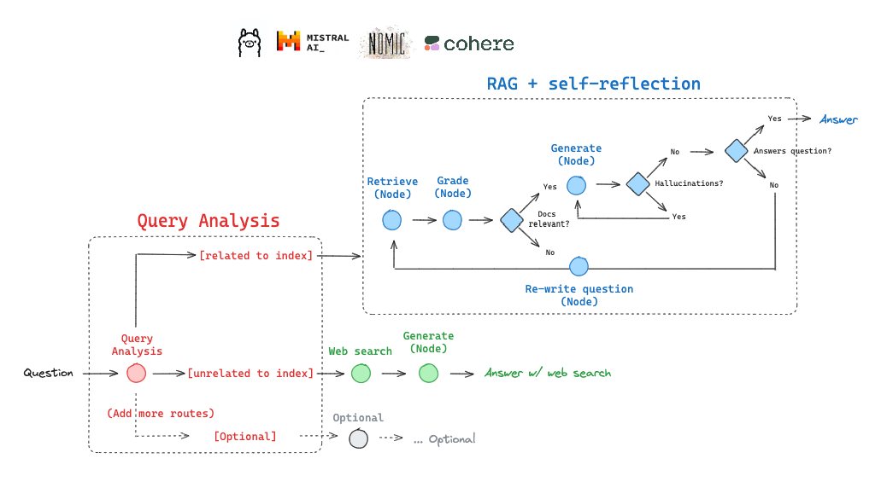

# 使用本地LLM的自适应RAG

自适应RAG是一种将(1) [查询分析](https://blog.langchain.dev/query-construction/)与(2) [主动/自我纠正RAG](https://blog.langchain.dev/agentic-rag-with-langgraph/)相结合的RAG策略。

在这篇[论文](https://arxiv.org/abs/2403.14403)中，他们报告了通过查询分析在以下几种情境中进行路由：

- 无检索
- 单次RAG
- 迭代RAG

让我们使用LangGraph在此基础上进行构建。

在我们的实现中，我们将在以下情况之间进行路由：

- 网络搜索：针对与最近事件相关的问题
- 自我纠正RAG：针对与我们索引相关的问题



# 环境

```shell
%capture --no-stderr
%pip install -U langchain-nomic langchain_community tiktoken langchainhub chromadb langchain langgraph tavily-python nomic[local]
```

### LLMs

#### 本地嵌入

你可以使用Nomic的`GPT4AllEmbeddings()`，它可以使用Nomic最近发布的[v1](https://blog.nomic.ai/posts/nomic-embed-text-v1)和[v1.5](https://blog.nomic.ai/posts/nomic-embed-matryoshka)嵌入。

按照[这里](https://docs.gpt4all.io/gpt4all_python_embedding.html#supported-embedding-models)的文档进行操作。

#### 本地LLM

(1) 下载[Ollama应用](https://ollama.ai/)。

(2) 从各种[Mistral版本](https://ollama.ai/library/mistral)和[Mixtral版本](https://ollama.ai/library/mixtral)中下载一个Mistral模型。此外，还可以尝试一个[量化的command-R模型](https://ollama.com/library/command-r)。

```shell
ollama pull mistral
```

```python
# Ollama模型名称
local_llm = "mistral"
```

### 跟踪

可选的，使用[LangSmith](https://docs.smith.langchain.com/)进行跟踪（如下所示）

```python
import os

os.environ["LANGCHAIN_TRACING_V2"] = "true"
os.environ["LANGCHAIN_ENDPOINT"] = "https://api.smith.langchain.com"
os.environ["LANGCHAIN_API_KEY"] = ""
```

## 索引

```python
from langchain.text_splitter import RecursiveCharacterTextSplitter
from langchain_community.document_loaders import WebBaseLoader
from langchain_community.vectorstores import Chroma
from langchain_nomic.embeddings import NomicEmbeddings

urls = [
    "https://lilianweng.github.io/posts/2023-06-23-agent/",
    "https://lilianweng.github.io/posts/2023-03-15-prompt-engineering/",
    "https://lilianweng.github.io/posts/2023-10-25-adv-attack-llm/",
]

docs = [WebBaseLoader(url).load() for url in urls]
docs_list = [item for sublist in docs for item in sublist]

text_splitter = RecursiveCharacterTextSplitter.from_tiktoken_encoder(
    chunk_size=250, chunk_overlap=0
)
doc_splits = text_splitter.split_documents(docs_list)

# 添加到vectorDB
vectorstore = Chroma.from_documents(
    documents=doc_splits,
    collection_name="rag-chroma",
    embedding=NomicEmbeddings(model="nomic-embed-text-v1.5", inference_mode="local"),
)
retriever = vectorstore.as_retriever()
```

## LLMs

注意：在Mac M2 32GB上测试cmd-R，[RAG生成的延迟约为52秒](https://smith.langchain.com/public/3998fe48-efc2-4d18-9069-972643d0982d/r)。

```python
### 路由器

from langchain.prompts import PromptTemplate
from langchain_community.chat_models import ChatOllama
from langchain_core.output_parsers import JsonOutputParser

# LLM
llm = ChatOllama(model=local_llm, format="json", temperature=0)

prompt = PromptTemplate(
    template="""You are an expert at routing a user question to a vectorstore or web search. \n
    Use the vectorstore for questions on LLM  agents, prompt engineering, and adversarial attacks. \n
    You do not need to be stringent with the keywords in the question related to these topics. \n
    Otherwise, use web-search. Give a binary choice 'web_search' or 'vectorstore' based on the question. \n
    Return the a JSON with a single key 'datasource' and no premable or explanation. \n
    Question to route: {question}""",
    input_variables=["question"],
)

question_router = prompt | llm | JsonOutputParser()
question = "llm agent memory"
docs = retriever.get_relevant_documents(question)
doc_txt = docs[1].page_content
print(question_router.invoke({"question": question}))
```

`{'datasource': 'vectorstore'}`

```python
### 检索评分器

from langchain.prompts import PromptTemplate
from langchain_community.chat_models import ChatOllama
from langchain_core.output_parsers import JsonOutputParser

# LLM
llm = ChatOllama(model=local_llm, format="json", temperature=0)

prompt = PromptTemplate(
    template="""You are a grader assessing relevance of a retrieved document to a user question. \n 
    Here is the retrieved document: \n\n {document} \n\n
    Here is the user question: {question} \n
    If the document contains keywords related to the user question, grade it as relevant. \n
    It does not need to be a stringent test. The goal is to filter out erroneous retrievals. \n
    Give a binary score 'yes' or 'no' score to indicate whether the document is relevant to the question. \n
    Provide the binary score as a JSON with a single key 'score' and no premable or explanation.""",
    input_variables=["question", "document"],
)

retrieval_grader = prompt | llm | JsonOutputParser()
question = "agent memory"
docs = retriever.get_relevant_documents(question)
doc_txt = docs[1].page_content
print(retrieval_grader.invoke({"question": question, "document": doc_txt}))
```

`{'score': 'yes'}`

```python
### 生成

from langchain import hub
from langchain_community.chat_models import ChatOllama
from langchain_core.output_parsers import StrOutputParser

# 提示
prompt = hub.pull("rlm/rag-prompt")

# LLM
llm = ChatOllama(model=local_llm, temperature=0)

# 后处理
def format_docs(docs):
    return "\n\n".join(doc.page_content for doc in docs)

# 链
rag_chain = prompt | llm | StrOutputParser()

# 运行
question = "agent memory"
generation = rag_chain.invoke({"context": docs, "question": question})
print(generation)
```

`在一个由LLM驱动的自主代理系统中，LLM作为代理的大脑。代理具有关键组件，包括记忆、规划和反思机制。记忆组件是一个长期记忆模块，记录代理的自然语言体验，包括一个用于存储过去经验的记忆流外部数据库。反思机制随着时间推移综合记忆并指导代理的未来行为。`

```python
### 幻觉评分器

# LLM
llm = ChatOllama(model=local_llm, format="json", temperature=0)

# 提示
prompt = PromptTemplate(
    template="""You are a grader assessing whether an answer is grounded in / supported by a set of facts. \n 
    Here are the facts:
    \n ------- \n
    {documents} 
    \n ------- \n
    Here is the answer: {generation}
    Give a binary score 'yes' or 'no' score to indicate whether the answer is grounded in / supported by a set of facts. \n
    Provide the binary score as a JSON with a single key 'score' and no preamble or explanation.""",
    input_variables=["generation", "documents"],
)

hallucination_grader = prompt | llm | JsonOutputParser()
hallucination_grader.invoke({"documents": docs, "generation": generation})
```

`{'score': 'yes'}`

```python
### 答案评分器

# LLM
llm = ChatOllama(model=local_llm, format="json", temperature=0)

# 提示
prompt = PromptTemplate(
    template="""You are a grader assessing whether an answer is useful to resolve a question. \n 
    Here is the answer:
    \n ------- \n
    {generation} 
    \n ------- \n
    Here is the question: {question}
    Give a binary score 'yes' or 'no' to indicate whether the answer is useful to resolve a question. \n
    Provide the binary score as a JSON with a single key 'score' and

 no preamble or explanation.""",
    input_variables=["generation", "question"],
)

answer_grader = prompt | llm | JsonOutputParser()
answer_grader.invoke({"question": question, "generation": generation})
```

`{'score': 'yes'}`

```python
### 问题改写器

# LLM
llm = ChatOllama(model=local_llm, temperature=0)

# 提示
re_write_prompt = PromptTemplate(
    template="""You a question re-writer that converts an input question to a better version that is optimized \n 
     for vectorstore retrieval. Look at the initial and formulate an improved question. \n
     Here is the initial question: \n\n {question}. Improved question with no preamble: \n """,
    input_variables=["generation", "question"],
)

question_rewriter = re_write_prompt | llm | StrOutputParser()
question_rewriter.invoke({"question": question})
```

`' What is agent memory and how can it be effectively utilized in vector database retrieval?'`

## 网络搜索工具

```python
### 搜索

from langchain_community.tools.tavily_search import TavilySearchResults

web_search_tool = TavilySearchResults(k=3)
```

# 图

将流程捕捉为图。

## 图状态

```python
from typing import List

from typing_extensions import TypedDict


class GraphState(TypedDict):
    """
    代表我们的图的状态。

    属性:
        question: 问题
        generation: LLM生成的答案
        documents: 文档列表
    """

    question: str
    generation: str
    documents: List[str]
```

```python
### 节点

from langchain.schema import Document


def retrieve(state):
    """
    检索文档

    参数:
        state (dict): 当前图的状态

    返回:
        state (dict): 添加了文档的新键，包含检索到的文档
    """
    print("---检索---")
    question = state["question"]

    # 检索
    documents = retriever.get_relevant_documents(question)
    return {"documents": documents, "question": question}


def generate(state):
    """
    生成答案

    参数:
        state (dict): 当前图的状态

    返回:
        state (dict): 添加了生成的答案的新键，包含LLM生成的答案
    """
    print("---生成---")
    question = state["question"]
    documents = state["documents"]

    # RAG生成
    generation = rag_chain.invoke({"context": documents, "question": question})
    return {"documents": documents, "question": question, "generation": generation}


def grade_documents(state):
    """
    确定检索到的文档是否与问题相关。

    参数:
        state (dict): 当前图的状态

    返回:
        state (dict): 更新了文档键，只包含相关的文档
    """

    print("---检查文档是否与问题相关---")
    question = state["question"]
    documents = state["documents"]

    # 评分每个文档
    filtered_docs = []
    for d in documents:
        score = retrieval_grader.invoke(
            {"question": question, "document": d.page_content}
        )
        grade = score["score"]
        if grade == "yes":
            print("---评分：文档相关---")
            filtered_docs.append(d)
        else:
            print("---评分：文档不相关---")
            continue
    return {"documents": filtered_docs, "question": question}


def transform_query(state):
    """
    转换查询以生成更好的问题。

    参数:
        state (dict): 当前图的状态

    返回:
        state (dict): 更新了问题键，包含重新措辞的问题
    """

    print("---转换查询---")
    question = state["question"]
    documents = state["documents"]

    # 重新措辞问题
    better_question = question_rewriter.invoke({"question": question})
    return {"documents": documents, "question": better_question}


def web_search(state):
    """
    基于重新措辞的问题进行网络搜索。

    参数:
        state (dict): 当前图的状态

    返回:
        state (dict): 更新了文档键，包含附加的网络搜索结果
    """

    print("---网络搜索---")
    question = state["question"]

    # 网络搜索
    docs = web_search_tool.invoke({"query": question})
    web_results = "\n".join([d["content"] for d in docs])
    web_results = Document(page_content=web_results)

    return {"documents": web_results, "question": question}


### 边 ###


def route_question(state):
    """
    将问题路由到网络搜索或RAG。

    参数:
        state (dict): 当前图的状态

    返回:
        str: 下一个调用的节点
    """

    print("---路由问题---")
    question = state["question"]
    print(question)
    source = question_router.invoke({"question": question})
    print(source)
    print(source["datasource"])
    if source["datasource"] == "web_search":
        print("---将问题路由到网络搜索---")
        return "web_search"
    elif source["datasource"] == "vectorstore":
        print("---将问题路由到RAG---")
        return "vectorstore"


def decide_to_generate(state):
    """
    决定是否生成答案或重新生成问题。

    参数:
        state (dict): 当前图的状态

    返回:
        str: 下一个调用的节点的二元决策
    """

    print("---评估评分文档---")
    state["question"]
    filtered_documents = state["documents"]

    if not filtered_documents:
        # 所有文档已在check_relevance中被过滤
        # 我们将重新生成一个新查询
        print("---决策：所有文档与问题无关，转换查询---")
        return "transform_query"
    else:
        # 我们有相关的文档，因此生成答案
        print("---决策：生成---")
        return "generate"


def grade_generation_v_documents_and_question(state):
    """
    确定生成的答案是否基于文档且回答了问题。

    参数:
        state (dict): 当前图的状态

    返回:
        str: 下一个调用的节点的决策
    """

    print("---检查幻觉---")
    question = state["question"]
    documents = state["documents"]
    generation = state["generation"]

    score = hallucination_grader.invoke(
        {"documents": documents, "generation": generation}
    )
    grade = score["score"]

    # 检查幻觉
    if grade == "yes":
        print("---决策：生成基于文档---")
        # 检查问题回答
        print("---评分生成与问题---")
        score = answer_grader.invoke({"question": question, "generation": generation})
        grade = score["score"]
        if grade == "yes":
            print("---决策：生成回答了问题---")
            return "useful"
        else:
            print("---决策：生成未回答问题---")
            return "not useful"
    else:
        pprint("---决策：生成不基于文档，重试---")
        return "not supported"
```

## 构建图

```python
from langgraph.graph import END, StateGraph, START

workflow = StateGraph(GraphState)

# 定义节点
workflow.add_node("web_search", web_search)  # 网络搜索
workflow.add_node("retrieve", retrieve)  # 检索
workflow.add_node("grade_documents", grade_documents)  # 评分文档
workflow.add_node("generate", generate)  # 生成
workflow.add_node("transform_query", transform_query)  # 转换查询

# 构建图
workflow.add_conditional_edges(
    START,
    route_question,
    {
        "web_search": "web_search",
        "vectorstore": "retrieve",
    },
)
workflow.add_edge("web_search", "generate")
workflow.add_edge("retrieve", "grade_documents")
workflow.add_conditional_edges(
    "grade_documents",
    decide_to_generate,
    {
        "transform_query": "transform_query",
        "generate": "generate",
    },
)
workflow.add_edge("transform_query", "retrieve")
workflow.add_conditional_edges(
    "generate",
    grade_generation_v_documents_and_question,
    {
        "not supported": "generate",
        "useful": END,
        "not useful": "transform_query",
    },
)

# 编译
app = workflow.compile()
```

```python
from pprint import pprint

# 运行
inputs = {"question": "What is the AlphaCodium paper about?"}
for output in app.stream(inputs):
    for key, value in output.items():
        # 节点
        pprint(f"Node '{key}':")
        # 可选：在每个节点处打印完整状态
        # pprint.pprint(value["keys"], indent=2, width=80, depth=None)
    pprint("\n---\n")

# 最终生成
pprint(value["generation"])
```

```python
---路由问题---
What is the AlphaCodium paper about?
{'datasource': 'web_search'}
web_search
---将问题路由到网络搜索---
---网络搜索---
"Node 'web_search':"
'\n---\n'
---生成---
---检查幻觉---
---决策：生成基于文档---
---评分生成与问题---
---决策：生成回答了问题---
"Node 'generate':"


'\n---\n'
(' The AlphaCodium paper introduces a new approach for code generation by '
 'Large Language Models (LLMs). It presents AlphaCodium, an iterative process '
 'that involves generating additional data to aid the flow, and testing it on '
 'the CodeContests dataset. The results show that AlphaCodium outperforms '
 "DeepMind's AlphaCode and AlphaCode2 without fine-tuning a model. The "
 'approach includes a pre-processing phase for problem reasoning in natural '
 'language and an iterative code generation phase with runs and fixes against '
 'tests.')
```

跟踪：

https://smith.langchain.com/public/81813813-be53-403c-9877-afcd5786ca2e/r

```python
# 运行
inputs = {"question": "What are the types of agent memory?"}
for output in app.stream(inputs):
    for key, value in output.items():
        # 节点
        pprint(f"Node '{key}':")
        # 可选：在每个节点处打印完整状态
        # pprint.pprint(value["keys"], indent=2, width=80, depth=None)
    pprint("\n---\n")

# 最终生成
pprint(value["generation"])
```

```python
---路由问题---
What are the types of agent memory?
{'datasource': 'vectorstore'}
vectorstore
---将问题路由到RAG---
---检索---
"Node 'retrieve':"
'\n---\n'
---检查文档是否与问题相关---
---评分：文档相关---
---评分：文档相关---
---评分：文档不相关---
---评分：文档相关---
---评估评分文档---
---决策：生成---
"Node 'grade_documents':"
'\n---\n'
---生成---
---检查幻觉---
---决策：生成基于文档---
---评分生成与问题---
---决策：生成回答了问题---
"Node 'generate':"
'\n---\n'
('代理记忆的类型包括感官记忆、短期记忆（STM）或工作记忆，以及长期记忆（LTM）具有显性/陈述性记忆和隐性/程序性记忆的子类型。感官记忆短暂保留感官信息，STM存储用于认知任务的信息，而LTM则存储长期的信息，具有不同类型的记忆。')
```

跟踪：

https://smith.langchain.com/public/fdf0a180-6d15-4d09-bb92-f84f2105ca51/r