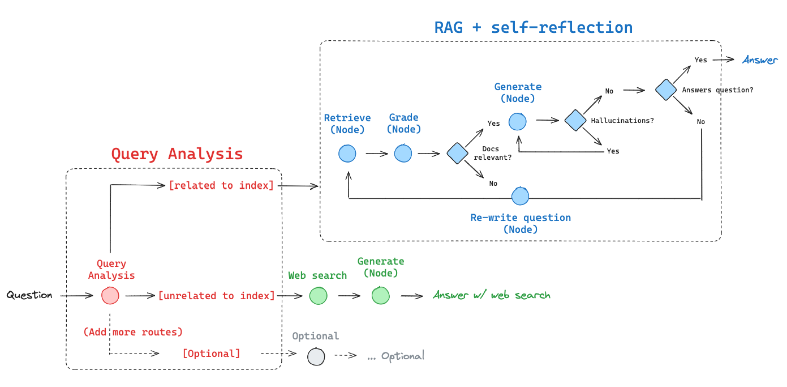

# 自适应 RAG

自适应 RAG 是一种 RAG 策略，它结合了（1）[查询分析](https://blog.langchain.dev/query-construction/)和（2）[主动/自我纠正 RAG](https://blog.langchain.dev/agentic-rag-with-langgraph/)。

在这篇[论文](https://arxiv.org/abs/2403.14403)中，他们报告了通过查询分析来路由以下内容：

- 无检索
- 单次 RAG
- 迭代 RAG

让我们使用 LangGraph 在此基础上进行构建。

在我们的实现中，我们将在以下之间进行路由：

- 网络搜索：用于与近期事件相关的问题
- 自我纠正 RAG：用于与我们的索引相关的问题



# 环境设置

```shell
pip install -U langchain_community tiktoken langchain-openai langchain-cohere langchainhub chromadb langchain langgraph tavily-python
```

```python
### LLMs
import os

os.environ["OPENAI_API_KEY"] = ""
os.environ["COHERE_API_KEY"] = ""
os.environ["TAVILY_API_KEY"] = ""
```

### 跟踪

- 可选地，通过设置[LangSmith](https://docs.smith.langchain.com/)进行跟踪（如底部所示）：

```python
### 跟踪（可选）
os.environ["LANGCHAIN_TRACING_V2"] = "true"
os.environ["LANGCHAIN_ENDPOINT"] = "https://api.smith.langchain.com"
os.environ["LANGCHAIN_API_KEY"] = ""
```

## 索引

```python
### 构建索引

from langchain.text_splitter import RecursiveCharacterTextSplitter
from langchain_community.document_loaders import WebBaseLoader
from langchain_community.vectorstores import Chroma
from langchain_openai import OpenAIEmbeddings

### from langchain_cohere import CohereEmbeddings

# 设置嵌入
embd = OpenAIEmbeddings()

# 要索引的文档
urls = [
    "https://lilianweng.github.io/posts/2023-06-23-agent/",
    "https://lilianweng.github.io/posts/2023-03-15-prompt-engineering/",
    "https://lilianweng.github.io/posts/2023-10-25-adv-attack-llm/",
]

# 加载
docs = [WebBaseLoader(url).load() for url in urls]
docs_list = [item for sublist in docs for item in sublist]

# 分割
text_splitter = RecursiveCharacterTextSplitter.from_tiktoken_encoder(
    chunk_size=500, chunk_overlap=0
)
doc_splits = text_splitter.split_documents(docs_list)

# 添加到向量存储
vectorstore = Chroma.from_documents(
    documents=doc_splits,
    collection_name="rag-chroma",
    embedding=embd,
)
retriever = vectorstore.as_retriever()
```

## LLMs

```python
### 路由器

from typing import Literal

from langchain_core.prompts import ChatPromptTemplate
from langchain_core.pydantic_v1 import BaseModel, Field
from langchain_openai import ChatOpenAI


# 数据模型
class RouteQuery(BaseModel):
    """将用户查询路由到最相关的数据源。"""

    datasource: Literal["vectorstore", "web_search"] = Field(
        ...,
        description="根据用户问题选择路由到网络搜索或向量存储。",
    )


# 带函数调用的 LLM
llm = ChatOpenAI(model="gpt-3.5-turbo-0125", temperature=0)
structured_llm_router = llm.with_structured_output(RouteQuery)

# 提示
system = """You are an expert at routing a user question to a vectorstore or web search.
The vectorstore contains documents related to agents, prompt engineering, and adversarial attacks.
Use the vectorstore for questions on these topics. Otherwise, use web-search."""
route_prompt = ChatPromptTemplate.from_messages(
    [
        ("system", system),
        ("human", "{question}"),
    ]
)

question_router = route_prompt | structured_llm_router
print(
    question_router.invoke(
        {"question": "Who will the Bears draft first in the NFL draft?"}
    )
)
print(question_router.invoke({"question": "What are the types of agent memory?"}))
```

输出：
```python
datasource='web_search'
datasource='vectorstore'
```

```python
### 检索评分器

# 数据模型
class GradeDocuments(BaseModel):
    """检索到的文档相关性检查的二进制评分。"""

    binary_score: str = Field(
        description="文档是否与问题相关，'yes' 或 'no'"
    )


# 带函数调用的 LLM
llm = ChatOpenAI(model="gpt-3.5-turbo-0125", temperature=0)
structured_llm_grader = llm.with_structured_output(GradeDocuments)

# 提示
system = """You are a grader assessing relevance of a retrieved document to a user question. \n 
    If the document contains keyword(s) or semantic meaning related to the user question, grade it as relevant. \n
    It does not need to be a stringent test. The goal is to filter out erroneous retrievals. \n
    Give a binary score 'yes' or 'no' score to indicate whether the document is relevant to the question."""
grade_prompt = ChatPromptTemplate.from_messages(
    [
        ("system", system),
        ("human", "Retrieved document: \n\n {document} \n\n User question: {question}"),
    ]
)

retrieval_grader = grade_prompt | structured_llm_grader
question = "agent memory"
docs = retriever.get_relevant_documents(question)
doc_txt = docs[1].page_content
print(retrieval_grader.invoke({"question": question, "document": doc_txt}))
```

输出：
```python
binary_score='no'
```

```python
### 生成

from langchain import hub
from langchain_core.output_parsers import StrOutputParser

# 提示
prompt = hub.pull("rlm/rag-prompt")

# LLM
llm = ChatOpenAI(model_name="gpt-3.5-turbo", temperature=0)


# 后处理
def format_docs(docs):
    return "\n\n".join(doc.page_content for doc in docs)


# 链
rag_chain = prompt | llm | StrOutputParser()

# 运行
generation = rag_chain.invoke({"context": docs, "question": question})
print(generation)
```

输出：
```python
The design of generative agents combines LLM with memory, planning, and reflection mechanisms to enable agents to behave based on past experience and interact with other agents. Memory stream is a long-term memory module that records agents' experiences in natural language. The retrieval model surfaces context to inform the agent's behavior based on relevance, recency, and importance.
```

```python
### 幻觉评分器

# 数据模型
class GradeHallucinations(BaseModel):
    """生成答案中的幻觉存在的二进制评分。"""

    binary_score: str = Field(
        description="答案是否基于事实，'yes' 或 'no'"
    )


# 带函数调用的 LLM
llm = ChatOpenAI(model="gpt-3.5-turbo-0125", temperature=0)
structured_llm_grader = llm.with_structured_output(GradeHallucinations)

# 提示
system = """You are a grader assessing whether an LLM generation is grounded in / supported by a set of retrieved facts. \n 
     Give a binary score 'yes' or 'no'. 'Yes' means that the answer is grounded in / supported by the set of facts."""
hallucination_prompt = ChatPromptTemplate.from_messages(
    [
        ("system", system),
        ("human", "Set of facts: \n\n {documents} \n\n LLM generation: {generation}"),
    ]
)

hallucination_grader = hallucination_prompt | structured_llm_grader
hallucination_grader.invoke({"documents": docs, "generation": generation})
```

输出：
```python
GradeHallucinations(binary_score='yes')
```

```python
### 答案评分器

# 数据模型
class GradeAnswer(BaseModel):
    """评估答案是否解决问题的二进制评分。"""

    binary_score: str = Field(
        description="答案是否解决了问题，'yes' 或 'no'"
    )


# 带函数调用的 LLM
llm = ChatOpenAI(model="gpt-3.5-turbo-0125", temperature=0)
structured_llm_grader = llm.with_structured_output(GradeAnswer)

# 提示
system = """You are a grader assessing whether an answer addresses / resolves a question \n 
     Give a binary score 'yes' or 'no'. Yes' means that the answer resolves the question."""
answer_prompt = ChatPromptTemplate.from_messages(
    [
        ("system", system),
        ("human", "User question: \n\n {question} \n\n LLM generation: {generation}"),
    ]
)

answer_grader = answer_prompt | structured_llm_grader
answer_grader.invoke({"question": question, "generation": generation})
```

输出：
```python
GradeAnswer(binary_score='yes')
```

```

python
### 问题重写器

# LLM
llm = ChatOpenAI(model="gpt-3.5-turbo-0125", temperature=0)

# 提示
system = """You a question re-writer that converts an input question to a better version that is optimized \n 
     for vectorstore retrieval. Look at the input and try to reason about the underlying semantic intent / meaning."""
re_write_prompt = ChatPromptTemplate.from_messages(
    [
        ("system", system),
        (
            "human",
            "Here is the initial question: \n\n {question} \n Formulate an improved question.",
        ),
    ]
)

question_rewriter = re_write_prompt | llm | StrOutputParser()
question_rewriter.invoke({"question": question})
```

输出：
```python
"What is the role of memory in an agent's functioning?"
```

## 网络搜索工具

```python
### 搜索

from langchain_community.tools.tavily_search import TavilySearchResults

web_search_tool = TavilySearchResults(k=3)
```

# 图表

将流程捕获为图表。

## 图表状态

```python
from typing import List

from typing_extensions import TypedDict


class GraphState(TypedDict):
    """
    表示我们的图表状态。

    属性:
        question: 问题
        generation: LLM 生成
        documents: 文档列表
    """

    question: str
    generation: str
    documents: List[str]
```

## 图表流程

```python
from langchain.schema import Document


def retrieve(state):
    """
    检索文档

    Args:
        state (dict): 当前图表状态

    Returns:
        state (dict): 新增了文档的状态键，其中包含检索到的文档
    """
    print("---检索---")
    question = state["question"]

    # 检索
    documents = retriever.invoke(question)
    return {"documents": documents, "question": question}


def generate(state):
    """
    生成答案

    Args:
        state (dict): 当前图表状态

    Returns:
        state (dict): 新增了生成的状态键，其中包含 LLM 生成
    """
    print("---生成---")
    question = state["question"]
    documents = state["documents"]

    # RAG 生成
    generation = rag_chain.invoke({"context": documents, "question": question})
    return {"documents": documents, "question": question, "generation": generation}


def grade_documents(state):
    """
    确定检索到的文档是否与问题相关。

    Args:
        state (dict): 当前图表状态

    Returns:
        state (dict): 更新了仅包含过滤后相关文档的文档键
    """

    print("---检查文档是否与问题相关---")
    question = state["question"]
    documents = state["documents"]

    # 评分每个文档
    filtered_docs = []
    for d in documents:
        score = retrieval_grader.invoke(
            {"question": question, "document": d.page_content}
        )
        grade = score.binary_score
        if grade == "yes":
            print("---评分：文档相关---")
            filtered_docs.append(d)
        else:
            print("---评分：文档不相关---")
            continue
    return {"documents": filtered_docs, "question": question}


def transform_query(state):
    """
    转换查询以生成更好的问题。

    Args:
        state (dict): 当前图表状态

    Returns:
        state (dict): 更新了重新措辞的问题的状态键
    """

    print("---转换查询---")
    question = state["question"]
    documents = state["documents"]

    # 重写问题
    better_question = question_rewriter.invoke({"question": question})
    return {"documents": documents, "question": better_question}


def web_search(state):
    """
    基于重新措辞的问题进行网络搜索。

    Args:
        state (dict): 当前图表状态

    Returns:
        state (dict): 更新了附加网络搜索结果的文档键
    """

    print("---网络搜索---")
    question = state["question"]

    # 网络搜索
    docs = web_search_tool.invoke({"query": question})
    web_results = "\n".join([d["content"] for d in docs])
    web_results = Document(page_content=web_results)

    return {"documents": web_results, "question": question}


### 边缘 ###


def route_question(state):
    """
    将问题路由到网络搜索或 RAG。

    Args:
        state (dict): 当前图表状态

    Returns:
        str: 下一个要调用的节点
    """

    print("---路由问题---")
    question = state["question"]
    source = question_router.invoke({"question": question})
    if source.datasource == "web_search":
        print("---将问题路由到网络搜索---")
        return "web_search"
    elif source.datasource == "vectorstore":
        print("---将问题路由到 RAG---")
        return "vectorstore"


def decide_to_generate(state):
    """
    确定是生成答案还是重新生成问题。

    Args:
        state (dict): 当前图表状态

    Returns:
        str: 二进制决策，用于确定下一个要调用的节点
    """

    print("---评估评分文档---")
    state["question"]
    filtered_documents = state["documents"]

    if not filtered_documents:
        # 所有文档均已被过滤 check_relevance
        # 我们将重新生成一个新查询
        print(
            "---决策：所有文档与问题无关，转换查询---"
        )
        return "transform_query"
    else:
        # 我们有相关文档，因此生成答案
        print("---决策：生成---")
        return "generate"


def grade_generation_v_documents_and_question(state):
    """
    确定生成是否基于文档并回答问题。

    Args:
        state (dict): 当前图表状态

    Returns:
        str: 决策用于确定下一个要调用的节点
    """

    print("---检查幻觉---")
    question = state["question"]
    documents = state["documents"]
    generation = state["generation"]

    score = hallucination_grader.invoke(
        {"documents": documents, "generation": generation}
    )
    grade = score.binary_score

    # 检查幻觉
    if grade == "yes":
        print("---决策：生成基于文档---")
        # 检查问题解答
        print("---评分生成与问题---")
        score = answer_grader.invoke({"question": question, "generation": generation})
        grade = score.binary_score
        if grade == "yes":
            print("---决策：生成回答了问题---")
            return "useful"
        else:
            print("---决策：生成没有回答问题---")
            return "not useful"
    else:
        pprint("---决策：生成没有基于文档，重试---")
        return "not supported"
```

## 构建图表

```python
from langgraph.graph import END, StateGraph, START

workflow = StateGraph(GraphState)

# 定义节点
workflow.add_node("web_search", web_search)  # 网络搜索
workflow.add_node("retrieve", retrieve)  # 检索
workflow.add_node("grade_documents", grade_documents)  # 评分文档
workflow.add_node("generate", generate)  # 生成
workflow.add_node("transform_query", transform_query)  # 转换查询

# 构建图表
workflow.add_conditional_edges(
    START,
    route_question,
    {
        "web_search": "web_search",
        "vectorstore": "retrieve",
    },
)
workflow.add_edge("web_search", "generate")
workflow.add_edge("retrieve", "grade_documents")
workflow.add_conditional_edges(
    "grade_documents",
    decide_to_generate,
    {
        "transform_query": "transform_query",
        "generate": "generate",
    },
)
workflow.add_edge("transform_query", "retrieve")
workflow.add_conditional_edges(
    "generate",
    grade_generation_v_documents_and_question,
    {
        "not supported": "generate",
        "useful": END,
        "not useful": "transform_query",
    },
)

# 编译
app = workflow.compile()
```

```python
from pprint import pprint

# 运行
inputs = {
    "question": "What player at the Bears expected to draft first in the 2024 NFL draft?"
}
for output in app.stream(inputs):
    for key, value in output.items():
        # 节点
        pprint(f"Node '{key}':")
        # 可选：在每个节点处打印完整状态
        # pprint.pprint(value["keys"], indent=2, width=80, depth=None)
    pprint("\n---\n")

# 最终生成
pprint(value["generation"])
```

输出：
```python
---路由问题---
---将问题路由到网络搜索---
---网络搜索---
"Node 'web_search':"
'\n---\n'
---生成---
---检查幻觉---
---决策：生成基于文档---
---评分生成与问题---
---决策：生成回答了问题---
"Node 'generate':"
'\n---\n'
('It is expected that the Chicago Bears could have the opportunity to draft '
 'the first defensive player in the 2024 NFL draft. The Bears have the first '
 'overall pick in the draft, giving them a prime position to select top '


 'talent. The top wide receiver Marvin Harrison Jr. from Ohio State is also '
 'mentioned as a potential pick for the Cardinals.')
```

跟踪：

[https://smith.langchain.com/public/7e3aa7e5-c51f-45c2-bc66-b34f17ff2263/r](https://smith.langchain.com/public/7e3aa7e5-c51f-45c2-bc66-b34f17ff2263/r)

```python
# 运行
inputs = {"question": "What are the types of agent memory?"}
for output in app.stream(inputs):
    for key, value in output.items():
        # 节点
        pprint(f"Node '{key}':")
        # 可选：在每个节点处打印完整状态
        # pprint.pprint(value["keys"], indent=2, width=80, depth=None)
    pprint("\n---\n")

# 最终生成
pprint(value["generation"])
```

输出：
```python
---路由问题---
---将问题路由到 RAG---
---检索---
"Node 'retrieve':"
'\n---\n'
---检查文档是否与问题相关---
---评分：文档相关---
---评分：文档相关---
---评分：文档不相关---
---评分：文档相关---
---评估评分文档---
---决策：生成---
"Node 'grade_documents':"
'\n---\n'
---生成---
---检查幻觉---
---决策：生成基于文档---
---评分生成与问题---
---决策：生成回答了问题---
"Node 'generate':"
'\n---\n'
('The types of agent memory include Sensory Memory, Short-Term Memory (STM) or '
 'Working Memory, and Long-Term Memory (LTM) with subtypes of Explicit / '
 'declarative memory and Implicit / procedural memory. Sensory memory retains '
 'sensory information briefly, STM stores information for cognitive tasks, and '
 'LTM stores information for a long time with different types of memories.')
```

跟踪：

[https://smith.langchain.com/public/fdf0a180-6d15-4d09-bb92-f84f2105ca51/r](https://smith.langchain.com/public/fdf0a180-6d15-4d09-bb92-f84f2105ca51/r)