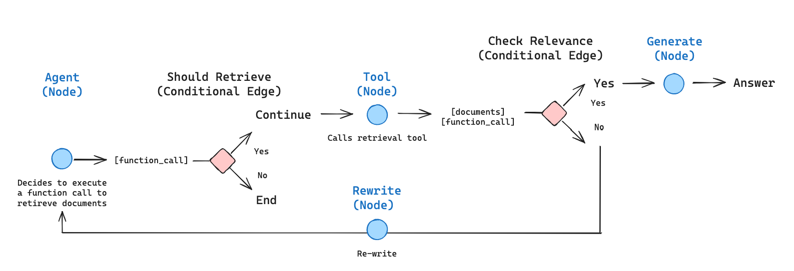
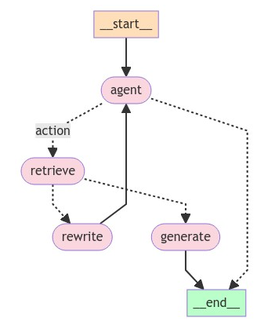

# Agentic RAG

[Retrieval Agents](https://python.langchain.com/v0.2/docs/tutorials/qa_chat_history/#agents) 在我们需要决定是否从索引中检索信息时非常有用。

要实现检索代理，我们只需为 LLM 提供一个检索工具的访问权限。

我们可以将其纳入 [LangGraph](https://langchain-ai.github.io/langgraph/) 中。

```
pip install -U --quiet langchain-community tiktoken langchain-openai langchainhub chromadb langchain langgraph langchain-text-splitters
```

```python
import getpass
import os


def _set_env(key: str):
    if key not in os.environ:
        os.environ[key] = getpass.getpass(f"{key}:")


_set_env("OPENAI_API_KEY")

# (Optional) For tracing
os.environ["LANGCHAIN_TRACING_V2"] = "true"
_set_env("LANGCHAIN_API_KEY")
```

## 检索器

首先，我们索引三个博客文章。

```python
from langchain_community.document_loaders import WebBaseLoader
from langchain_community.vectorstores import Chroma
from langchain_openai import OpenAIEmbeddings
from langchain_text_splitters import RecursiveCharacterTextSplitter

urls = [
    "https://lilianweng.github.io/posts/2023-06-23-agent/",
    "https://lilianweng.github.io/posts/2023-03-15-prompt-engineering/",
    "https://lilianweng.github.io/posts/2023-10-25-adv-attack-llm/",
]

docs = [WebBaseLoader(url).load() for url in urls]
docs_list = [item for sublist in docs for item in sublist]

text_splitter = RecursiveCharacterTextSplitter.from_tiktoken_encoder(
    chunk_size=100, chunk_overlap=50
)
doc_splits = text_splitter.split_documents(docs_list)

# 添加到向量数据库
vectorstore = Chroma.from_documents(
    documents=doc_splits,
    collection_name="rag-chroma",
    embedding=OpenAIEmbeddings(),
)
retriever = vectorstore.as_retriever()
```

然后我们创建一个检索工具。

```python
from langchain.tools.retriever import create_retriever_tool

retriever_tool = create_retriever_tool(
    retriever,
    "retrieve_blog_posts",
    "Search and return information about Lilian Weng blog posts on LLM agents, prompt engineering, and adversarial attacks on LLMs.",
)

tools = [retriever_tool]
```

## 代理状态

我们将定义一个图。

一个传递给每个节点的 `state` 对象。

我们的状态将是一个 `messages` 列表。

我们的图中的每个节点都将附加到它。

```python
from typing import Annotated, Sequence, TypedDict

from langchain_core.messages import BaseMessage

from langgraph.graph.message import add_messages


class AgentState(TypedDict):
    # add_messages 函数定义了如何处理更新
    # 默认是替换。add_messages 表示“附加”
    messages: Annotated[Sequence[BaseMessage], add_messages]
```

## 节点和边

我们可以像这样布局一个 agentic RAG 图：

- 状态是一组消息
- 每个节点将更新（附加到）状态
- 条件边决定访问哪个节点



```python
from typing import Annotated, Literal, Sequence, TypedDict

from langchain import hub
from langchain_core.messages import BaseMessage, HumanMessage
from langchain_core.output_parsers import StrOutputParser
from langchain_core.prompts import PromptTemplate
from langchain_core.pydantic_v1 import BaseModel, Field
from langchain_openai import ChatOpenAI

from langgraph.prebuilt import tools_condition

### 边


def grade_documents(state) -> Literal["generate", "rewrite"]:
    """
    确定检索到的文档是否与问题相关。

    参数:
        state (messages): 当前状态

    返回:
        str: 决定文档是否相关的决定
    """

    print("---检查相关性---")

    # 数据模型
    class grade(BaseModel):
        """相关性检查的二进制评分。"""

        binary_score: str = Field(description="相关性评分 'yes' 或 'no'")

    # LLM
    model = ChatOpenAI(temperature=0, model="gpt-4-0125-preview", streaming=True)

    # 具有工具和验证功能的 LLM
    llm_with_tool = model.with_structured_output(grade)

    # 提示
    prompt = PromptTemplate(
        template="""You are a grader assessing relevance of a retrieved document to a user question. \n 
        Here is the retrieved document: \n\n {context} \n\n
        Here is the user question: {question} \n
        If the document contains keyword(s) or semantic meaning related to the user question, grade it as relevant. \n
        Give a binary score 'yes' or 'no' score to indicate whether the document is relevant to the question.""",
        input_variables=["context", "question"],
    )

    # 链
    chain = prompt | llm_with_tool

    messages = state["messages"]
    last_message = messages[-1]

    question = messages[0].content
    docs = last_message.content

    scored_result = chain.invoke({"question": question, "context": docs})

    score = scored_result.binary_score

    if score == "yes":
        print("---决定：文档相关---")
        return "generate"

    else:
        print("---决定：文档不相关---")
        print(score)
        return "rewrite"


### 节点


def agent(state):
    """
    调用代理模型以根据当前状态生成响应。给定问题，它将决定是否使用检索工具进行检索，或简单地结束。

    参数:
        state (messages): 当前状态

    返回:
        dict: 附加了代理响应的更新状态
    """
    print("---调用代理---")
    messages = state["messages"]
    model = ChatOpenAI(temperature=0, streaming=True, model="gpt-4-turbo")
    model = model.bind_tools(tools)
    response = model.invoke(messages)
    # 我们返回一个列表，因为这将添加到现有列表中
    return {"messages": [response]}


def rewrite(state):
    """
    转换查询以生成更好的问题。

    参数:
        state (messages): 当前状态

    返回:
        dict: 更新了重新措辞问题的状态
    """

    print("---转换查询---")
    messages = state["messages"]
    question = messages[0].content

    msg = [
        HumanMessage(
            content=f""" \n 
    Look at the input and try to reason about the underlying semantic intent / meaning. \n 
    Here is the initial question:
    \n ------- \n
    {question} 
    \n ------- \n
    Formulate an improved question: """,
        )
    ]

    # 评分
    model = ChatOpenAI(temperature=0, model="gpt-4-0125-preview", streaming=True)
    response = model.invoke(msg)
    return {"messages": [response]}


def generate(state):
    """
    生成答案

    参数:
        state (messages): 当前状态

    返回:
         dict: 更新了重新措辞问题的状态
    """
    print("---生成---")
    messages = state["messages"]
    question = messages[0].content
    last_message = messages[-1]

    question = messages[0].content
    docs = last_message.content

    # 提示
    prompt = hub.pull("rlm/rag-prompt")

    # LLM
    llm = ChatOpenAI(model_name="gpt-3.5-turbo", temperature=0, streaming=True)

    # 后处理
    def format_docs(docs):
        return "\n\n".join(doc.page_content for doc in docs)

    # 链
    rag_chain = prompt | llm | StrOutputParser()

    # 运行
    response = rag_chain.invoke({"context": docs, "question": question})
    return {"messages": [response]}


print("*" * 20 + "Prompt[rlm/rag-prompt]" + "*" * 20)
prompt = hub.pull("rlm/rag-prompt").pretty_print()  # 显示提示的样子
```

```python
********************Prompt[rlm/rag-prompt]********************
================================ 人类消息 =================================

You are an assistant for question-answering tasks. Use the following pieces of retrieved context to answer the question. If you don't know the answer, just say that you don't know. Use three sentences maximum and keep the answer concise.
Question: {question} 
Context: {context} 
Answer:
```

## 图

- 从代理 `call_model` 开始
- 代理决定是否调用函数
- 如果是，则 `action` 调用工具（检索器）
- 然后在工具输出添加到消息（`state`）后调用代理

```python
from langgraph.graph import END, StateGraph, START
from langgraph.prebuilt import ToolNode

# 定义一个新图
workflow = StateGraph(AgentState)

# 定义我们将在之间循环的节点
workflow.add_node("agent", agent)  # 代理


retrieve = ToolNode([retriever_tool])
workflow.add_node("retrieve", retrieve)  # 检索
workflow.add_node("rewrite", rewrite)  # 重新措辞问题
workflow.add_node(
    "generate", generate
)  # 在确定文档相关后生成响应
# 调用代理节点以决定是否检索
workflow.add_edge(START, "agent")

# 决定是否检索
workflow.add_conditional_edges(
    "agent",
    # 评估代理决定
    tools_condition,
    {
        # 将条件输出转换为图中的节点
        "tools": "retrieve",
        END: END,
    },
)

# 调用 `action` 节点后采取的边。
workflow.add_conditional_edges(
    "retrieve",
    # 评估代理决定
    grade_documents,
)
workflow.add_edge("generate", END)
workflow.add_edge("rewrite", "agent")

# 编译
graph = workflow.compile()
```

```python
from IPython.display import Image, display

try:
    display(Image(graph.get_graph(xray=True).draw_mermaid_png()))
except Exception:
    # 这需要一些额外的依赖项，并且是可选的
    pass
```



```python
import pprint

inputs = {
    "messages": [
        ("user", "What does Lilian Weng say about the types of agent memory?"),
    ]
}
for output in graph.stream(inputs):
    for key, value in output.items():
        pprint.pprint(f"Output from node '{key}':")
        pprint.pprint("---")
        pprint.pprint(value, indent=2, width=80, depth=None)
    pprint.pprint("\n---\n")
```

```python
---调用代理---
"Output from node 'agent':"
'---'
{ 'messages': [ AIMessage(content='', additional_kwargs={'tool_calls': [{'index': 0, 'id': 'call_z36oPZN8l1UC6raxrebqc1bH', 'function': {'arguments': '{"query":"types of agent memory"}', 'name': 'retrieve_blog_posts'}, 'type': 'function'}]}, response_metadata={'finish_reason': 'tool_calls'}, id='run-2bad2518-8187-4d8f-8e23-2b9501becb6f-0', tool_calls=[{'name': 'retrieve_blog_posts', 'args': {'query': 'types of agent memory'}, 'id': 'call_z36oPZN8l1UC6raxrebqc1bH'}])]}
'\n---\n'
---检查相关性---
---决定：文档相关---
"Output from node 'retrieve':"
'---'
{ 'messages': [ ToolMessage(content='Table of Contents\n\n\n\nAgent System Overview\n\nComponent One: Planning\n\nTask Decomposition\n\nSelf-Reflection\n\n\nComponent Two: Memory\n\nTypes of Memory\n\nMaximum Inner Product Search (MIPS)\n\n\nComponent Three: Tool Use\n\nCase Studies\n\nScientific Discovery Agent\n\nGenerative Agents Simulation\n\nProof-of-Concept Examples\n\n\nChallenges\n\nCitation\n\nReferences\n\nPlanning\n\nSubgoal and decomposition: The agent breaks down large tasks into smaller, manageable subgoals, enabling efficient handling of complex tasks.\nReflection and refinement: The agent can do self-criticism and self-reflection over past actions, learn from mistakes and refine them for future steps, thereby improving the quality of final results.\n\n\nMemory\n\nMemory\n\nShort-term memory: I would consider all the in-context learning (See Prompt Engineering) as utilizing short-term memory of the model to learn.\nLong-term memory: This provides the agent with the capability to retain and recall (infinite) information over extended periods, often by leveraging an external vector store and fast retrieval.\n\n\nTool use\n\nThe design of generative agents combines LLM with memory, planning and reflection mechanisms to enable agents to behave conditioned on past experience, as well as to interact with other agents.', name='retrieve_blog_posts', id='d815f283-868c-4660-a1c6-5f6e5373ca06', tool_call_id='call_z36oPZN8l1UC6raxrebqc1bH')]}
'\n---\n'
---生成---
"Output from node 'generate':"
'---'
{ 'messages': [ 'Lilian Weng discusses short-term and long-term memory in '
                'agent systems. Short-term memory is used for in-context '
                'learning, while long-term memory allows agents to retain and '
                'recall information over extended periods.']}
'\n---\n'
```