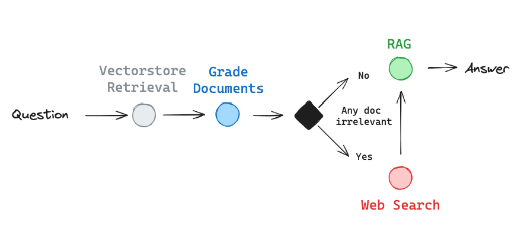
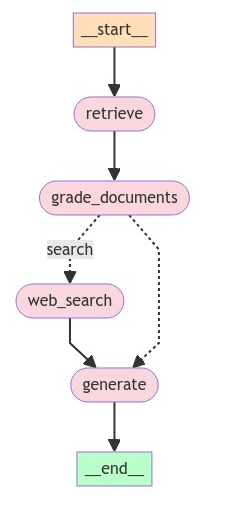
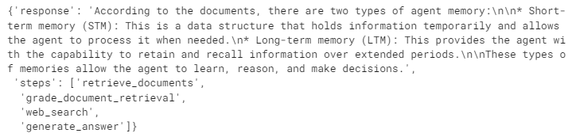
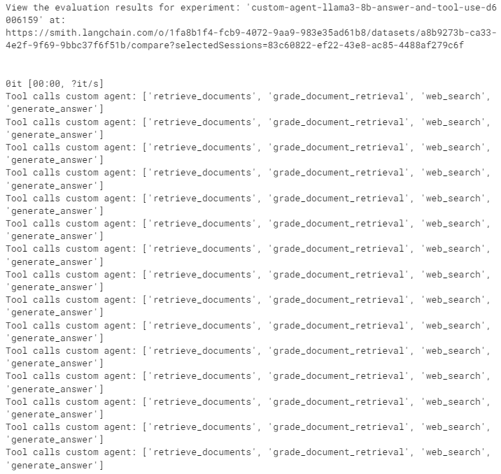
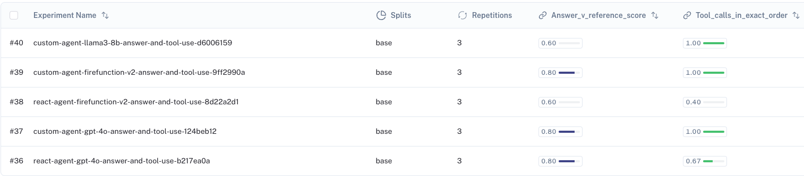

# 使用本地 LLMs 的纠错 RAG (CRAG)

[纠错 RAG (CRAG)](https://arxiv.org/abs/2401.15884) 是一种 RAG 策略，包含对检索到的文档进行自我反思/自我评分。

论文遵循以下一般流程：

- 如果至少有一份文档超过了`相关性`阈值，则继续生成。
- 如果所有文档都低于`相关性`阈值或评分者不确定，则使用网页搜索补充检索。
- 在生成之前，对搜索或检索到的文档进行知识细化。
- 将文档划分为`知识条`。
- 对每条进行评分，过滤掉不相关的内容。

我们将使用 [LangGraph](https://langchain-ai.github.io/langgraph/) 从头开始实现这些想法：

- 如果*任何*文档不相关，我们将通过网页搜索补充检索。
- 我们将跳过知识细化，但如果需要，可以将其添加回来作为节点。
- 我们将使用 [Tavily Search](https://python.langchain.com/v0.2/docs/integrations/tools/tavily_search/) 进行网页搜索。



### 环境

我们将使用 [Ollama](https://ollama.ai/) 访问本地 LLM：

- 下载 [Ollama 应用](https://ollama.ai/)。
- 拉取你选择的模型，例如：`ollama pull llama3`

我们将使用 [Tavily](https://python.langchain.com/v0.2/docs/integrations/tools/tavily_search/) 进行网页搜索。

我们将使用带有 [Nomic 本地嵌入](https://blog.nomic.ai/posts/nomic-embed-text-v1) 的向量存储，或者选择使用 OpenAI 嵌入。

我们将使用 [LangSmith](https://docs.smith.langchain.com/) 进行跟踪和评估。

```
pip install -U langchain_community tiktoken langchainhub scikit-learn langchain langgraph tavily-python  nomic[local] langchain-nomic langchain_openai
```

```
# 搜索
import os

os.environ["TAVILY_API_KEY"] = "xxx"

# 嵌入 (可选)
os.environ["OPENAI_API_KEY"] = "xxx"

# 跟踪和测试 (可选)
os.environ["LANGCHAIN_API_KEY"] = "xxx"
os.environ["LANGCHAIN_TRACING_V2"] = "true"
os.environ["LANGCHAIN_ENDPOINT"] = "https://api.smith.langchain.com"
os.environ["LANGCHAIN_PROJECT"] = "corrective-rag-agent-testing"
```


### LLM

你可以从 [Ollama LLMs](https://ollama.com/library) 中选择。

```
local_llm = "llama3"
model_tested = "llama3-8b"
metadata = f"CRAG, {model_tested}"
```

### 索引

我们来索引三个博客文章。

```python
from langchain.text_splitter import RecursiveCharacterTextSplitter
from langchain_community.document_loaders import WebBaseLoader
from langchain_community.vectorstores import SKLearnVectorStore
from langchain_nomic.embeddings import NomicEmbeddings  # 本地
from langchain_openai import OpenAIEmbeddings  # API

# 要从中加载文档的 URL 列表
urls = [
    "https://lilianweng.github.io/posts/2023-06-23-agent/",
    "https://lilianweng.github.io/posts/2023-03-15-prompt-engineering/",
    "https://lilianweng.github.io/posts/2023-10-25-adv-attack-llm/",
]

# 从 URL 加载文档
docs = [WebBaseLoader(url).load() for url in urls]
docs_list = [item for sublist in docs for item in sublist]

# 使用指定的块大小和重叠初始化文本分割器
text_splitter = RecursiveCharacterTextSplitter.from_tiktoken_encoder(
    chunk_size=250, chunk_overlap=0
)

# 将文档分割成块
doc_splits = text_splitter.split_documents(docs_list)

# 嵌入
"""
embedding=NomicEmbeddings(
    model="nomic-embed-text-v1.5",
    inference_mode="local",
)
"""
embedding = OpenAIEmbeddings()

# 将文档块添加到“向量存储”
vectorstore = SKLearnVectorStore.from_documents(
    documents=doc_splits,
    embedding=embedding,
)
retriever = vectorstore.as_retriever(k=4)
```


```
USER_AGENT 环境变量未设置，建议设置以识别您的请求。
```

### 工具

```python
### 检索评分器

from langchain.prompts import PromptTemplate
from langchain_community.chat_models import ChatOllama
from langchain_core.output_parsers import JsonOutputParser
from langchain_mistralai.chat_models import ChatMistralAI

# LLM
llm = ChatOllama(model=local_llm, format="json", temperature=0)

# 提示
prompt = PromptTemplate(
    template="""你是一名教师，正在评分测验。你将得到：
    1/ 一个问题
    2/ 学生提供的一个事实
    
    你正在评分相关性回忆：
    分数1表示事实中的任何陈述与问题相关。
    分数0表示事实中的任何陈述与问题无关。
    1是最高（最好）的分数。0是你可以给出的最低分数。
    
    以逐步的方式解释你的推理。确保你的推理和结论是正确的。
    
    避免在一开始就简单地陈述正确答案。
    
    问题: {question} \n
    事实: \n\n {documents} \n\n
    
    给出一个二元评分“是”或“否”，以表明文档是否与问题相关。 \n
    提供一个键为“score”的 JSON 格式的二元评分，不需要前言或解释。
    """,
    input_variables=["question", "documents"],
)

retrieval_grader = prompt | llm | JsonOutputParser()
question = "代理记忆"
docs = retriever.invoke(question)
doc_txt = docs[1].page_content
print(retrieval_grader.invoke({"question": question, "documents": doc_txt}))
```


```
{'score': '1'}

文档提到了“记忆流”，这是一种长期记忆模块，用自然语言记录代理的全面经验列表。它还讨论了短期记忆和长期记忆，后者提供了代理在较长时间内保留和回忆信息的能力。此外，它提到了规划和反思机制，使代理能够根据过去的经验行事。

```

### 图

这里我们将明确定义大部分控制流，只使用 LLM 来定义评分后的一个分支点。

```python
from typing import List
from typing_extensions import TypedDict
from IPython.display import Image, display
from langchain.schema import Document
from langgraph.graph import START, END, StateGraph


class GraphState(TypedDict):
    """
    表示我们图的状态。

    属性:
        question: 问题
        generation: LLM 生成
        search: 是否添加搜索
        documents: 文档列表
    """

    question: str
    generation: str
    search: str
    documents: List[str]
    steps: List[str]


def retrieve(state):
    """
    检索文档

    参数:
        state (dict): 当前的图状态

    返回:
        state (dict): 新增的包含检索到的文档的状态
    """
    question = state["question"]
    documents = retriever.invoke(question)
    steps = state["steps"]
    steps.append("retrieve_documents")
    return {"documents": documents, "question": question, "steps": steps}


def generate(state):
    """
    生成答案

    参数:
        state (dict): 当前的图状态

    返回:
        state (dict): 新增的包含 LLM 生成的状态
    """

    question = state["question"]
    documents = state["documents"]
    generation = rag_chain.invoke({"documents": documents, "question": question})
    steps = state["steps"]
    steps.append("generate_answer")
    return {
        "documents": documents,
        "question": question,
        "generation": generation,
        "steps": steps,
    }


def grade_documents(state):
    """
    确定检索到的文档是否与问题相关。

    参数:
        state (dict): 当前的图状态

    返回:
        state (dict): 更新的仅包含相关文档的状态
    """

    question = state["question"]
    documents = state["documents"]
    steps = state["steps"]
    steps.append("grade_document_retrieval")
    filtered_docs = []
    search = "No"
    for d in documents:
        score = retrieval_grader.invoke(
            {"question": question, "documents": d.page_content}
        )
        grade = score["score"]
        if grade == "yes":
            filtered_docs.append(d)
        else:
            search = "Yes"
            continue
    return {
        "documents": filtered_docs,
       

 "question": question,
        "search": search,
        "steps": steps,
    }


def web_search(state):
    """
    基于重新措辞的问题进行网页搜索。

    参数:
        state (dict): 当前的图状态

    返回:
        state (dict): 更新的包含附加网页搜索结果的状态
    """

    question = state["question"]
    documents = state.get("documents", [])
    steps = state["steps"]
    steps.append("web_search")
    web_results = web_search_tool.invoke({"query": question})
    documents.extend(
        [
            Document(page_content=d["content"], metadata={"url": d["url"]})
            for d in web_results
        ]
    )
    return {"documents": documents, "question": question, "steps": steps}


def decide_to_generate(state):
    """
    确定是否生成答案，或者重新生成问题。

    参数:
        state (dict): 当前的图状态

    返回:
        str: 下一步调用的节点的二元决策
    """
    search = state["search"]
    if search == "Yes":
        return "search"
    else:
        return "generate"


# 图
workflow = StateGraph(GraphState)

# 定义节点
workflow.add_node("retrieve", retrieve)  # 检索
workflow.add_node("grade_documents", grade_documents)  # 评分文档
workflow.add_node("generate", generate)  # 生成
workflow.add_node("web_search", web_search)  # 网页搜索

# 构建图
workflow.add_edge(START, "retrieve")
workflow.add_edge("retrieve", "grade_documents")
workflow.add_conditional_edges(
    "grade_documents",
    decide_to_generate,
    {
        "search": "web_search",
        "generate": "generate",
    },
)
workflow.add_edge("web_search", "generate")
workflow.add_edge("generate", END)

custom_graph = workflow.compile()

display(Image(custom_graph.get_graph(xray=True).draw_mermaid_png()))
```



```python
import uuid


def predict_custom_agent_local_answer(example: dict):
    config = {"configurable": {"thread_id": str(uuid.uuid4())}}
    state_dict = custom_graph.invoke(
        {"question": example["input"], "steps": []}, config
    )
    return {"response": state_dict["generation"], "steps": state_dict["steps"]}


example = {"input": "代理记忆的类型有哪些？"}
response = predict_custom_agent_local_answer(example)
response
```



Trace:

https://smith.langchain.com/public/88e7579e-2571-4cf6-98d2-1f9ce3359967/r

## 评估

现在我们已经定义了两个大致做相同事情的代理架构！

我们可以评估它们。请参阅我们关于代理评估的[概念指南](https://docs.smith.langchain.com/concepts/evaluation#agents)。

### 响应

首先，我们可以评估[我们的代理在一组问答对上的表现](https://docs.smith.langchain.com/tutorials/Developers/agents#response-evaluation)。

我们将创建一个数据集并将其保存在 LangSmith 中。

```python
from langsmith import Client

client = Client()

# 创建一个数据集
examples = [
    (
        "ReAct 代理如何使用自我反思？",
        "ReAct 结合了推理和行动，执行诸如 Wikipedia 搜索 API 等工具，然后观察/推理工具输出。",
    ),
    (
        "少样本提示可能出现的偏见类型有哪些？",
        "少样本提示可能出现的偏见类型包括 (1) 大多数标签偏见, (2) 近期偏见, 和 (3) 常见词偏见。",
    ),
    (
        "五种对抗性攻击类型是什么？",
        "五种对抗性攻击类型是 (1) 词元操纵, (2) 基于梯度的攻击, (3) 越狱提示, (4) 人类红队测试, (5) 模型红队测试。",
    ),
    (
        "芝加哥熊队在2024年NFL选秀中第一轮选择了谁？",
        "芝加哥熊队在2024年NFL选秀中第一轮选择了凯莱布·威廉姆斯。",
    ),
    ("谁赢得了2024年NBA总决赛？", "波士顿凯尔特人赢得了2024年NBA总决赛"),
]

# 保存它
dataset_name = "Corrective RAG Agent Testing"
if not client.has_dataset(dataset_name=dataset_name):
    dataset = client.create_dataset(dataset_name=dataset_name)
    inputs, outputs = zip(
        *[({"input": text}, {"output": label}) for text, label in examples]
    )
    client.create_examples(inputs=inputs, outputs=outputs, dataset_id=dataset.id)
```

现在，我们将使用`LLM作为评分者`来比较两个代理响应和我们的参考答案。

[这里](https://smith.langchain.com/hub/rlm/rag-answer-vs-reference)是我们可以使用的默认提示。

我们将使用`gpt-4o`作为我们的LLM评分者。

```python
from langchain import hub
from langchain_openai import ChatOpenAI

# 评分提示
grade_prompt_answer_accuracy = hub.pull("langchain-ai/rag-answer-vs-reference")


def answer_evaluator(run, example) -> dict:
    """
    一个简单的 RAG 答案准确性评估器
    """

    # 获取问题，参考答案，RAG 链答案预测
    input_question = example.inputs["input"]
    reference = example.outputs["output"]
    prediction = run.outputs["response"]

    # 定义一个 LLM 评分者
    llm = ChatOpenAI(model="gpt-4o", temperature=0)
    answer_grader = grade_prompt_answer_accuracy | llm

    # 运行评估器
    score = answer_grader.invoke(
        {
            "question": input_question,
            "correct_answer": reference,
            "student_answer": prediction,
        }
    )
    score = score["Score"]
    return {"key": "answer_v_reference_score", "score": score}
```

### 轨迹

其次，[我们可以评估每个代理相对于预期轨迹的工具调用列表](https://docs.smith.langchain.com/tutorials/Developers/agents#trajectory)。

这可以评估我们的代理所采取的具体推理路径！

```python
from langsmith.schemas import Example, Run

# 我们期望代理采取的推理轨迹
expected_trajectory_1 = [
    "retrieve_documents",
    "grade_document_retrieval",
    "web_search",
    "generate_answer",
]
expected_trajectory_2 = [
    "retrieve_documents",
    "grade_document_retrieval",
    "generate_answer",
]


def check_trajectory_react(root_run: Run, example: Example) -> dict:
    """
    检查是否按确切顺序调用了所有预期的工具，并且没有任何额外的工具调用。
    """
    messages = root_run.outputs["messages"]
    tool_calls = find_tool_calls_react(messages)
    print(f"ReAct 代理的工具调用: {tool_calls}")
    if tool_calls == expected_trajectory_1 or tool_calls == expected_trajectory_2:
        score = 1
    else:
        score = 0

    return {"score": int(score), "key": "tool_calls_in_exact_order"}


def check_trajectory_custom(root_run: Run, example: Example) -> dict:
    """
    检查是否按确切顺序调用了所有预期的工具，并且没有任何额外的工具调用。
    """
    tool_calls = root_run.outputs["steps"]
    print(f"自定义代理的工具调用: {tool_calls}")
    if tool_calls == expected_trajectory_1 or tool_calls == expected_trajectory_2:
        score = 1
    else:
        score = 0

    return {"score": int(score), "key": "tool_calls_in_exact_order"}
```

```python
from langsmith.evaluation import evaluate

experiment_prefix = f"custom-agent-{model_tested}"
experiment_results = evaluate(
    predict_custom_agent_local_answer,
    data=dataset_name,
    evaluators=[answer_evaluator, check_trajectory_custom],
    experiment_prefix=experiment_prefix + "-answer-and-tool-use",
    num_repetitions=3,
    max_concurrency=1,  # 本地运行时使用
    metadata={"version": metadata},
)
```



我们可以看到相对于`GPT-4o`和`Llama-3-70b`的`Custom`代理（如这里所示）和ReAct的基准结果。



`本地自定义代理`在工具调用可靠性方面表现良好：它遵循预期的推理轨迹。

然而，答案准确性表现落后于使用`自定义代理`实现的大模型。
