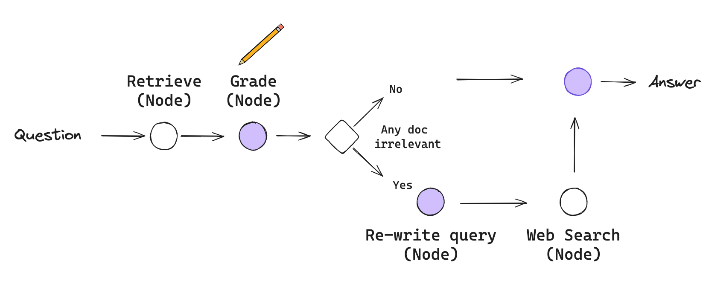
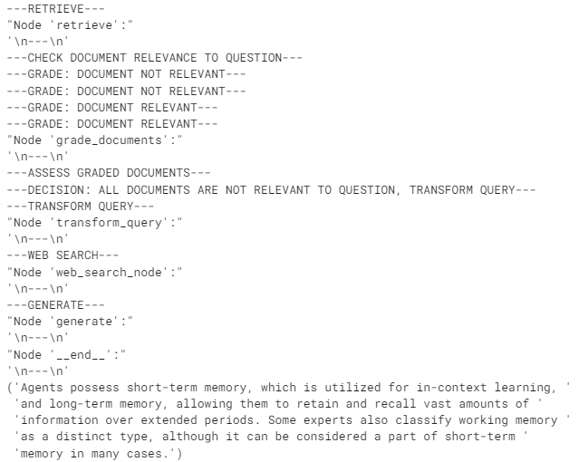
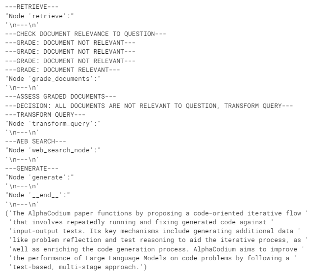

# Corrective RAG (CRAG)

Corrective-RAG (CRAG) 是一种 RAG 策略，包含对检索到的文档进行自我反思/自我评分。

在[这篇论文](https://arxiv.org/pdf/2401.15884.pdf)中，采取了以下几个步骤：

- 如果至少有一份文档超过了相关性的阈值，则继续生成。
- 在生成之前，执行知识细化。
- 这会将文档分为“知识条”。
- 它会对每条进行评分，并过滤掉不相关的内容。
- 如果所有文档的相关性低于阈值，或者评分者不确定，则框架会寻找其他数据源。
- 它会使用网页搜索来补充检索。

我们将使用 [LangGraph](https://langchain-ai.github.io/langgraph/) 从头开始实现这些想法：

- 我们将跳过知识细化阶段，作为第一次尝试。如果需要，可以将其添加回来作为节点。
- 如果 *任何* 文档不相关，我们将选择通过网页搜索来补充检索。
- 我们将使用 [Tavily Search](https://python.langchain.com/v0.2/docs/integrations/tools/tavily_search/) 进行网页搜索。
- 我们将使用查询重写来优化网页搜索的查询。



# 环境

```
pip install langchain_community tiktoken langchain-openai langchainhub chromadb langchain langgraph tavily-python
```

### LLMs

```python
import os

os.environ["OPENAI_API_KEY"] = ""
```

### 搜索

我们将使用 [Tavily Search](https://python.langchain.com/docs/integrations/tools/tavily_search) 进行网页搜索。

```python
os.environ["TAVILY_API_KEY"] = ""
```

### 跟踪

可选地，使用 [LangSmith](https://docs.smith.langchain.com/) 进行跟踪（在底部显示）

```python
os.environ["LANGCHAIN_TRACING_V2"] = "true"
os.environ["LANGCHAIN_ENDPOINT"] = "https://api.smith.langchain.com"
os.environ["LANGCHAIN_API_KEY"] = ""
```

## 索引

我们来索引三个博客文章。

```python
from langchain.text_splitter import RecursiveCharacterTextSplitter
from langchain_community.document_loaders import WebBaseLoader
from langchain_community.vectorstores import Chroma
from langchain_openai import OpenAIEmbeddings

urls = [
    "https://lilianweng.github.io/posts/2023-06-23-agent/",
    "https://lilianweng.github.io/posts/2023-03-15-prompt-engineering/",
    "https://lilianweng.github.io/posts/2023-10-25-adv-attack-llm/",
]

docs = [WebBaseLoader(url).load() for url in urls]
docs_list = [item for sublist in docs for item in sublist]

text_splitter = RecursiveCharacterTextSplitter.from_tiktoken_encoder(
    chunk_size=250, chunk_overlap=0
)
doc_splits = text_splitter.split_documents(docs_list)

# 添加到向量数据库
vectorstore = Chroma.from_documents(
    documents=doc_splits,
    collection_name="rag-chroma",
    embedding=OpenAIEmbeddings(),
)
retriever = vectorstore.as_retriever()
```

## LLMs

```python
### 检索评分器

from langchain_core.prompts import ChatPromptTemplate
from langchain_core.pydantic_v1 import BaseModel, Field
from langchain_openai import ChatOpenAI


# 数据模型
class GradeDocuments(BaseModel):
    """对检索到的文档进行相关性检查的二元评分。"""

    binary_score: str = Field(
        description="文档与问题相关，'yes' 或 'no'"
    )


# 带有函数调用的 LLM
llm = ChatOpenAI(model="gpt-3.5-turbo-0125", temperature=0)
structured_llm_grader = llm.with_structured_output(GradeDocuments)

# 提示
system = """你是评估检索到的文档是否与用户问题相关的评分者。 \n 
    如果文档包含与问题相关的关键字或语义，请将其评为相关。 \n
    给出 'yes' 或 'no' 的二元评分，以表示文档是否与问题相关。"""
grade_prompt = ChatPromptTemplate.from_messages(
    [
        ("system", system),
        ("human", "检索到的文档: \n\n {document} \n\n 用户问题: {question}"),
    ]
)

retrieval_grader = grade_prompt | structured_llm_grader
question = "代理记忆"
docs = retriever.get_relevant_documents(question)
doc_txt = docs[1].page_content
print(retrieval_grader.invoke({"question": question, "document": doc_txt}))
```

`binary_score='yes'`

```python
### 生成

from langchain import hub
from langchain_core.output_parsers import StrOutputParser

# 提示
prompt = hub.pull("rlm/rag-prompt")

# LLM
llm = ChatOpenAI(model_name="gpt-3.5-turbo", temperature=0)


# 后处理
def format_docs(docs):
    return "\n\n".join(doc.page_content for doc in docs)


# 链
rag_chain = prompt | llm | StrOutputParser()

# 运行
generation = rag_chain.invoke({"context": docs, "question": question})
print(generation)
```

`生成代理的设计结合了 LLM、记忆、计划和反思机制，使代理能够根据过去的经验行事。记忆流是一个长期记忆模块，用自然语言记录代理的经验列表。短期记忆用于上下文学习，而长期记忆允许代理在较长时间内保留和回忆信息。`

```python
### 问题重写器

# LLM
llm = ChatOpenAI(model="gpt-3.5-turbo-0125", temperature=0)

# 提示
system = """你是一个问题重写器，将输入的问题转换为优化后的版本，\n 
     用于网页搜索。查看输入并尝试推理其潜在语义意图。"""
re_write_prompt = ChatPromptTemplate.from_messages(
    [
        ("system", system),
        (
            "human",
            "这是初始问题: \n\n {question} \n 形成一个改进的问题。",
        ),
    ]
)

question_rewriter = re_write_prompt | llm | StrOutputParser()
question_rewriter.invoke({"question": question})
```

`在人工智能代理中，记忆的作用是什么？`

## 网页搜索工具

```python
### 搜索

from langchain_community.tools.tavily_search import TavilySearchResults

web_search_tool = TavilySearchResults(k=3)
```

# 图

将流程捕获为图。

## 图状态

```python
from typing import List

from typing_extensions import TypedDict


class GraphState(TypedDict):
    """
    表示我们图的状态。

    属性:
        question: 问题
        generation: LLM 生成
        web_search: 是否添加搜索
        documents: 文档列表
    """

    question: str
    generation: str
    web_search: str
    documents: List[str]

```

```python
from langchain.schema import Document


def retrieve(state):
    """
    检索文档

    参数:
        state (dict): 当前的图状态

    返回:
        state (dict): 新增的包含检索到的文档的状态
    """
    print("---检索---")
    question = state["question"]

    # 检索
    documents = retriever.get_relevant_documents(question)
    return {"documents": documents, "question": question}


def generate(state):
    """
    生成答案

    参数:
        state (dict): 当前的图状态

    返回:
        state (dict): 新增的包含 LLM 生成的状态
    """
    print("---生成---")
    question = state["question"]
    documents = state["documents"]

    # RAG 生成
    generation = rag_chain.invoke({"context": documents, "question": question})
    return {"documents": documents, "question": question, "generation": generation}


def grade_documents(state):
    """
    确定检索到的文档是否与问题相关。

    参数:
        state (dict): 当前的图状态

    返回:
        state (dict): 更新的仅包含相关文档的状态
    """

    print("---检查文档与问题的相关性---")
    question = state["question"]
    documents = state["documents"]

    # 为每个文档评分
    filtered_docs = []
    web_search = "No"
    for d in documents:
        score = retrieval_grader.invoke(
            {"question": question, "document": d.page_content}
        )
        grade = score.binary_score
        if grade == "yes":
            print("---评分: 文档相关---")
            filtered_docs.append(d)
        else:
            print("---评分: 文档不相关---")
            web_search = "Yes"
            continue
    return {"documents": filtered_docs, "question": question, "web

_search": web_search}


def transform_query(state):
    """
    转换查询以生成更好的问题。

    参数:
        state (dict): 当前的图状态

    返回:
        state (dict): 更新的包含重新措辞问题的状态
    """

    print("---转换查询---")
    question = state["question"]
    documents = state["documents"]

    # 重新措辞问题
    better_question = question_rewriter.invoke({"question": question})
    return {"documents": documents, "question": better_question}


def web_search(state):
    """
    基于重新措辞的问题进行网页搜索。

    参数:
        state (dict): 当前的图状态

    返回:
        state (dict): 更新的状态，其中包含附加的网页搜索结果
    """

    print("---网页搜索---")
    question = state["question"]
    documents = state["documents"]

    # 网页搜索
    docs = web_search_tool.invoke({"query": question})
    web_results = "\n".join([d["content"] for d in docs])
    web_results = Document(page_content=web_results)
    documents.append(web_results)

    return {"documents": documents, "question": question}


### 边


def decide_to_generate(state):
    """
    确定是否生成答案，或者重新生成问题。

    参数:
        state (dict): 当前的图状态

    返回:
        str: 下一步调用的节点的二元决策
    """

    print("---评估评分后的文档---")
    state["question"]
    web_search = state["web_search"]
    state["documents"]

    if web_search == "Yes":
        # 所有文档均已过滤，检查相关性
        # 我们将重新生成一个新查询
        print(
            "---决策: 所有文档与问题不相关，转换查询---"
        )
        return "transform_query"
    else:
        # 我们有相关文档，因此生成答案
        print("---决策: 生成---")
        return "generate"
```


## 构建图

这只是遵循我们在上图中概述的流程。

```python
from langgraph.graph import END, StateGraph, START

workflow = StateGraph(GraphState)

# 定义节点
workflow.add_node("retrieve", retrieve)  # 检索
workflow.add_node("grade_documents", grade_documents)  # 评分文档
workflow.add_node("generate", generate)  # 生成
workflow.add_node("transform_query", transform_query)  # 转换查询
workflow.add_node("web_search_node", web_search)  # 网页搜索

# 构建图
workflow.add_edge(START, "retrieve")
workflow.add_edge("retrieve", "grade_documents")
workflow.add_conditional_edges(
    "grade_documents",
    decide_to_generate,
    {
        "transform_query": "transform_query",
        "generate": "generate",
    },
)
workflow.add_edge("transform_query", "web_search_node")
workflow.add_edge("web_search_node", "generate")
workflow.add_edge("generate", END)

# 编译
app = workflow.compile()
```

```python
from pprint import pprint

# 运行
inputs = {"question": "代理记忆的类型有哪些？"}
for output in app.stream(inputs):
    for key, value in output.items():
        # 节点
        pprint(f"Node '{key}':")
        # 可选: 在每个节点打印完整状态
        # pprint.pprint(value["keys"], indent=2, width=80, depth=None)
    pprint("\n---\n")

# 最终生成结果
pprint(value["generation"])
```



```python
from pprint import pprint

# 运行
inputs = {"question": "AlphaCodium 论文是如何运作的？"}
for output in app.stream(inputs):
    for key, value in output.items():
        # 节点
        pprint(f"Node '{key}':")
        # 可选: 在每个节点打印完整状态
        # pprint.pprint(value["keys"], indent=2, width=80, depth=None)
    pprint("\n---\n")

# 最终生成结果
pprint(value["generation"])
```




LangSmith 跟踪 -

- https://smith.langchain.com/public/f6b1716c-e842-4282-9112-1026b93e246b/r
- https://smith.langchain.com/public/497c8ed9-d9e2-429e-8ada-e64de3ec26c9/r