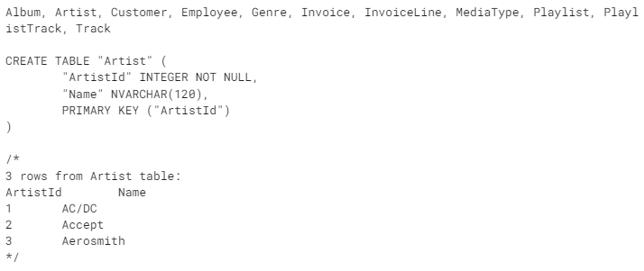

# 用于与 SQL 数据库交互的代理

在本教程中，我们将逐步构建一个能够回答关于 SQL 数据库问题的代理。

代理将执行以下步骤：

1. 从数据库中获取可用表
2. 决定哪些表与问题相关
3. 获取相关表的 DDL（数据定义语言）
4. 根据问题和 DDL 信息生成查询
5. 使用 LLM 检查查询中的常见错误
6. 执行查询并返回结果
7. 修正数据库引擎暴露的错误，直到查询成功
8. 根据结果制定响应

完整的工作流程如下所示：


## 设置环境

我们将为 OpenAI 设置环境变量，并可选地启用 [LangSmith](https://smith.langchain.com/) 进行跟踪。

```python
import os

os.environ["OPENAI_API_KEY"] = "sk-..."
os.environ["LANGSMITH_API_KEY"] = "lsv2_pt_..."
os.environ["LANGCHAIN_TRACING_V2"] = "true"
os.environ["LANGCHAIN_PROJECT"] = "sql-agent"
```

## 配置数据库

我们将为本教程创建一个 SQLite 数据库。SQLite 是一个轻量级数据库，易于设置和使用。我们将加载 `chinook` 数据库，这是一个代表数字媒体商店的示例数据库。有关数据库的更多信息，请访问[这里](https://www.sqlitetutorial.net/sqlite-sample-database/)。

为了方便，我们已将数据库 (`Chinook.db`) 托管在一个公共 GCS 存储桶中。

```python
import requests

url = "https://storage.googleapis.com/benchmarks-artifacts/chinook/Chinook.db"

response = requests.get(url)

if response.status_code == 200:
    # 以二进制写入模式打开本地文件
    with open("Chinook.db", "wb") as file:
        # 将响应的内容（文件）写入本地文件
        file.write(response.content)
    print("文件下载并保存为 Chinook.db")
else:
    print(f"下载文件失败。状态码：{response.status_code}")
```

`文件下载并保存为 Chinook.db`

我们将使用 `langchain_community` 包中提供的方便的 SQL 数据库封装与数据库进行交互。该封装提供了一个简单的接口来执行 SQL 查询并获取结果。我们还将使用 `langchain_openai` 包来与 OpenAI 的语言模型 API 交互。

```python
pip install langgraph langchain_community langchain_openai
```

```python
from langchain_community.utilities import SQLDatabase

db = SQLDatabase.from_uri("sqlite:///Chinook.db")
print(db.dialect)
print(db.get_usable_table_names())
db.run("SELECT * FROM Artist LIMIT 10;")
```

`文件下载并保存为 Chinook.db`


## 实用函数

我们将定义一些实用函数来帮助我们实现代理。具体来说，我们将用一个带有回退功能的 `ToolNode` 来处理错误并将其呈现给代理。

```python
from typing import Any

from langchain_core.messages import ToolMessage
from langchain_core.runnables import RunnableLambda, RunnableWithFallbacks
from langgraph.prebuilt import ToolNode


def create_tool_node_with_fallback(tools: list) -> RunnableWithFallbacks[Any, dict]:
    """
    创建一个带有回退功能的 ToolNode 来处理错误并将其呈现给代理。
    """
    return ToolNode(tools).with_fallbacks(
        [RunnableLambda(handle_tool_error)], exception_key="error"
    )


def handle_tool_error(state) -> dict:
    error = state.get("error")
    tool_calls = state["messages"][-1].tool_calls
    return {
        "messages": [
            ToolMessage(
                content=f"错误：{repr(error)}\n 请修正你的错误。",
                tool_call_id=tc["id"],
            )
            for tc in tool_calls
        ]
    }
```

## 为代理定义工具

我们将定义一些工具，代理将使用这些工具与数据库交互。

1. `list_tables_tool`: 获取数据库中的可用表
2. `get_schema_tool`: 获取表的 DDL
3. `db_query_tool`: 执行查询并获取结果，或在查询失败时返回错误消息

对于前两个工具，我们将从 `SQLDatabaseToolkit` 中获取它们，该工具包也在 `langchain_community` 包中提供。

```python
from langchain_community.agent_toolkits import SQLDatabaseToolkit
from langchain_openai import ChatOpenAI

toolkit = SQLDatabaseToolkit(db=db, llm=ChatOpenAI(model="gpt-4o"))
tools = toolkit.get_tools()

list_tables_tool = next(tool for tool in tools if tool.name == "sql_db_list_tables")
get_schema_tool = next(tool for tool in tools if tool.name == "sql_db_schema")

print(list_tables_tool.invoke(""))

print(get_schema_tool.invoke("Artist"))
```



第三个工具将手动定义。对于 `db_query_tool`，我们将针对数据库执行查询并返回结果。

```python
from langchain_core.tools import tool


@tool
def db_query_tool(query: str) -> str:
    """
    对数据库执行 SQL 查询并获取结果。
    如果查询不正确，将返回错误消息。
    如果返回错误，请重写查询，检查查询，并重试。
    """
    result = db.run_no_throw(query)
    if not result:
        return "错误：查询失败。请重写查询并重试。"
    return result


print(db_query_tool.invoke("SELECT * FROM Artist LIMIT 10;"))
```


虽然严格来说这不是一个工具，但我们将提示 LLM 检查查询中的常见错误，并在工作流中稍后将其添加为一个节点。

```python
from langchain_core.prompts import ChatPromptTemplate

query_check_system = """你是一个 SQL 专家，具有强烈的细节关注度。
请检查 SQLite 查询中的常见错误，包括：
- 使用 NOT IN 处理 NULL 值
- 应使用 UNION ALL 而不是 UNION
- 使用 BETWEEN 进行排他范围
- 谓词中的数据类型不匹配
- 正确引用标识符
- 为函数使用正确数量的参数
- 转换为正确的数据类型
- 为连接使用适当的列

如果存在上述错误之一，请重写查询。如果没有错误，只需复制原始查询。

在执行此检查后，你将调用适当的工具来执行查询。"""

query_check_prompt = ChatPromptTemplate.from_messages(
    [("system", query_check_system), ("placeholder", "{messages}")]
)
query_check = query_check_prompt | ChatOpenAI(model="gpt-4o", temperature=0).bind_tools(
    [db_query_tool], tool_choice="required"
)

query_check.invoke({"messages": [("user", "SELECT * FROM Artist LIMIT 10;")]})
```


## 定义工作流程

然后我们将为代理定义工作流程。代理将首先强制调用 `list_tables_tool` 以获取数据库中的可用表，然后按照本教程开头提到的步骤进行。

```python
from typing import Annotated, Literal

from langchain_core.messages import AIMessage
from langchain_core.pydantic_v1 import BaseModel, Field
from langchain_openai import ChatOpenAI
from typing_extensions import TypedDict

from langgraph.graph import END, StateGraph, START
from langgraph.graph.message import AnyMessage, add_messages


# 定义代理的状态
class State(TypedDict):
    messages: Annotated[list[AnyMessage], add_messages]


# 定义一个新的图
workflow = StateGraph(State)


# 为第一个工具调用添加一个节点
def first_tool_call(state: State) -> dict[str, list[AIMessage]]:
    return {
        "messages": [
            AIMessage(
                content="",
                tool_calls=[
                    {
                        "name": "sql_db_list_tables",
                        "args": {},
                        "id": "tool_abcd123",
                    }
                ],
            )
        ]
    }


def model_check_query(state: State) -> dict[str, list[AIMessage]]:
    """
    使用此工具在执行查询之前检查查询是否正确。
    """
    return {"messages": [query_check.invoke({"messages": [state["messages"][-1]]})]}


workflow.add_node("first_tool_call", first_tool_call)

# 为前两个工具添加节点
workflow.add_node(
    "list_tables_tool", create_tool_node_with_fallback([list_tables_tool])
)
workflow.add_node("get_schema_tool", create_tool_node_with_fallback([get_schema_tool]))

# 为模型添加一个节点，以根据问题和可用表选择相关表
model_get_schema = ChatOpenAI(model="gpt-4o", temperature=0).bind_tools(
    [get_schema_tool]
)
workflow.add_node(
    "model_get_schema",
    lambda state: {
        "messages": [model_get_schema.invoke(state["messages"])

],
    },
)


# 描述一个工具来表示结束状态
class SubmitFinalAnswer(BaseModel):
    """根据查询结果向用户提交最终答案。"""

    final_answer: str = Field(..., description="提交给用户的最终答案")


# 为模型添加一个节点，以根据问题和架构生成查询
query_gen_system = """你是一个 SQL 专家，具有强烈的细节关注度。

给定一个输入问题，输出一个语法正确的 SQLite 查询来运行，然后查看查询结果并返回答案。

除非用户指定要获取的示例数量，否则始终将查询限制为最多 5 个结果。
你可以按相关列排序结果，以返回数据库中最有趣的示例。
绝不要查询特定表的所有列，只查询与问题相关的列。

如果在执行查询时遇到错误，请重写查询并重试。

如果结果集为空，你应该尝试重写查询以获取非空的结果集。
如果没有足够的信息来回答查询，请说你没有足够的信息。

如果你有足够的信息来回答输入问题，只需调用适当的工具向用户提交最终答案。

不要对数据库执行任何 DML 语句（INSERT、UPDATE、DELETE、DROP 等）。"""
query_gen_prompt = ChatPromptTemplate.from_messages(
    [("system", query_gen_system), ("placeholder", "{messages}")]
)
query_gen = query_gen_prompt | ChatOpenAI(model="gpt-4o", temperature=0).bind_tools(
    [SubmitFinalAnswer]
)


def query_gen_node(state: State):
    message = query_gen.invoke(state)

    # 有时，LLM 会产生错误的工具调用。我们需要捕获这个并返回错误消息。
    tool_messages = []
    if message.tool_calls:
        for tc in message.tool_calls:
            if tc["name"] != "SubmitFinalAnswer":
                tool_messages.append(
                    ToolMessage(
                        content=f"错误：调用了错误的工具：{tc['name']}。请修正你的错误。记住，只调用 SubmitFinalAnswer 来提交最终答案。生成的查询应在没有工具调用的情况下输出。",
                        tool_call_id=tc["id"],
                    )
                )
    else:
        tool_messages = []
    return {"messages": [message] + tool_messages}


workflow.add_node("query_gen", query_gen_node)

# 为模型添加一个节点，以在执行查询之前检查查询
workflow.add_node("correct_query", model_check_query)

# 添加节点以执行查询
workflow.add_node("execute_query", create_tool_node_with_fallback([db_query_tool]))


# 定义条件边以决定是否继续或结束工作流程
def should_continue(state: State) -> Literal[END, "correct_query", "query_gen"]:
    messages = state["messages"]
    last_message = messages[-1]
    # 如果有工具调用，则完成
    if getattr(last_message, "tool_calls", None):
        return END
    if last_message.content.startswith("错误："):
        return "query_gen"
    else:
        return "correct_query"


# 指定节点之间的边
workflow.add_edge(START, "first_tool_call")
workflow.add_edge("first_tool_call", "list_tables_tool")
workflow.add_edge("list_tables_tool", "model_get_schema")
workflow.add_edge("model_get_schema", "get_schema_tool")
workflow.add_edge("get_schema_tool", "query_gen")
workflow.add_conditional_edges(
    "query_gen",
    should_continue,
)
workflow.add_edge("correct_query", "execute_query")
workflow.add_edge("execute_query", "query_gen")

# 将工作流程编译为可运行的应用程序
app = workflow.compile()
```

## 可视化图

```python
from IPython.display import Image, display
from langchain_core.runnables.graph import MermaidDrawMethod

display(
    Image(
        app.get_graph().draw_mermaid_png(
            draw_method=MermaidDrawMethod.API,
        )
    )
)
```


## 运行代理

```python
import json

messages = app.invoke(
    {"messages": [("user", "2009 年销售额最高的销售代理是谁？")]}
)
json_str = messages["messages"][-1].additional_kwargs["tool_calls"][0]["function"][
    "arguments"
]
json.loads(json_str)["final_answer"]
```

`'2009 年销售额最高的销售代理是 Steve Johnson，总销售额为 164.34。`

```python
for event in app.stream(
    {"messages": [("user", "2009 年销售额最高的销售代理是谁？")]}
):
    print(event)
```

## 评估

现在，我们可以评估这个代理！我们之前在 LangSmith 评估烹饪书中定义了[简单的 SQL 代理](https://github.com/langchain-ai/langsmith-cookbook/blob/main/testing-examples/agent-evals-with-langgraph/langgraph_sql_agent_eval.ipynb)，并评估了我们数据库的 5 个问题的响应。我们可以将这个代理与我们之前的代理在同一个数据集上进行比较。[代理评估](https://docs.smith.langchain.com/concepts/evaluation#agents)可以关注 3 件事：

- `响应`：输入是一个提示和一个工具列表。输出是代理的响应。
- `单个工具`：与之前一样，输入是一个提示和一个工具列表。输出是工具调用。
- `轨迹`：与之前一样，输入是一个提示和一个工具列表。输出是工具调用列表。


### 响应

我们将评估代理的端到端响应相对于参考答案。让我们对同一个数据集进行[响应评估](https://docs.smith.langchain.com/concepts/evaluation#evaluating-an-agents-final-response)。

```python
import json


def predict_sql_agent_answer(example: dict):
    """用于答案评估"""
    msg = {"messages": ("user", example["input"])}
    messages = app.invoke(msg)
    json_str = messages["messages"][-1].additional_kwargs["tool_calls"][0]["function"][
        "arguments"
    ]
    response = json.loads(json_str)["final_answer"]
    return {"response": response}
```

```python
from langchain import hub
from langchain_openai import ChatOpenAI

# 评分提示
grade_prompt_answer_accuracy = prompt = hub.pull("langchain-ai/rag-answer-vs-reference")


def answer_evaluator(run, example) -> dict:
    """
    一个简单的 RAG 答案准确性评估器
    """

    # 获取问题、参考答案、链
    input_question = example.inputs["input"]
    reference = example.outputs["output"]
    prediction = run.outputs["response"]

    # LLM 评分器
    llm = ChatOpenAI(model="gpt-4-turbo", temperature=0)

    # 结构化提示
    answer_grader = grade_prompt_answer_accuracy | llm

    # 运行评估器
    score = answer_grader.invoke(
        {
            "question": input_question,
            "correct_answer": reference,
            "student_answer": prediction,
        }
    )
    score = score["Score"]

    return {"key": "answer_v_reference_score", "score": score}
```

```python
from langsmith.evaluation import evaluate

dataset_name = "SQL Agent Response"
experiment_results = evaluate(
    predict_sql_agent_answer,
    data=dataset_name,
    evaluators=[answer_evaluator],
    num_repetitions=3,
    experiment_prefix="sql-agent-multi-step-response-v-reference",
    metadata={"version": "Chinook, gpt-4o multi-step-agent"},
)
```

总结指标（请参阅数据集[这里](https://smith.langchain.com/public/20808486-67c3-4e30-920b-6d49d6f2b6b8/d)）：

- 这里的 `multi-step` 代理优于之前定义的[基础 SQL 代理](https://github.com/langchain-ai/langsmith-cookbook/blob/main/testing-examples/agent-evals-with-langgraph/langgraph_sql_agent_eval.ipynb)


### 轨迹

让我们在同一个数据集上进行[轨迹评估](https://docs.smith.langchain.com/concepts/evaluation#evaluating-an-agents-trajectory)。

```python
# 这些是我们期望代理使用的工具
expected_trajectory = [
    "sql_db_list_tables",  # 第一个：list_tables_tool 节点
    "sql_db_schema",  # 第二个：get_schema_tool 节点
    "db_query_tool",  # 第三个：execute_query 节点
    "SubmitFinalAnswer",
]  # 第四个：query_gen
```

```python
def predict_sql_agent_messages(example: dict):
    """用于答案评估"""
    msg = {"messages": ("user", example["input"])}
    messages = app.invoke(msg)
    return {"response": messages}
```

```python
from langsmith.schemas import Example, Run


def find_tool_calls(messages):
    """
    找到返回消息中的所有工具调用
    """
    tool_calls = [
        tc["name"] for m in messages["messages"] for tc in getattr(m, "tool_calls", [])
    ]
    return tool_calls


def contains_all

_tool_calls_in_order_exact_match(
    root_run: Run, example: Example
) -> dict:
    """
    检查是否所有预期工具按顺序调用且没有任何额外的工具调用。
    """
    expected_trajectory = [
        "sql_db_list_tables",
        "sql_db_schema",
        "db_query_tool",
        "SubmitFinalAnswer",
    ]
    messages = root_run.outputs["response"]
    tool_calls = find_tool_calls(messages)

    # 打印工具调用以进行调试
    print("这是我的工具调用：")
    print(tool_calls)

    # 检查工具调用是否完全匹配预期轨迹
    if tool_calls == expected_trajectory:
        score = 1
    else:
        score = 0

    return {"score": int(score), "key": "multi_tool_call_in_exact_order"}


def contains_all_tool_calls_in_order(root_run: Run, example: Example) -> dict:
    """
    检查所有预期工具是否按顺序调用，但允许在预期工具之间调用其他工具。
    """
    messages = root_run.outputs["response"]
    tool_calls = find_tool_calls(messages)

    # 打印工具调用以进行调试
    print("这是我的工具调用：")
    print(tool_calls)

    it = iter(tool_calls)
    if all(elem in it for elem in expected_trajectory):
        score = 1
    else:
        score = 0
    return {"score": int(score), "key": "multi_tool_call_in_order"}
```

```python
experiment_results = evaluate(
    predict_sql_agent_messages,
    data=dataset_name,
    evaluators=[
        contains_all_tool_calls_in_order,
        contains_all_tool_calls_in_order_exact_match,
    ],
    num_repetitions=3,
    experiment_prefix="sql-agent-multi-step-tool-calling-trajecory-in-order",
    metadata={"version": "Chinook, gpt-4o multi-step-agent"},
)
```

聚合分数显示我们从未按顺序正确调用工具：


查看日志，我们可以看到一些有趣的内容：

```
['sql_db_list_tables', 'sql_db_schema', 'sql_db_query', 'db_query_tool', 'SubmitFinalAnswer']
```

我们似乎在大多数运行中在轨迹中插入了一个幻觉工具调用 `sql_db_query`。

这就是为什么 `multi_tool_call_in_exact_order` 失败，但 `multi_tool_call_in_order` 仍然通过。

我们将在未来的烹饪书中探索使用 LangGraph 解决这个问题的方法！