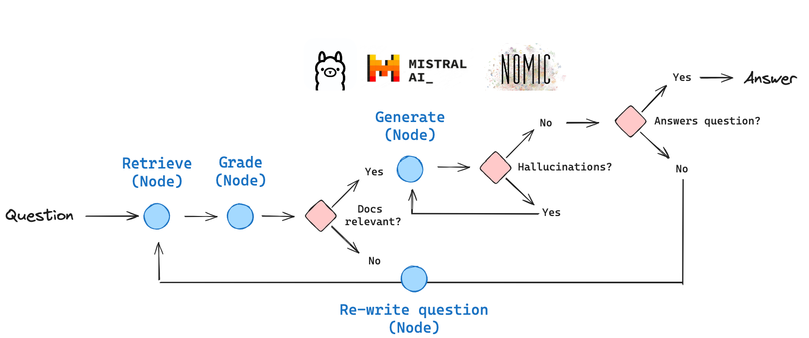

# 使用本地 LLM 的 Self RAG

Self-RAG 是一种 RAG 策略，包含对检索到的文档和生成结果的自我反思/自我评分。

在[这篇论文](https://arxiv.org/abs/2310.11511)中，做出了几个决策：

1. 是否应该从检索器 `R` 中检索 -

- 输入: `x (问题)` 或 `x (问题)`，`y (生成)`
- 决定何时用 `R` 检索 `D` 块
- 输出: `是, 否, 继续`

2. 检索到的段落 `D` 是否与问题 `x` 相关 -

- 输入: (`x (问题)`，`d (段落)`) 对于 `D` 中的 `d`
- `d` 提供了解决 `x` 的有用信息
- 输出: `相关, 不相关`

3. 每个块中的 LLM 生成是否与该块相关（幻觉等） -

- 输入: `x (问题)`，`d (段落)`，`y (生成)` 对于 `D` 中的 `d`
- `y (生成)` 中所有值得验证的陈述均由 `d` 支持
- 输出: `{完全支持, 部分支持, 不支持`

4. 每个块中的 LLM 生成是否是对 `x (问题)` 的有用回应 -

- 输入: `x (问题)`，`y (生成)` 对于 `D` 中的 `d`
- `y (生成)` 是对 `x (问题)` 的有用回应。
- 输出: `{5, 4, 3, 2, 1}`

我们将使用 [LangGraph](https://langchain-ai.github.io/langgraph/) 从头开始实现这些想法。



# 环境

```
pip install -U langchain-nomic langchain_community tiktoken langchainhub chromadb langchain langgraph nomic[local]
```

### LLMs

#### 本地嵌入

您可以使用 Nomic 的 `GPT4AllEmbeddings()`，它可以访问 Nomic 最近发布的 [v1](https://blog.nomic.ai/posts/nomic-embed-text-v1) 和 [v1.5](https://blog.nomic.ai/posts/nomic-embed-matryoshka) 嵌入。

请遵循 [此处](https://docs.gpt4all.io/gpt4all_python_embedding.html#supported-embedding-models) 的文档。

#### 本地 LLM

(1) 下载 [Ollama 应用](https://ollama.ai/)。

(2) 从 [此处](https://ollama.ai/library/mistral) 的各种 Mistral 版本和 [此处](https://ollama.ai/library/mixtral) 的 Mixtral 版本下载一个 `Mistral` 模型。

```
ollama pull mistral
```

```
# Ollama 模型名称
local_llm = "mistral"
```

### 跟踪

可选地，使用 [LangSmith](https://docs.smith.langchain.com/) 进行跟踪（在底部显示）

```
import os

os.environ["LANGCHAIN_TRACING_V2"] = "true"
os.environ["LANGCHAIN_ENDPOINT"] = "https://api.smith.langchain.com"
os.environ["LANGCHAIN_API_KEY"] = ""
```

## 索引

我们来索引三个博客文章。

```python
from langchain.text_splitter import RecursiveCharacterTextSplitter
from langchain_community.document_loaders import WebBaseLoader
from langchain_community.vectorstores import Chroma
from langchain_nomic.embeddings import NomicEmbeddings

urls = [
    "https://lilianweng.github.io/posts/2023-06-23-agent/",
    "https://lilianweng.github.io/posts/2023-03-15-prompt-engineering/",
    "https://lilianweng.github.io/posts/2023-10-25-adv-attack-llm/",
]

docs = [WebBaseLoader(url).load() for url in urls]
docs_list = [item for sublist in docs for item in sublist]

text_splitter = RecursiveCharacterTextSplitter.from_tiktoken_encoder(
    chunk_size=250, chunk_overlap=0
)
doc_splits = text_splitter.split_documents(docs_list)

# 添加到向量数据库
vectorstore = Chroma.from_documents(
    documents=doc_splits,
    collection_name="rag-chroma",
    embedding=NomicEmbeddings(model="nomic-embed-text-v1.5", inference_mode="local"),
)
retriever = vectorstore.as_retriever()
```

## LLMs

```python
### 检索评分器

from langchain.prompts import PromptTemplate
from langchain_community.chat_models import ChatOllama
from langchain_core.output_parsers import JsonOutputParser

# LLM
llm = ChatOllama(model=local_llm, format="json", temperature=0)

prompt = PromptTemplate(
    template="""You are a grader assessing relevance of a retrieved document to a user question. \n 
    Here is the retrieved document: \n\n {document} \n\n
    Here is the user question: {question} \n
    If the document contains keywords related to the user question, grade it as relevant. \n
    It does not need to be a stringent test. The goal is to filter out erroneous retrievals. \n
    Give a binary score 'yes' or 'no' score to indicate whether the document is relevant to the question. \n
    Provide the binary score as a JSON with a single key 'score' and no premable or explanation.""",
    input_variables=["question", "document"],
)

retrieval_grader = prompt | llm | JsonOutputParser()
question = "agent memory"
docs = retriever.get_relevant_documents(question)
doc_txt = docs[1].page_content
print(retrieval_grader.invoke({"question": question, "document": doc_txt}))
```

`{'score': 'yes'}`

```python
### 生成

from langchain import hub
from langchain_core.output_parsers import StrOutputParser

# 提示
prompt = hub.pull("rlm/rag-prompt")

# LLM
llm = ChatOllama(model=local_llm, temperature=0)


# 后处理
def format_docs(docs):
    return "\n\n".join(doc.page_content for doc in docs)


# 链
rag_chain = prompt | llm | StrOutputParser()

# 运行
generation = rag_chain.invoke({"context": docs, "question": question})
print(generation)
```

`在 LLM 驱动的自主代理系统中，大型语言模型（LLM）作为代理的“大脑”。代理具有包括记忆、计划和反思机制在内的关键组件。记忆组件是一个长期记忆模块，用自然语言记录代理的经验列表。它包括一个记忆流，这是一个用于存储过去经验的外部数据库。反思机制随着时间的推移将记忆综合成更高级别的推论，并指导代理的未来行为。`

```python
### 幻觉评分器

# LLM
llm = ChatOllama(model=local_llm, format="json", temperature=0)

# 提示
prompt = PromptTemplate(
    template="""You are a grader assessing whether an answer is grounded in / supported by a set of facts. \n 
    Here are the facts:
    \n ------- \n
    {documents} 
    \n ------- \n
    Here is the answer: {generation}
    Give a binary score 'yes' or 'no' score to indicate whether the answer is grounded in / supported by a set of facts. \n
    Provide the binary score as a JSON with a single key 'score' and no preamble or explanation.""",
    input_variables=["generation", "documents"],
)

hallucination_grader = prompt | llm | JsonOutputParser()
hallucination_grader.invoke({"documents": docs, "generation": generation})
```

`{'score': 'yes'}`

```python
### 答案评分器

# LLM
llm = ChatOllama(model=local_llm, format="json", temperature=0)

# 提示
prompt = PromptTemplate(
    template="""You are a grader assessing whether an answer is useful to resolve a question. \n 
    Here is the answer:
    \n ------- \n
    {generation} 
    \n ------- \n
    Here is the question: {question}
    Give a binary score 'yes' or 'no' to indicate whether the answer is useful to resolve a question. \n
    Provide the binary score as a JSON with a single key 'score' and no preamble or explanation.""",
    input_variables=["generation", "question"],
)

answer_grader = prompt | llm | JsonOutputParser()
answer_grader.invoke({"question": question, "generation": generation})
```

`{'score': 'yes'}`

```python
### 问题重写器

# LLM
llm = ChatOllama(model=local_llm, temperature=0)

# 提示
re_write_prompt = PromptTemplate(
    template="""You a question re-writer that converts an input question to a better version

 that is optimized \n 
     for vectorstore retrieval. Look at the initial and formulate an improved question. \n
     Here is the initial question: \n\n {question}. Improved question with no preamble: \n """,
    input_variables=["generation", "question"],
)

question_rewriter = re_write_prompt | llm | StrOutputParser()
question_rewriter.invoke({"question": question})
```

`'什么是代理记忆，它如何在向量数据库检索中有效利用？'`

# 图

将流程捕获为图。

## 图状态

```python
from typing import List

from typing_extensions import TypedDict


class GraphState(TypedDict):
    """
    表示我们图的状态。

    属性:
        question: 问题
        generation: LLM 生成
        documents: 文档列表
    """

    question: str
    generation: str
    documents: List[str]

```

```python
### 节点

def retrieve(state):
    """
    检索文档

    参数:
        state (dict): 当前的图状态

    返回:
        state (dict): 新增的包含检索到的文档的状态
    """
    print("---检索---")
    question = state["question"]

    # 检索
    documents = retriever.get_relevant_documents(question)
    return {"documents": documents, "question": question}


def generate(state):
    """
    生成答案

    参数:
        state (dict): 当前的图状态

    返回:
        state (dict): 新增的包含 LLM 生成的状态
    """
    print("---生成---")
    question = state["question"]
    documents = state["documents"]

    # RAG 生成
    generation = rag_chain.invoke({"context": documents, "question": question})
    return {"documents": documents, "question": question, "generation": generation}


def grade_documents(state):
    """
    确定检索到的文档是否与问题相关。

    参数:
        state (dict): 当前的图状态

    返回:
        state (dict): 更新的仅包含相关文档的状态
    """

    print("---检查文档与问题的相关性---")
    question = state["question"]
    documents = state["documents"]

    # 为每个文档评分
    filtered_docs = []
    for d in documents:
        score = retrieval_grader.invoke(
            {"question": question, "document": d.page_content}
        )
        grade = score["score"]
        if grade == "yes":
            print("---评分: 文档相关---")
            filtered_docs.append(d)
        else:
            print("---评分: 文档不相关---")
            continue
    return {"documents": filtered_docs, "question": question}


def transform_query(state):
    """
    转换查询以生成更好的问题。

    参数:
        state (dict): 当前的图状态

    返回:
        state (dict): 更新的包含重新措辞问题的状态
    """

    print("---转换查询---")
    question = state["question"]
    documents = state["documents"]

    # 重新措辞问题
    better_question = question_rewriter.invoke({"question": question})
    return {"documents": documents, "question": better_question}


### 边


def decide_to_generate(state):
    """
    确定是否生成答案，或者重新生成问题。

    参数:
        state (dict): 当前的图状态

    返回:
        str: 下一步调用的节点的二元决策
    """

    print("---评估评分后的文档---")
    state["question"]
    filtered_documents = state["documents"]

    if not filtered_documents:
        # 所有文档均已过滤，检查相关性
        # 我们将重新生成一个新查询
        print(
            "---决策: 所有文档与问题不相关，转换查询---"
        )
        return "transform_query"
    else:
        # 我们有相关文档，因此生成答案
        print("---决策: 生成---")
        return "generate"


def grade_generation_v_documents_and_question(state):
    """
    确定生成的内容是否基于文档并回答问题。

    参数:
        state (dict): 当前的图状态

    返回:
        str: 下一步调用的节点的决策
    """

    print("---检查幻觉---")
    question = state["question"]
    documents = state["documents"]
    generation = state["generation"]

    score = hallucination_grader.invoke(
        {"documents": documents, "generation": generation}
    )
    grade = score["score"]

    # 检查幻觉
    if grade == "yes":
        print("---决策: 生成的内容基于文档---")
        # 检查是否回答了问题
        print("---生成与问题的评分---")
        score = answer_grader.invoke({"question": question, "generation": generation})
        grade = score["score"]
        if grade == "yes":
            print("---决策: 生成的内容回答了问题---")
            return "useful"
        else:
            print("---决策: 生成的内容没有回答问题---")
            return "not useful"
    else:
        print("---决策: 生成的内容不基于文档，重试---")
        return "not supported"
```

## 构建图

这只是遵循我们在上图中概述的流程。

```python
from langgraph.graph import END, StateGraph, START

workflow = StateGraph(GraphState)

# 定义节点
workflow.add_node("retrieve", retrieve)  # 检索
workflow.add_node("grade_documents", grade_documents)  # 评分文档
workflow.add_node("generate", generate)  # 生成
workflow.add_node("transform_query", transform_query)  # 转换查询

# 构建图
workflow.add_edge(START, "retrieve")
workflow.add_edge("retrieve", "grade_documents")
workflow.add_conditional_edges(
    "grade_documents",
    decide_to_generate,
    {
        "transform_query": "transform_query",
        "generate": "generate",
    },
)
workflow.add_edge("transform_query", "retrieve")
workflow.add_conditional_edges(
    "generate",
    grade_generation_v_documents_and_question,
    {
        "not supported": "generate",
        "useful": END,
        "not useful": "transform_query",
    },
)

# 编译
app = workflow.compile()
```

## 运行

```python
from pprint import pprint

# 运行
inputs = {"question": "解释不同类型的代理记忆是如何工作的？"}
for output in app.stream(inputs):
    for key, value in output.items():
        # 节点
        pprint(f"Node '{key}':")
        # 可选: 在每个节点打印完整状态
        # pprint.pprint(value["keys"], indent=2, width=80, depth=None)
    pprint("\n---\n")

# 最终生成结果
pprint(value["generation"])
```

```python
---检索---
"Node 'retrieve':"
'\n---\n'
---检查文档与问题的相关性---
---评分: 文档相关---
---评分: 文档相关---
---评分: 文档相关---
---评分: 文档相关---
"Node 'grade_documents':"
'\n---\n'
---评估评分后的文档---
---决策: 生成---
---生成---
"Node 'generate':"
'\n---\n'
---检查幻觉---
---决策: 生成的内容基于文档---
---生成与问题的评分---
---决策: 生成的内容回答了问题---
"Node '__end__':"
'\n---\n'
(' 在一个由 LLM 驱动的自主代理系统中，记忆是一个关键组件，使代理能够存储和检索信息。'
 '在人的大脑中，有不同类型的记忆，例如感官记忆，它保留感觉信息的印象几秒钟，'
 '而长期记忆则记录长期的经验 (Lil\'Log, 2023)。在 LLM 代理的背景下，记忆通常被实现为外部数据库或记忆流 (Lil\'Log, 2023)。'
 '代理可以咨询这种记忆，根据相关性、新颖性和重要性来指导其行为。此外，反思机制随着时间的推移将记忆综合成更高级别的推论，并指导代理的未来行为 (Lil\'Log, 2023)。')
```

跟踪：

https://smith.langchain.com/public/4163a342-5260-4852-8602-bda3f95177e7/r