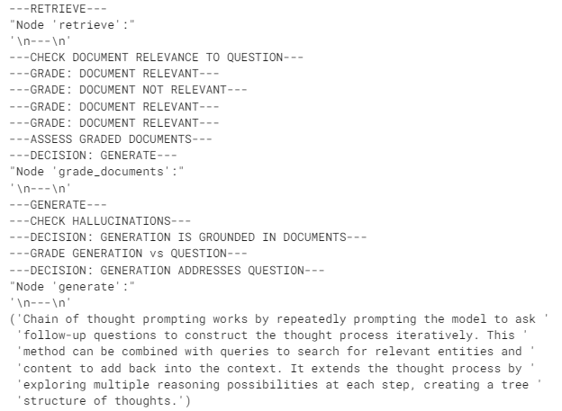

# Self-RAG

Self-RAG 是一种 RAG 策略，包含对检索到的文档和生成的答案进行自我反思/自我评分。

在[这篇论文](https://arxiv.org/abs/2310.11511)中，做出了一些决策：

1. 我是否应该从检索器 `R` 中检索 -

- 输入：`x (问题)` 或 `x (问题)，y (生成)`
- 决定何时使用 `R` 检索 `D` 块
- 输出：`是，否，继续`

1. 检索到的段落 `D` 是否与问题 `x` 相关 -

- 输入：(`x (问题)`，`d (块)`) 对于 `D` 中的 `d`
- `d` 提供了解决 `x` 的有用信息
- 输出：`相关，不相关`

1. 每个块中的 LLM 生成是否与块相关（幻觉等）-

- 输入：`x (问题)`，`d (块)`，`y (生成)` 对于 `D` 中的 `d`
- `y (生成)` 中所有需要验证的陈述都由 `d` 支持
- 输出：`完全支持，部分支持，不支持`

1. 每个块中的 LLM 生成是否是对 `x (问题)` 的有用回答 -

- 输入：`x (问题)`，`y (生成)` 对于 `D` 中的 `d`
- `y (生成)` 是对 `x (问题)` 的有用回答
- 输出：`{5, 4, 3, 2, 1}`

我们将使用 [LangGraph](https://langchain-ai.github.io/langgraph/) 从头开始实现这些想法。


# 环境

```
pip install -U langchain_community tiktoken langchain-openai langchainhub chromadb langchain langgraph
```

### LLMs

```
import os

os.environ["OPENAI_API_KEY"] = ""
```

### 跟踪

可选地，使用 [LangSmith](https://docs.smith.langchain.com/) 进行跟踪（如底部所示）

```
os.environ["LANGCHAIN_TRACING_V2"] = "true"
os.environ["LANGCHAIN_ENDPOINT"] = "https://api.smith.langchain.com"
os.environ["LANGCHAIN_API_KEY"] = ""
```

## 检索器

让我们索引三个博客文章。

```python
from langchain.text_splitter import RecursiveCharacterTextSplitter
from langchain_community.document_loaders import WebBaseLoader
from langchain_community.vectorstores import Chroma
from langchain_openai import OpenAIEmbeddings

urls = [
    "https://lilianweng.github.io/posts/2023-06-23-agent/",
    "https://lilianweng.github.io/posts/2023-03-15-prompt-engineering/",
    "https://lilianweng.github.io/posts/2023-10-25-adv-attack-llm/",
]

docs = [WebBaseLoader(url).load() for url in urls]
docs_list = [item for sublist in docs for item in sublist]

text_splitter = RecursiveCharacterTextSplitter.from_tiktoken_encoder(
    chunk_size=250, chunk_overlap=0
)
doc_splits = text_splitter.split_documents(docs_list)

# 添加到 vectorDB
vectorstore = Chroma.from_documents(
    documents=doc_splits,
    collection_name="rag-chroma",
    embedding=OpenAIEmbeddings(),
)
retriever = vectorstore.as_retriever()
```

## LLMs

```python
### 检索评分器

from langchain_core.prompts import ChatPromptTemplate
from langchain_core.pydantic_v1 import BaseModel, Field
from langchain_openai import ChatOpenAI

# 数据模型
class GradeDocuments(BaseModel):
    """检索文档相关性检查的二元评分。"""

    binary_score: str = Field(
        description="文档是否与问题相关，'是' 或 '否'"
    )


# 带函数调用的 LLM
llm = ChatOpenAI(model="gpt-3.5-turbo-0125", temperature=0)
structured_llm_grader = llm.with_structured_output(GradeDocuments)

# 提示
system = """你是一名评分者，评估检索到的文档是否与用户问题相关。\n 
    不需要严格测试。目标是过滤错误的检索结果。\n
    如果文档包含与用户问题相关的关键词或语义含义，请评分为相关。\n
    给出二元评分“是”或“否”以表明文档是否与问题相关。"""
grade_prompt = ChatPromptTemplate.from_messages(
    [
        ("system", system),
        ("human", "检索到的文档：\n\n {document} \n\n 用户问题：{question}"),
    ]
)

retrieval_grader = grade_prompt | structured_llm_grader
question = "代理记忆"
docs = retriever.get_relevant_documents(question)
doc_txt = docs[1].page_content
print(retrieval_grader.invoke({"question": question, "document": doc_txt}))
```

`binary_score='yes'`

```python
### 生成

from langchain import hub
from langchain_core.output_parsers import StrOutputParser

# 提示
prompt = hub.pull("rlm/rag-prompt")

# LLM
llm = ChatOpenAI(model_name="gpt-3.5-turbo", temperature=0)


# 后处理
def format_docs(docs):
    return "\n\n".join(doc.page_content for doc in docs)


# 链
rag_chain = prompt | llm | StrOutputParser()

# 运行
generation = rag_chain.invoke({"context": docs, "question": question})
print(generation)
```

`生成代理的设计结合了 LLM、记忆、规划和反思机制，使代理能够根据过去的经验行事并与其他代理互动。长期记忆提供了代理在长时间内保留和回忆无限信息的能力。短期记忆用于上下文学习。`

```python
### 幻觉评分器

# 数据模型
class GradeHallucinations(BaseModel):
    """生成答案中幻觉存在的二元评分。"""

    binary_score: str = Field(
        description="答案是否基于事实，'是' 或 '否'"
    )


# 带函数调用的 LLM
llm = ChatOpenAI(model="gpt-3.5-turbo-0125", temperature=0)
structured_llm_grader = llm.with_structured_output(GradeHallucinations)

# 提示
system = """你是一名评分者，评估 LLM 生成的答案是否基于/由一组检索到的事实支持。\n 
     给出二元评分“是”或“否”。“是”表示答案基于/由一组事实支持。"""
hallucination_prompt = ChatPromptTemplate.from_messages(
    [
        ("system", system),
        ("human", "事实集合：\n\n {documents} \n\n LLM 生成：{generation}"),
    ]
)

hallucination_grader = hallucination_prompt | structured_llm_grader
hallucination_grader.invoke({"documents": docs, "generation": generation})
```

`GradeHallucinations(binary_score='yes')`

```python
### 答案评分器

# 数据模型
class GradeAnswer(BaseModel):
    """评估答案是否解决问题的二元评分。"""

    binary_score: str = Field(
        description="答案是否解决问题，'是' 或 '否'"
    )


# 带函数调用的 LLM
llm = ChatOpenAI(model="gpt-3.5-turbo-0125", temperature=0)
structured_llm_grader = llm.with_structured_output(GradeAnswer)

# 提示
system = """你是一名评分者，评估答案是否解决/回答了问题。\n 
     给出二元评分“是”或“否”。“是”表示答案解决了问题。"""
answer_prompt = ChatPromptTemplate.from_messages(
    [
        ("system", system),
        ("human", "用户问题：\n\n {question} \n\n LLM 生成：{generation}"),
    ]
)

answer_grader = answer_prompt | structured_llm_grader
answer_grader.invoke({"question": question, "generation": generation})
```

`GradeAnswer(binary_score='yes')`

```python
### 问题重写器

# LLM
llm = ChatOpenAI(model="gpt-3.5-turbo-0125", temperature=0)

# 提示
system = """你是一个问题重写器，将输入问题转换为优化后的版本，适用于向量存储检索。查看输入并尝试推理其基本语义意图/含义。"""
re_write_prompt = ChatPromptTemplate.from_messages(
    [
        ("system", system),
        (
            "human",
            "这是初始问题：\n\n {question} \n 请形成一个改进的问题。",
        ),
    ]
)

question_rewriter = re_write_prompt | llm | StrOutputParser()
question_rewriter.invoke({"question": question})
```

`"记忆在代理的功能中

扮演什么角色？"`

# 图

将流程捕获为图。

## 图状态

```python
from typing import List

from typing_extensions import TypedDict


class GraphState(TypedDict):
    """
    表示我们图的状态。

    属性：
        question：问题
        generation：LLM 生成
        documents：文档列表
    """

    question: str
    generation: str
    documents: List[str]

```

```python
### 节点

def retrieve(state):
    """
    检索文档

    参数：
        state (dict)：当前图状态

    返回：
        state (dict)：添加到状态的新键，documents，包含检索到的文档
    """
    print("---检索---")
    question = state["question"]

    # 检索
    documents = retriever.get_relevant_documents(question)
    return {"documents": documents, "question": question}


def generate(state):
    """
    生成答案

    参数：
        state (dict)：当前图状态

    返回：
        state (dict)：添加到状态的新键，generation，包含 LLM 生成
    """
    print("---生成---")
    question = state["question"]
    documents = state["documents"]

    # RAG 生成
    generation = rag_chain.invoke({"context": documents, "question": question})
    return {"documents": documents, "question": question, "generation": generation}


def grade_documents(state):
    """
    确定检索到的文档是否与问题相关。

    参数：
        state (dict)：当前图状态

    返回：
        state (dict)：更新的状态，包含仅相关的文档
    """
    print("---检查文档与问题的相关性---")
    question = state["question"]
    documents = state["documents"]

    # 对每个文档评分
    filtered_docs = []
    for d in documents:
        score = retrieval_grader.invoke(
            {"question": question, "document": d.page_content}
        )
        grade = score.binary_score
        if grade == "yes":
            print("---评分：文档相关---")
            filtered_docs.append(d)
        else:
            print("---评分：文档不相关---")
            continue
    return {"documents": filtered_docs, "question": question}


def transform_query(state):
    """
    转换查询以生成更好的问题。

    参数：
        state (dict)：当前图状态

    返回：
        state (dict)：更新的状态，包含重新措辞的问题
    """
    print("---转换查询---")
    question = state["question"]
    documents = state["documents"]

    # 重写问题
    better_question = question_rewriter.invoke({"question": question})
    return {"documents": documents, "question": better_question}


### 边

def decide_to_generate(state):
    """
    确定是否生成答案，或者重新生成问题。

    参数：
        state (dict)：当前图状态

    返回：
        str：调用下一节点的二元决策
    """
    print("---评估已评分的文档---")
    state["question"]
    filtered_documents = state["documents"]

    if not filtered_documents:
        # 所有文档已被过滤
        # 我们将重新生成新查询
        print(
            "---决策：所有文档与问题无关，转换查询---"
        )
        return "transform_query"
    else:
        # 我们有相关文档，因此生成答案
        print("---决策：生成---")
        return "generate"


def grade_generation_v_documents_and_question(state):
    """
    确定生成的答案是否基于文档并回答问题。

    参数：
        state (dict)：当前图状态

    返回：
        str：调用下一节点的决策
    """
    print("---检查幻觉---")
    question = state["question"]
    documents = state["documents"]
    generation = state["generation"]

    score = hallucination_grader.invoke(
        {"documents": documents, "generation": generation}
    )
    grade = score.binary_score

    # 检查幻觉
    if grade == "yes":
        print("---决策：生成基于文档---")
        # 检查问答
        print("---评分生成 vs 问题---")
        score = answer_grader.invoke({"question": question, "generation": generation})
        grade = score.binary_score
        if grade == "yes":
            print("---决策：生成解决了问题---")
            return "useful"
        else:
            print("---决策：生成未解决问题---")
            return "not useful"
    else:
        pprint("---决策：生成未基于文档，重试---")
        return "not supported"
```


## 构建图

这只是遵循上图中我们概述的流程。

```python
from langgraph.graph import END, StateGraph, START

workflow = StateGraph(GraphState)

# 定义节点
workflow.add_node("retrieve", retrieve)  # 检索
workflow.add_node("grade_documents", grade_documents)  # 评分文档
workflow.add_node("generate", generate)  # 生成
workflow.add_node("transform_query", transform_query)  # 转换查询

# 构建图
workflow.add_edge(START, "retrieve")
workflow.add_edge("retrieve", "grade_documents")
workflow.add_conditional_edges(
    "grade_documents",
    decide_to_generate,
    {
        "transform_query": "transform_query",
        "generate": "generate",
    },
)
workflow.add_edge("transform_query", "retrieve")
workflow.add_conditional_edges(
    "generate",
    grade_generation_v_documents_and_question,
    {
        "not supported": "generate",
        "useful": END,
        "not useful": "transform_query",
    },
)

# 编译
app = workflow.compile()
```

```python
from pprint import pprint

# 运行
inputs = {"question": "解释代理记忆的不同类型如何工作？"}
for output in app.stream(inputs):
    for key, value in output.items():
        # 节点
        pprint(f"节点 '{key}':")
        # 可选：在每个节点打印完整状态
        # pprint.pprint(value["keys"], indent=2, width=80, depth=None)
    pprint("\n---\n")

# 最终生成
pprint(value["generation"])
```


```python
inputs = {"question": "解释链式思维提示如何工作？"}
for output in app.stream(inputs):
    for key, value in output.items():
        # 节点
        pprint(f"节点 '{key}':")
        # 可选：在每个节点打印完整状态
        # pprint.pprint(value["keys"], indent=2, width=80, depth=None)
    pprint("\n---\n")

# 最终生成
pprint(value["generation"])
```



LangSmith 跟踪 -

- https://smith.langchain.com/public/55d6180f-aab8-42bc-8799-dadce6247d9b/r
- https://smith.langchain.com/public/1c6bf654-61b2-4fc5-9889-054b020c78aa/r
